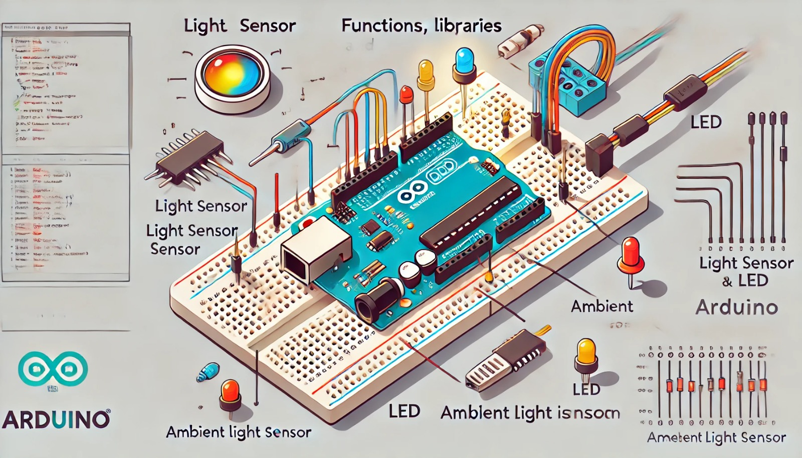

### Aula 14: Funções, Bibliotecas e Integração com Sensores

Bem-vindos à aula 14! Hoje, vamos aprender a integrar sensores ao Arduino e utilizar **funções** e **bibliotecas** para tornar o código mais eficiente e fácil de entender. Além disso, você aprenderá a montar um circuito e programar o Arduino para controlar o comportamento de componentes com base nos dados do sensor.

#### O que São Funções?

As **funções** são blocos de código que realizam uma tarefa específica. Elas permitem que você divida seu código em partes menores e reutilizáveis. Usar funções torna o programa mais organizado e fácil de manter.

Por exemplo, uma função para fazer um LED piscar pode ser escrita assim:

```cpp
void piscarLED(int pino, int tempo) {
  digitalWrite(pino, HIGH);  // Liga o LED
  delay(tempo);              // Aguarda pelo tempo definido
  digitalWrite(pino, LOW);   // Desliga o LED
  delay(tempo);              // Aguarda novamente
}
```

No código acima, você define os parâmetros **pino** (onde o LED está conectado) e **tempo** (quanto tempo o LED ficará ligado ou desligado). Isso permite reutilizar a função várias vezes com diferentes LEDs ou tempos.

#### O que São Bibliotecas?

As **bibliotecas** são coleções de funções prontas, criadas para simplificar o uso de sensores e outros componentes no Arduino. Elas permitem que você trabalhe com sensores e dispositivos sem precisar escrever o código completo do zero.

Exemplo com a biblioteca **Servo**:
```cpp
#include <Servo.h>  // Inclui a biblioteca Servo

Servo meuServo;  // Cria um objeto Servo

void setup() {
  meuServo.attach(9);  // Conecta o servo ao pino 9
}

void loop() {
  meuServo.write(90);  // Move o servo para 90 graus
  delay(1000);         // Espera 1 segundo
  meuServo.write(0);   // Move o servo para 0 graus
  delay(1000);         // Espera 1 segundo
}
```

Nesse exemplo, a biblioteca **Servo** facilita o controle de servomotores, evitando que você precise implementar todo o controle de ângulo manualmente.

#### Integração com Sensores

Agora vamos ver como integrar um sensor ao Arduino. Vamos usar o **Sensor de Luz Ambiente** (LDR) para controlar o LED. O LED acenderá quando a luz ambiente estiver baixa.

### Montagem do Circuito

**Componentes Necessários:**
- Arduino Uno
- Sensor de Luz Ambiente (LDR)
- Resistor de 10kΩ
- LED
- Resistor de 220Ω
- Breadboard
- Cabos Jumper

#### Passo a Passo da Montagem:

1. **Conecte o Sensor de Luz:**
   - Coloque o **Sensor de Luz Ambiente (LDR)** na breadboard.
   - Conecte **uma perna do sensor ao pino 5V** do Arduino (isso fornece energia para o sensor).
   - Conecte **a outra perna do sensor a uma extremidade de um resistor de 10kΩ**.
   - Conecte a outra extremidade do resistor ao **GND** (terra) no Arduino.
   - No ponto entre o **sensor** e o **resistor**, conecte um cabo ao pino **A0** do Arduino (entrada analógica). Esse ponto vai medir a tensão para que o Arduino saiba o quão forte está a luz ambiente.

2. **Conecte o LED:**
   - Coloque o **LED** na breadboard.
   - Conecte a **perna longa (anodo)** do LED ao pino **9** do Arduino.
   - Conecte a **perna curta (cátodo)** do LED ao **GND** (terra) através de um resistor de **220Ω**. O resistor limita a corrente e protege o LED de queimar.

Agora que você montou o circuito, vamos para o código!

#### Código de Integração

Esse código lê a intensidade da luz e acende o LED quando a luz ambiente está baixa.

```cpp
int sensorLuz = A0;  // Pino onde o Sensor de Luz está conectado
int ledPin = 9;      // Pino onde o LED está conectado
int valorLuz = 0;    // Variável para armazenar a leitura do sensor

void setup() {
  pinMode(ledPin, OUTPUT);  // Configura o LED como saída
  Serial.begin(9600);       // Inicializa a comunicação serial para depuração
}

void loop() {
  valorLuz = analogRead(sensorLuz);  // Lê o valor da luminosidade
  Serial.println(valorLuz);          // Exibe o valor no Serial Monitor

  // Se a luz ambiente for baixa, liga o LED
  if (valorLuz < 70) {
    digitalWrite(ledPin, HIGH);  // Liga o LED
  } else {
    digitalWrite(ledPin, LOW);   // Desliga o LED
  }

  delay(100);  // Pequena pausa para evitar leituras rápidas demais
}
```

### Explicação do Código:

1. **analogRead(A0):** Lê o valor da luminosidade ambiente no pino **A0** (entrada analógica). Quanto mais luz, maior o valor retornado (de 0 a 1023).
2. **if (valorLuz < 70):** Se a leitura do sensor for menor que 70 (luz baixa), o LED acende. Caso contrário, o LED apaga.
3. **Serial Monitor:** Utilizamos o `Serial.println()` para visualizar os valores lidos do sensor no monitor serial do Arduino IDE.

### Testando o Projeto no Tinkercad

1. Monte o circuito no **Tinkercad** e use o código acima.
2. No simulador, você pode ajustar o controle deslizante do sensor de luz para simular diferentes níveis de luz.
3. Observe como o LED acende automaticamente quando a luz está baixa.

#### Conclusão

Nesta aula, você aprendeu como usar **funções**, **bibliotecas** e integrar sensores ao Arduino para criar projetos mais inteligentes. Agora que você sabe como usar sensores de luz e outras funções importantes, pode criar sistemas mais interativos que respondem ao ambiente ao redor. Continue experimentando com diferentes sensores e componentes para aprofundar seu aprendizado!