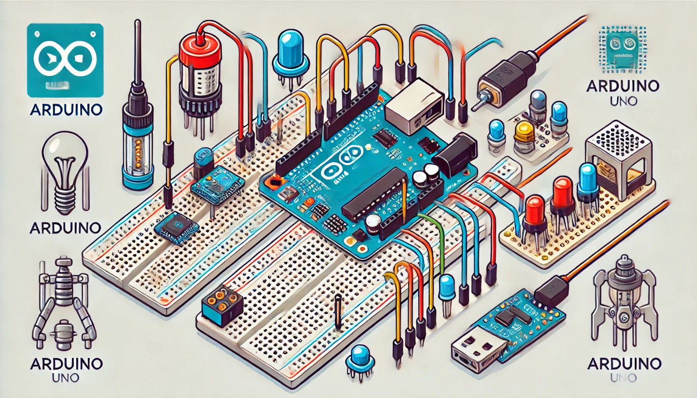

### Aula 15: Projeto Prático – Sistema de Alarme Simples com Sensores

Bem-vindos à nossa décima quinta aula! Hoje, vamos construir um projeto prático que simula um **sistema de alarme simples**, utilizando sensores e o Arduino. Este projeto será uma ótima oportunidade para integrar todos os conceitos que aprendemos até agora, como **funções**, **bibliotecas** e a **integração com sensores**.

### Objetivo do Projeto

Criar um sistema de alarme básico que detecta movimento usando um sensor e aciona um alarme sonoro (um buzzer) e um LED para indicar que foi detectada uma presença. Esse sistema poderia ser utilizado em casas, escritórios ou como parte de um sistema maior.

### Componentes Necessários

- **Arduino Uno**
- **Sensor PIR (Sensor de Movimento)**
- **Buzzer (Alarme Sonoro)**
- **LED**
- **Resistor de 220Ω** (para o LED)
- **Breadboard**
- **Cabos Jumper**

### O que é o Sensor PIR?

O **Sensor PIR** (Passive InfraRed) detecta movimento no ambiente, captando as mudanças na radiação infravermelha emitida pelos objetos. Quando o sensor detecta movimento, ele envia um sinal de alta tensão (HIGH) para o Arduino.

### Passo a Passo da Montagem

#### 1. Conectando o Sensor PIR:
   - Conecte o **VCC** do sensor PIR ao pino **5V** do Arduino (para alimentação).
   - Conecte o **GND** do sensor PIR ao **GND** do Arduino (terra).
   - Conecte a saída de sinal do PIR ao pino digital **7** do Arduino.

#### 2. Conectando o Buzzer:
   - Conecte o pino positivo do **Buzzer** ao pino digital **8** do Arduino.
   - Conecte o pino negativo do buzzer ao **GND**.

#### 3. Conectando o LED:
   - Coloque o LED na breadboard.
   - Conecte a perna longa (anodo) do LED ao pino digital **9** do Arduino.
   - Conecte a perna curta (cátodo) do LED ao **GND** através do **resistor de 220Ω**.

### Código para o Sistema de Alarme

Agora que o circuito está montado, vamos programar o Arduino para detectar movimento e acionar o alarme (buzzer e LED).

```cpp
int sensorPIR = 7;  // Pino onde o sensor PIR está conectado
int buzzer = 8;     // Pino onde o buzzer está conectado
int ledPin = 9;     // Pino onde o LED está conectado
int estadoPIR = 0;  // Variável para armazenar o estado do sensor

void setup() {
  pinMode(sensorPIR, INPUT);  // Configura o sensor PIR como entrada
  pinMode(buzzer, OUTPUT);    // Configura o buzzer como saída
  pinMode(ledPin, OUTPUT);    // Configura o LED como saída
  Serial.begin(9600);         // Inicializa a comunicação serial
}

void loop() {
  estadoPIR = digitalRead(sensorPIR);  // Lê o estado do sensor PIR

  if (estadoPIR == HIGH) {
    // Se o movimento for detectado, o alarme é ativado
    digitalWrite(buzzer, HIGH);  // Ativa o buzzer
    digitalWrite(ledPin, HIGH);  // Liga o LED
    Serial.println("Movimento detectado! Alarme ativado.");
  } else {
    // Se não houver movimento, o alarme é desativado
    digitalWrite(buzzer, LOW);   // Desativa o buzzer
    digitalWrite(ledPin, LOW);   // Desliga o LED
  }

  delay(100);  // Pequena pausa para evitar leituras rápidas demais
}
```

### Explicação do Código

1. **pinMode():** Configura o pino do sensor PIR como entrada e os pinos do LED e buzzer como saídas.
2. **digitalRead(sensorPIR):** Lê o valor do sensor PIR. Se o valor for **HIGH**, significa que foi detectado movimento.
3. **if (estadoPIR == HIGH):** Quando o sensor detecta movimento, o buzzer e o LED são ativados. Caso contrário, o sistema fica em espera.
4. **Serial Monitor:** O `Serial.println()` permite acompanhar no monitor serial quando o movimento é detectado.

### Testando o Projeto

1. **Montagem:** Certifique-se de que todas as conexões estão corretas na breadboard e no Arduino.
2. **Simulação (opcional no Tinkercad):** Caso esteja simulando no Tinkercad, você pode ajustar a sensibilidade do sensor PIR e testar o código.
3. **Ajustes:** Se o alarme estiver muito sensível, você pode alterar o valor de delay ou ajustar a posição do sensor PIR no circuito.

### Expansão do Projeto

Este projeto básico pode ser expandido para criar sistemas de alarme mais complexos:
- **Adicionar um display LCD** para exibir mensagens como "Movimento Detectado".
- **Usar um controle remoto** para ativar ou desativar o alarme remotamente.
- **Integrar com outros sensores**, como sensores de portas ou janelas, para aumentar a segurança.

### Conclusão

Neste projeto, você aprendeu a usar um sensor PIR para criar um sistema de alarme simples com o Arduino. Esse é um exemplo prático de como integrar sensores e atuadores (como buzzer e LED) para construir um sistema que reage ao ambiente. Continue experimentando, criando e expandindo suas habilidades com sensores e controle de dispositivos!

Na próxima aula, continuaremos a explorar mais projetos práticos com diferentes sensores e componentes.