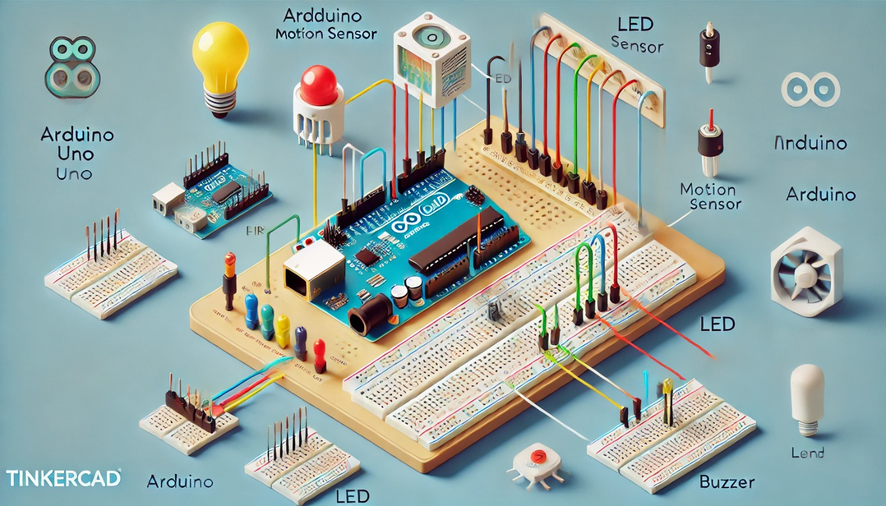

### Aula 16: Prática no Tinkercad – Implementação e Teste do Sistema de Alarme

Nesta aula, vamos implementar e testar o **sistema de alarme simples** que criamos na aula anterior, mas desta vez utilizando a simulação no **Tinkercad**. O Tinkercad é uma ferramenta online que permite simular circuitos eletrônicos e testar o código do Arduino sem precisar de hardware físico. Isso facilita muito o aprendizado e a prototipagem de projetos.

### Objetivo da Aula

Implementar e testar o sistema de alarme simples com um **sensor de movimento PIR**, um **LED**, e um **buzzer**, tudo simulado no Tinkercad. O objetivo é garantir que o sistema funcione corretamente, detectando movimento e acionando o alarme visual (LED) e sonoro (buzzer).

### Passos para Implementação no Tinkercad

#### 1. Acesse o Tinkercad

- Vá para o site [Tinkercad](https://www.tinkercad.com) e faça login na sua conta.
- No painel inicial, clique em "Criar novo circuito".

#### 2. Montagem do Circuito no Tinkercad

**Componentes Virtuais:**
- **Arduino Uno**
- **Sensor PIR (Sensor de Movimento)**
- **Buzzer (Alarme Sonoro)**
- **LED**
- **Resistor de 220Ω** (para o LED)
- **Breadboard**
- **Cabos Jumper**

**Passo a Passo da Montagem:**

1. **Conecte o Sensor PIR:**
   - Coloque o **sensor PIR** na breadboard.
   - Conecte o pino **VCC** do PIR ao **5V** do Arduino.
   - Conecte o **GND** do PIR ao **GND** do Arduino.
   - Conecte a saída de sinal do PIR ao pino **7** do Arduino.

2. **Conecte o Buzzer:**
   - Coloque o **buzzer** na breadboard.
   - Conecte o pino positivo do buzzer ao pino **8** do Arduino.
   - Conecte o pino negativo do buzzer ao **GND**.

3. **Conecte o LED:**
   - Coloque o **LED** na breadboard.
   - Conecte a perna longa (anodo) do LED ao pino **9** do Arduino através do **resistor de 220Ω**.
   - Conecte a perna curta (cátodo) do LED ao **GND**.

#### 3. Programando o Arduino no Tinkercad

Agora que o circuito está montado, vamos adicionar o código para controlar o sistema de alarme. No editor de código do Tinkercad, copie e cole o seguinte código:

```cpp
int sensorPIR = 7;  // Pino onde o sensor PIR está conectado
int buzzer = 8;     // Pino onde o buzzer está conectado
int ledPin = 9;     // Pino onde o LED está conectado
int estadoPIR = 0;  // Variável para armazenar o estado do sensor

void setup() {
  pinMode(sensorPIR, INPUT);  // Configura o sensor PIR como entrada
  pinMode(buzzer, OUTPUT);    // Configura o buzzer como saída
  pinMode(ledPin, OUTPUT);    // Configura o LED como saída
  Serial.begin(9600);         // Inicializa a comunicação serial
}

void loop() {
  estadoPIR = digitalRead(sensorPIR);  // Lê o estado do sensor PIR

  if (estadoPIR == HIGH) {
    // Se o movimento for detectado, o alarme é ativado
    digitalWrite(buzzer, HIGH);  // Liga o buzzer
    digitalWrite(ledPin, HIGH);  // Liga o LED
    Serial.println("Movimento detectado! Alarme ativado.");
  } else {
    // Se não houver movimento, o alarme é desativado
    digitalWrite(buzzer, LOW);   // Desliga o buzzer
    digitalWrite(ledPin, LOW);   // Desliga o LED
  }

  delay(100);  // Pequena pausa para evitar leituras rápidas demais
}
```

### Explicação do Código

- **sensorPIR:** O sensor PIR está conectado ao pino 7 do Arduino. Quando detecta movimento, ele envia um sinal HIGH.
- **buzzer e LED:** Ambos são configurados como saídas nos pinos 8 e 9, respectivamente. Quando o movimento é detectado, o LED e o buzzer são acionados.
- **Serial Monitor:** O `Serial.println()` exibe uma mensagem no monitor serial do Arduino IDE sempre que o movimento é detectado.

#### 4. Iniciando a Simulação

- Clique em "Iniciar Simulação" no Tinkercad.
- O sistema irá simular a detecção de movimento através do **sensor PIR**. Quando o movimento é detectado, o LED acende e o buzzer toca.
- Você pode ajustar o ambiente do PIR na interface do Tinkercad para testar diferentes cenários.

### Ajustes e Testes

- **Sensibilidade do PIR:** Experimente ajustar a sensibilidade do sensor PIR no Tinkercad para testar o comportamento do alarme em diferentes condições de movimento.
- **Modifique o Código:** Teste adicionar funcionalidades, como o uso de um segundo LED para indicar o status "Armado" ou "Desarmado" do sistema.

### Conclusão

Nesta aula prática, implementamos e testamos um **sistema de alarme simples** com sensores no Tinkercad. Usamos o **sensor PIR** para detectar movimento e acionamos um **buzzer** e um **LED** para sinalizar a presença detectada. Agora que você sabe como implementar esse projeto em um ambiente simulado, pode usá-lo como base para projetos mais avançados no futuro, incluindo a adição de novos sensores ou dispositivos de controle.

Continue praticando e explorando as possibilidades que o Tinkercad oferece para criar protótipos e testar novos projetos!