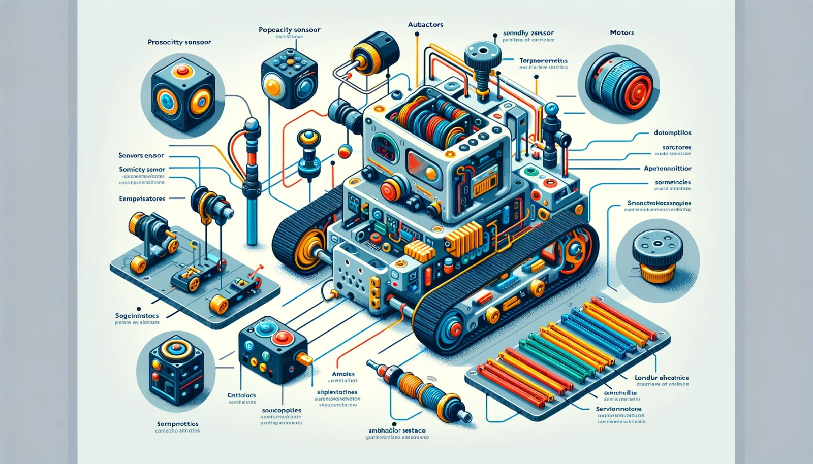

### Aula 17: Visão Geral dos Componentes de um Robô – Sensores, Atuadores, e Motores

Hoje, vamos explorar os componentes fundamentais que compõem um robô. Entender esses elementos é essencial para o desenvolvimento de robôs funcionais e eficientes. Os principais componentes de um robô incluem **sensores**, **atuadores** e **motores**. Cada um deles desempenha um papel específico e fundamental para que o robô execute suas tarefas de forma autônoma.

---

### 1. Sensores

Os **sensores** são os “sentidos” do robô. Eles capturam informações do ambiente, permitindo que o robô reaja a mudanças e tome decisões com base nesses dados. Existem vários tipos de sensores, cada um com uma função específica.

- **Sensor Ultrassônico:** Utilizado para medir distâncias. Funciona emitindo ondas ultrassônicas que refletem em obstáculos e retornam ao sensor. É útil para navegação e prevenção de colisões.
- **Sensor de Luz (LDR):** Detecta a intensidade da luz. Pode ser usado para identificar ambientes claros ou escuros e orientar o robô conforme necessário.
- **Sensor de Temperatura:** Mede a temperatura ambiente. Em robôs industriais, ajuda a monitorar o calor e evitar superaquecimento.
- **Sensor de Toque:** Detecta quando o robô entra em contato com um objeto. Pode ser usado em robôs que precisam interagir fisicamente com objetos ou humanos.

Os sensores ajudam o robô a entender o ambiente e ajustar seu comportamento, por exemplo, mudando de direção ao detectar um obstáculo.

---

### 2. Atuadores

Os **atuadores** são os componentes que permitem ao robô executar ações físicas. Eles convertem energia (geralmente elétrica) em movimento ou outras formas de ação mecânica. Atuadores podem ser usados para criar movimentos precisos e controlar a posição dos componentes do robô.

- **Servomotores:** Permitem movimentos precisos em ângulos específicos. São ideais para braços robóticos e mecanismos que exigem controle preciso de posição.
- **Eletroímãs:** Utilizados para agarrar e soltar objetos metálicos. Eles podem ser ativados e desativados conforme necessário.
- **Bombas Hidráulicas e Pneumáticas:** Convertem energia em força mecânica, permitindo ao robô levantar objetos pesados ou realizar tarefas que exigem muita força.

Os atuadores são fundamentais para que o robô interaja com o ambiente, manipulando objetos e realizando tarefas específicas.

---

### 3. Motores

Os **motores** são o “coração” de muitos robôs, permitindo movimento e deslocamento. Eles fornecem a energia necessária para que o robô se mova e cumpra suas funções de forma independente.

- **Motor DC (Corrente Contínua):** Simples e amplamente utilizado para movimentação de rodas. É controlado por modulação de largura de pulso (PWM) para ajustar a velocidade.
- **Motor de Passo:** Permite movimentos precisos em pequenos incrementos, o que é essencial em robôs que precisam de precisão, como impressoras 3D e robôs de corte.
- **Motor Servo:** Oferece controle de posição e ângulo, sendo utilizado em robôs que precisam de movimentos exatos.

Os motores permitem que o robô se mova, gire e execute manobras complexas. Eles são essenciais em robôs móveis e em qualquer aplicação que exija deslocamento.

---

### Resumo

Cada um desses componentes trabalha em conjunto para que o robô possa “sentir” o ambiente, processar informações e executar ações físicas. Sensores fornecem os dados do ambiente, atuadores realizam ações específicas e motores permitem o movimento.

---

### Exercícios de Fixação

1. **Qual a principal função dos sensores em um robô?**
   - A) Gerar energia para os motores
   - B) Permitir que o robô execute ações físicas
   - C) Capturar informações do ambiente
   - D) Proteger o robô de falhas

2. **Um sensor ultrassônico é comumente utilizado para:**
   - A) Detectar temperatura
   - B) Medir distância
   - C) Gerar movimento em ângulos precisos
   - D) Manipular objetos metálicos

3. **Os servomotores são ideais para:**
   - A) Movimentos em pequenas etapas
   - B) Medições de temperatura ambiente
   - C) Movimentos precisos em ângulos específicos
   - D) Detecção de obstáculos

4. **Qual componente é utilizado para permitir que o robô execute ações físicas específicas, como agarrar ou soltar objetos?**
   - A) Motores
   - B) Atuadores
   - C) Sensores de luz
   - D) Baterias

5. **Para qual propósito são usados os motores DC em robôs?**
   - A) Precisão em pequenos movimentos
   - B) Movimentação de rodas e deslocamento
   - C) Controle de temperatura
   - D) Comunicação com o ambiente

6. **Os motores de passo são geralmente utilizados para:**
   - A) Movimentação simples em robôs
   - B) Movimentos precisos e controlados
   - C) Detecção de luz e cor
   - D) Alimentação de sensores

7. **Qual dos seguintes sensores é ideal para detectar a presença de uma pessoa ou objeto?**
   - A) Sensor de luz
   - B) Sensor PIR (Infravermelho Passivo)
   - C) Sensor de temperatura
   - D) Eletroímã

8. **O que é um atuador?**
   - A) Um dispositivo que armazena energia elétrica
   - B) Um componente que lê dados do ambiente
   - C) Um dispositivo que converte energia em movimento
   - D) Um tipo de sensor de toque

9. **Para que serve um sensor de temperatura em um robô industrial?**
   - A) Detectar a presença de objetos
   - B) Controlar a iluminação ambiente
   - C) Monitorar o calor e evitar superaquecimento
   - D) Converter calor em energia

10. **Qual dos seguintes componentes é responsável por permitir o movimento completo e deslocamento de um robô?**
    - A) Sensores
    - B) Atuadores
    - C) Motores
    - D) Eletroímãs