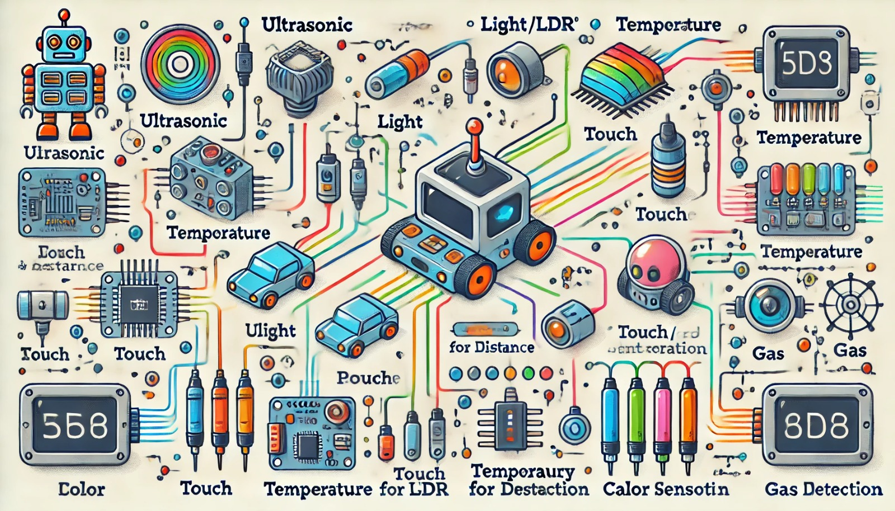

### Aula 18: Exploração de Diferentes Tipos de Sensores e Suas Aplicações

Hoje, vamos explorar os diferentes tipos de sensores utilizados em robótica e automação. Cada sensor tem uma função específica, ajudando o robô a captar informações do ambiente e interagir com o mundo ao seu redor. Vamos entender como esses sensores funcionam e em quais contextos eles são utilizados.

---

### 1. Sensor Ultrassônico

**Como Funciona:** Emite ondas sonoras ultrassônicas e mede o tempo que elas levam para retornar após atingir um objeto. Com isso, ele calcula a distância até o objeto.

**Aplicações:** 
- Detecção de obstáculos em robôs móveis.
- Controle de distância em robôs de limpeza.
- Sistemas de estacionamento em veículos.

---

### 2. Sensor de Luz (LDR)

**Como Funciona:** A resistência desse sensor varia conforme a intensidade da luz. Quando exposto a mais luz, sua resistência diminui, e quando há pouca luz, a resistência aumenta.

**Aplicações:**
- Robôs seguidores de linha, que detectam áreas escuras e claras no chão.
- Sistemas de controle de iluminação automática, que ajustam as luzes de acordo com a luminosidade ambiente.

---

### 3. Sensor de Temperatura

**Como Funciona:** Mede a temperatura do ambiente usando materiais que mudam suas propriedades elétricas com o calor. O sensor envia uma tensão proporcional à temperatura medida.

**Aplicações:**
- Robôs industriais que monitoram o aquecimento de máquinas para evitar superaquecimento.
- Robôs de pesquisa ambiental, que registram temperaturas em locais remotos.
- Controle de ar-condicionado em sistemas de automação residencial.

---

### 4. Sensor de Proximidade (Infravermelho ou Magnético)

**Como Funciona:** Detecta a presença de objetos próximos sem precisar tocá-los. Os sensores infravermelhos emitem luz que reflete nos objetos próximos, enquanto os magnéticos detectam a proximidade de objetos metálicos.

**Aplicações:**
- Robôs de segurança que identificam a presença de objetos ou pessoas em áreas restritas.
- Sistemas de detecção de portas automáticas, que abrem ao detectar a presença de alguém.
- Controle de montagem de peças em linhas de produção industrial.

---

### 5. Sensor de Toque

**Como Funciona:** Aciona um circuito quando pressionado, indicando que o robô entrou em contato com um objeto.

**Aplicações:**
- Robôs de interação humana, que respondem ao toque.
- Robôs de fabricação que precisam parar ao encostar em uma peça.
- Robôs de brinquedo que reagem quando alguém os toca.

---

### 6. Sensor de Cor

**Como Funciona:** Emite luz sobre um objeto e mede a quantidade de luz refletida nas cores primárias (vermelho, verde e azul). Com isso, ele consegue identificar a cor do objeto.

**Aplicações:**
- Robôs de classificação, que separam objetos com base em sua cor.
- Sistemas de qualidade que identificam produtos defeituosos pela cor.
- Robôs seguidores de linha que reconhecem diferentes cores para diferentes rotas.

---

### 7. Sensor de Gás

**Como Funciona:** Mede a concentração de gases específicos no ar, mudando a resistência elétrica conforme a presença de certos gases.

**Aplicações:**
- Robôs de monitoramento ambiental, que detectam poluição em áreas industriais.
- Sistemas de segurança que detectam vazamentos de gás.
- Robôs de resgate, que verificam a presença de gases perigosos em locais de risco.

---

### Exercícios de Fixação

1. **Qual sensor é mais adequado para medir a distância entre o robô e um obstáculo?**
   - A) Sensor de Toque
   - B) Sensor de Temperatura
   - C) Sensor Ultrassônico
   - D) Sensor de Cor

2. **Qual é a principal função do sensor de luz (LDR) em um robô?**
   - A) Medir a temperatura ambiente
   - B) Detectar a presença de obstáculos
   - C) Medir a intensidade de luz
   - D) Detectar gases

3. **Para que um robô utilize um sensor de temperatura, ele poderia estar envolvido em:**
   - A) Controle de iluminação
   - B) Verificação de segurança em ambientes industriais
   - C) Identificação de objetos metálicos
   - D) Identificação de obstáculos

4. **Qual sensor é ideal para detectar a presença de uma pessoa ou objeto próximo sem tocá-lo?**
   - A) Sensor de Toque
   - B) Sensor de Proximidade
   - C) Sensor de Gás
   - D) Sensor de Cor

5. **O sensor de cor é comumente usado para:**
   - A) Medir a temperatura
   - B) Seguir linhas em diferentes rotas
   - C) Medir a distância até objetos
   - D) Detectar presença de gases no ar

6. **Um robô industrial utiliza o sensor de toque para:**
   - A) Verificar a cor de uma peça
   - B) Medir a distância até o chão
   - C) Parar ao encostar em uma peça
   - D) Identificar a presença de pessoas

7. **Em um robô de monitoramento ambiental, o sensor de gás é usado para:**
   - A) Detectar obstáculos
   - B) Medir intensidade de luz
   - C) Detectar vazamentos de gás
   - D) Identificar objetos pelo toque

8. **Qual sensor mede a concentração de gases específicos no ar?**
   - A) Sensor de Proximidade
   - B) Sensor de Temperatura
   - C) Sensor de Gás
   - D) Sensor de Luz

9. **Em um sistema de portas automáticas, qual sensor provavelmente seria utilizado para detectar a presença de uma pessoa se aproximando?**
   - A) Sensor de Temperatura
   - B) Sensor de Proximidade
   - C) Sensor de Toque
   - D) Sensor de Cor

10. **Para que serve o sensor infravermelho em robôs de segurança?**
    - A) Para medir a temperatura ambiente
    - B) Para medir a intensidade de luz
    - C) Para identificar a presença de intrusos
    - D) Para detectar a presença de gases