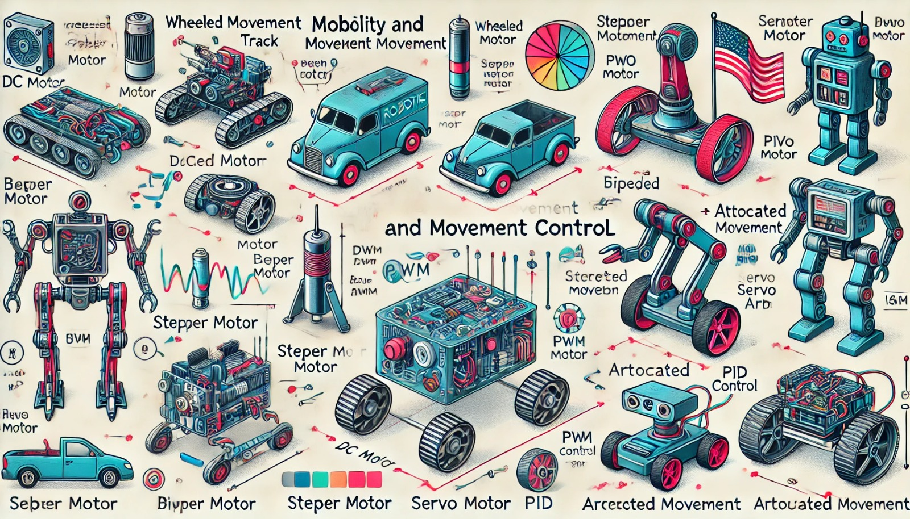

### Aula 19: Mobilidade e Controle de Movimento em Robótica

Bem-vindos à nossa décima nona aula! Hoje, vamos explorar um dos aspectos mais essenciais da robótica: **mobilidade e controle de movimento**. Em um robô, a mobilidade é fundamental para permitir que ele se desloque no ambiente, execute tarefas e interaja com objetos. Para entender como isso funciona, veremos os tipos de movimento, os componentes responsáveis pela mobilidade e como controlá-los.

---

### 1. Tipos de Movimento em Robôs

Existem diferentes tipos de movimento que um robô pode realizar, dependendo de sua construção e função:

- **Movimento sobre rodas:** Um dos tipos mais comuns de mobilidade. Robôs com rodas podem se deslocar com rapidez e eficiência, especialmente em superfícies lisas.
- **Movimento com esteiras:** Utilizado para terrenos irregulares e em robôs que precisam de estabilidade. As esteiras oferecem maior aderência e permitem que o robô se mova em superfícies difíceis, como areia ou pedras.
- **Movimento bípede:** Simula o movimento das pernas humanas. É usado em robôs que precisam subir escadas ou se deslocar em terrenos desiguais, mas consome mais energia e exige controle mais complexo.
- **Movimento articulado:** Presente em braços robóticos e robôs industriais, onde partes do robô se movem em várias direções para manipular objetos com precisão.

Cada tipo de movimento tem suas vantagens e desvantagens, sendo escolhido conforme a aplicação do robô.

---

### 2. Componentes de Mobilidade

Para permitir que o robô se mova, são usados componentes específicos que convertem comandos em movimento:

- **Motores DC (Corrente Contínua):** Fornecem movimento contínuo e são comuns em robôs com rodas. A velocidade pode ser controlada através da modulação por largura de pulso (PWM), que ajusta a quantidade de energia enviada ao motor.
- **Motores de Passo:** Permitem movimentos precisos e são usados em robôs que precisam de controle detalhado, como braços robóticos. Cada passo corresponde a um ângulo fixo, o que possibilita controle exato de posição.
- **Servomotores:** São ideais para movimentos precisos em ângulos específicos. São utilizados em articulações que requerem controle de posição, como em braços robóticos ou câmeras que se movem em diferentes direções.
- **Motores com Redutor:** Aumentam a força e reduzem a velocidade de rotação, permitindo ao robô mover objetos pesados ou se deslocar com mais potência.

---

### 3. Controle de Movimento

Para que o robô se mova de forma precisa e eficiente, é necessário controlar os motores e os componentes de mobilidade com comandos específicos. Os principais métodos de controle incluem:

- **PWM (Modulação por Largura de Pulso):** Permite controlar a velocidade dos motores. Enviando pulsos em intervalos variados, é possível ajustar a quantidade de energia que chega ao motor e, consequentemente, sua velocidade.
- **Controle PID (Proporcional, Integral e Derivativo):** Uma técnica avançada que ajusta a velocidade e posição dos motores com base no feedback de sensores. O controle PID é usado para manter o movimento estável e corrigir desvios de posição.
- **Sensores de Encoders:** Utilizados para medir a rotação dos motores e fornecer feedback sobre a posição e velocidade. Os encoders ajudam o robô a saber a distância percorrida e corrigir o curso, garantindo precisão no deslocamento.

---

### Exemplos Práticos de Mobilidade

1. **Robô de Limpeza (Movimento sobre Rodas):** Utiliza motores DC controlados por PWM para mover-se pelo ambiente e sensores de encoders para calcular a distância percorrida.
2. **Braço Robótico (Movimento Articulado):** Usa motores de passo e servomotores para posicionar o braço em diferentes ângulos e realizar tarefas de precisão, como soldagem ou montagem.
3. **Robô Exploratório (Movimento com Esteiras):** Utiliza motores DC com redutores para superar terrenos irregulares. Pode ser equipado com controle PID para ajustar a velocidade em tempo real e lidar com diferentes tipos de solo.

---

### Resumo

A mobilidade e o controle de movimento são fundamentais para que um robô se mova de forma eficiente e cumpra suas tarefas. Os diferentes tipos de movimento, componentes de mobilidade e técnicas de controle permitem que o robô se adapte ao ambiente e execute tarefas com precisão.

---

### Exercícios de Fixação

1. **Qual dos tipos de movimento é mais indicado para um robô que precisa se deslocar em terrenos irregulares?**
   - A) Movimento sobre rodas
   - B) Movimento com esteiras
   - C) Movimento bípede
   - D) Movimento articulado

2. **Qual tipo de motor é ideal para um robô que necessita de controle preciso de posição em pequenos passos?**
   - A) Motor DC
   - B) Motor de Passo
   - C) Motor com Redutor
   - D) Motor Ultrassônico

3. **Servomotores são comumente usados em:**
   - A) Robôs que precisam de movimentos contínuos em alta velocidade
   - B) Braços robóticos e câmeras articuladas
   - C) Robôs de segurança que detectam intrusos
   - D) Robôs de limpeza que se movem por terrenos lisos

4. **Para ajustar a velocidade de um motor DC, o método mais utilizado é:**
   - A) Controle PID
   - B) Sensores de Encoders
   - C) PWM (Modulação por Largura de Pulso)
   - D) Controle Ultrassônico

5. **O controle PID é uma técnica utilizada para:**
   - A) Medir a intensidade de luz
   - B) Detectar a presença de objetos
   - C) Ajustar a velocidade e posição de motores com base no feedback
   - D) Controlar o som emitido por um robô

6. **Qual dos componentes abaixo mede a rotação e fornece feedback de posição e velocidade?**
   - A) Servo
   - B) Encoder
   - C) Sensor Ultrassônico
   - D) Sensor de Toque

7. **Em um robô de limpeza, o movimento mais comum para deslocamento em superfícies lisas é:**
   - A) Movimento sobre rodas
   - B) Movimento com esteiras
   - C) Movimento bípede
   - D) Movimento articulado

8. **Os motores com redutores são ideais para:**
   - A) Movimentos rápidos em superfícies lisas
   - B) Aumentar a força de tração e reduzir a velocidade
   - C) Ajustes rápidos em pequenas distâncias
   - D) Medição de temperatura no ambiente

9. **Para medir a distância percorrida por um robô, é comum usar:**
   - A) Controle PWM
   - B) Sensores de Encoders
   - C) Controle PID
   - D) Motores com Redutor

10. **Qual dos seguintes tipos de movimento é utilizado principalmente em robôs que simulam o movimento humano?**
    - A) Movimento sobre rodas
    - B) Movimento com esteiras
    - C) Movimento bípede
    - D) Movimento com encoders

---

Esses exercícios ajudarão a fixar os conceitos de mobilidade e controle de movimento em robótica. Boa sorte!