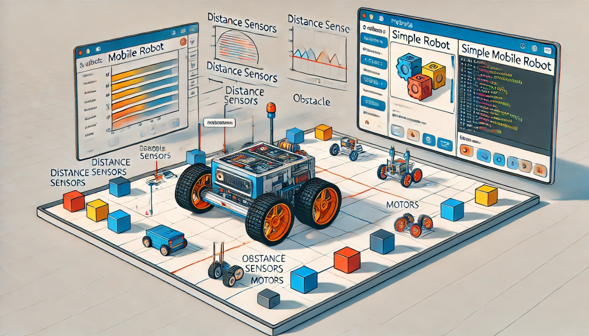

### Aula 20: Prática no Webots – Design e Simulação de um Robô Móvel Simples

Nesta aula, vamos explorar o **Webots**, uma plataforma de simulação de robótica poderosa e gratuita. O Webots permite que você projete e simule robôs móveis e autônomos, criando cenários realistas com física avançada e controle preciso de motores e sensores. Vamos desenvolver um robô móvel simples, programá-lo para se mover no ambiente e testar a navegação com sensores básicos.

---

### O Que é o Webots?

**Webots** é um software de simulação de robótica amplamente utilizado em pesquisa e educação. Ele oferece uma biblioteca de modelos de robôs, ambientes e sensores, permitindo que você simule o comportamento de robôs móveis, manipuladores robóticos e até mesmo drones.

**Principais recursos do Webots:**
- **Simulação de física realista:** Inclui gravidade, colisão e dinâmica avançada.
- **Modelos de sensores e atuadores:** Suporte para sensores de distância, câmeras, motores, e muito mais.
- **Programação flexível:** Permite programar robôs em diversas linguagens, como Python, C++, e JavaScript.

---

### Objetivo da Aula

Projetar e simular um robô móvel simples no Webots, com controle básico de movimento e navegação. Usaremos motores e sensores de distância para criar um robô que se move de forma autônoma e desvia de obstáculos.

### Passo a Passo para o Projeto no Webots

#### 1. Instalação do Webots

1. Acesse o site oficial do Webots: [cyberbotics.com](https://cyberbotics.com/).
2. Baixe e instale a versão gratuita do software para o seu sistema operacional.
3. Abra o Webots após a instalação.

#### 2. Criando um Novo Projeto e Adicionando o Robô

1. **Crie um novo projeto**: No Webots, clique em **File > New Project Directory** e escolha um local para salvar seu projeto.
2. **Escolha um ambiente**: O Webots oferece ambientes pré-configurados, mas você pode criar o seu próprio ambiente vazio.
3. **Adicione um robô móvel simples**: No menu de objetos, procure por um modelo de robô móvel, como o **e-puck** ou **Pioneer 3DX**.
4. **Personalize o robô**: Você pode adicionar rodas, sensores e personalizar o robô para adaptá-lo ao projeto.

#### 3. Adicionando Componentes ao Robô

- **Motores nas rodas:** Cada roda do robô terá um motor que será controlado para permitir o movimento.
- **Sensores de Distância:** Adicione sensores de distância infravermelhos ou ultrassônicos na frente e nas laterais do robô. Esses sensores ajudarão o robô a detectar obstáculos e desviar deles.

#### 4. Programando o Robô para Movimento e Desvio de Obstáculos

No Webots, você pode programar o robô em Python para facilitar a manipulação de sensores e atuadores. Crie um arquivo de controle (controller) em Python e adicione o seguinte código:

```python
from controller import Robot

# Inicialização
tempo_passo = 64  # Definir o tempo de passo em milissegundos
robot = Robot()  # Instanciar o robô

# Configuração dos motores
motor_esquerdo = robot.getDevice("left wheel motor")
motor_direito = robot.getDevice("right wheel motor")
motor_esquerdo.setPosition(float('inf'))  # Definir como modo de velocidade
motor_direito.setPosition(float('inf'))
motor_esquerdo.setVelocity(0.0)  # Inicia em velocidade zero
motor_direito.setVelocity(0.0)

# Configuração dos sensores de distância
sensor_distancia = []
nomes_sensores = ["ps0", "ps1", "ps2", "ps5", "ps6", "ps7"]  # Nomes dos sensores
for nome in nomes_sensores:
    sensor = robot.getDevice(nome)
    sensor.enable(tempo_passo)
    sensor_distancia.append(sensor)

# Função para desviar de obstáculos
def evitar_obstaculo():
    for sensor in sensor_distancia:
        if sensor.getValue() > 80:  # Se o sensor detectar um objeto próximo
            motor_esquerdo.setVelocity(-2.0)  # Girar para evitar o obstáculo
            motor_direito.setVelocity(2.0)
            return
    motor_esquerdo.setVelocity(3.0)  # Continuar em frente
    motor_direito.setVelocity(3.0)

# Loop principal
while robot.step(tempo_passo) != -1:
    evitar_obstaculo()
```

### Explicação do Código

1. **Configuração dos Motores:** Os motores das rodas são configurados em modo de velocidade, permitindo controle contínuo da velocidade do robô.
2. **Configuração dos Sensores de Distância:** Ativamos os sensores de distância para que o robô detecte objetos à sua frente e nos lados.
3. **Função evitar_obstaculo():** Esta função verifica se algum sensor detecta um obstáculo próximo. Se um obstáculo for detectado, o robô gira para evitar a colisão, ajustando as velocidades das rodas para fazer a curva.
4. **Loop Principal:** No loop principal, o robô chama a função `evitar_obstaculo()` para se mover e reagir ao ambiente continuamente.

#### 5. Testando a Simulação

1. **Inicie a Simulação:** Clique em "Play" no Webots para iniciar a simulação.
2. **Observe o Comportamento do Robô:** O robô deve se mover para frente e desviar automaticamente de obstáculos usando os sensores de distância.
3. **Ajuste os Parâmetros:** Experimente alterar a velocidade, a sensibilidade dos sensores e a configuração dos motores para observar diferentes comportamentos do robô.

### Expansão do Projeto

Você pode expandir este projeto básico de várias maneiras:
- **Adicionar sensores de cor:** Para que o robô siga linhas de cores específicas.
- **Usar um controlador PID:** Para um controle mais suave e preciso da velocidade.
- **Implementar comportamento de “procura” ou “fuga”:** Para que o robô se aproxime ou se afaste de determinados objetos ou sinais.

### Conclusão

Com o Webots, é possível criar simulações avançadas de robôs móveis, explorando diferentes sensores e técnicas de controle. Esta aula oferece um ponto de partida para entender como projetar e programar um robô móvel em um ambiente de simulação. Continue experimentando e criando suas próprias simulações para aprender mais sobre controle e navegação robótica.

---

### Exercícios de Fixação

1. **Qual das opções abaixo é uma vantagem de usar o Webots para simulação de robôs?**
   - A) Permite simular física e interação realista com o ambiente.
   - B) Não requer nenhum tipo de código para programar o robô.
   - C) Simula apenas robôs com motores de passo.
   - D) Só permite programar em C++.

2. **Qual tipo de sensor foi utilizado neste projeto para ajudar o robô a detectar obstáculos?**
   - A) Sensor de toque
   - B) Sensor de distância
   - C) Sensor de temperatura
   - D) Sensor de cor

3. **No Webots, o que o comando `motor_esquerdo.setVelocity(3.0)` faz?**
   - A) Liga o motor em alta velocidade
   - B) Configura o motor para uma rotação precisa em ângulos
   - C) Define a velocidade do motor esquerdo para um valor constante
   - D) Define o motor para detectar obstáculos

4. **Qual dos seguintes métodos é utilizado para evitar colisões com obstáculos?**
   - A) Controle de temperatura
   - B) Controle PID
   - C) Uso de sensores de distância e ajuste de velocidade dos motores
   - D) Controle de iluminação

5. **Qual o papel da função `evitar_obstaculo()` no código?**
   - A) Controlar a velocidade do motor apenas
   - B) Monitorar a temperatura do robô
   - C) Detectar obstáculos e ajustar o movimento do robô para evitar colisões
   - D) Ligar e desligar o robô

6. **Qual componente é necessário para programar o robô no Webots?**
   - A) Apenas um motor DC
   - B) Um arquivo de controle para inserir o código
   - C) Somente um sensor de temperatura
   - D) Somente uma roda de movimento

7. **Qual dos seguintes ambientes é ideal para simular robôs móveis?**
   - A) Tinkercad
   - B) Microsoft Word
   - C) Webots
   - D) Notepad

8. **Para que serve o `Robot.step()` no código do Webots?**
   - A) Define a velocidade do motor esquerdo
   - B) Avança a simulação em um pequeno intervalo de tempo
   - C) Ativa os sensores de cor do robô
   - D) Desativa o motor direito

9. **O que acontece se o robô no Webots detectar um obstáculo?**
   - A) Ele para e retorna ao ponto inicial.
   - B) Ele reduz a velocidade e ajusta a direção.
   - C

) Ele desliga todos os sensores.
   - D) Ele acelera automaticamente.

10. **Qual linguagem de programação é utilizada no exemplo para programar o robô no Webots?**
    - A) C++
    - B) JavaScript
    - C) Python
    - D) HTML

Esses exercícios ajudam a fixar os conceitos de mobilidade e programação de robôs em um ambiente de simulação como o Webots. Boa sorte!