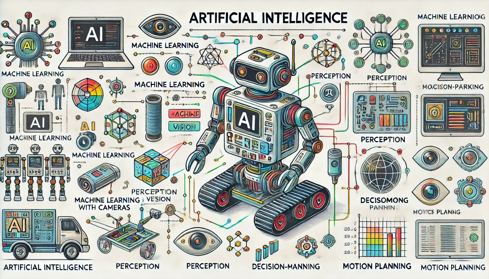

### Aula 21: Fundamentos de Inteligência Artificial e sua Aplicação em Robótica

Nesta aula, vamos explorar os **fundamentos da Inteligência Artificial (IA)** e entender como ela é aplicada em robótica para tornar os robôs mais autônomos, inteligentes e capazes de interagir com o ambiente. A IA é um campo vasto e interdisciplinar que combina aprendizado de máquina, visão computacional, processamento de linguagem natural, e muito mais, para criar sistemas que simulem a inteligência humana.

---

### 1. O que é Inteligência Artificial?

**Inteligência Artificial (IA)** é uma área da ciência da computação que busca desenvolver sistemas capazes de realizar tarefas que normalmente exigiriam inteligência humana, como reconhecimento de padrões, aprendizado com dados, tomada de decisão e até interação com humanos. Em robótica, a IA é fundamental para permitir que o robô analise seu ambiente, tome decisões e realize ações de forma autônoma.

Existem dois principais tipos de IA:
- **IA Simples (IA estreita):** Programada para realizar uma única tarefa específica, como reconhecimento de objetos ou controle de movimento.
- **IA Geral (IA forte):** Uma inteligência mais ampla e próxima da humana, capaz de aprender e realizar uma ampla gama de tarefas. Atualmente, a IA em robótica se concentra principalmente na IA estreita.

---

### 2. Aprendizado de Máquina e Robótica

**Aprendizado de Máquina (Machine Learning)** é um ramo da IA que permite que sistemas aprendam com dados e melhorem seu desempenho ao longo do tempo. Em robótica, o aprendizado de máquina é usado para ensinar robôs a reconhecer padrões, classificar objetos e otimizar suas ações.

Existem três tipos principais de aprendizado de máquina:

- **Aprendizado Supervisionado:** O robô aprende com dados rotulados, ou seja, com exemplos já classificados. Um exemplo em robótica seria treinar um robô a identificar objetos, fornecendo imagens com a classificação correta (por exemplo, "cadeira", "mesa").
- **Aprendizado Não Supervisionado:** O robô explora dados não rotulados, encontrando padrões e relacionamentos sem orientação. Esse tipo de aprendizado é usado para agrupar dados ou identificar anomalias.
- **Aprendizado por Reforço:** O robô aprende com base em recompensas e punições. Cada ação correta resulta em uma recompensa, enquanto ações erradas levam a punições. Esse aprendizado é muito usado em robôs que precisam desenvolver estratégias, como robôs de jogo ou de navegação.

---

### 3. Percepção e Sensoriamento em Robótica

A percepção é a capacidade do robô de interpretar o ambiente ao seu redor. Para isso, ele utiliza sensores e técnicas de visão computacional.

- **Visão Computacional:** Permite que o robô "veja" usando câmeras e identifique objetos, formas, cores e até movimento. A visão computacional é usada em robôs de inspeção e em robôs que interagem com humanos.
- **Processamento de Sinais de Sensores:** Inclui a interpretação de dados de sensores, como sensores de distância, sensores de toque e sensores de temperatura, para que o robô possa reagir ao ambiente de forma adequada.

Essas técnicas de percepção ajudam o robô a entender e adaptar suas ações conforme o ambiente muda.

---

### 4. Planejamento e Tomada de Decisão

A **IA de Planejamento** é usada para que o robô possa determinar as etapas necessárias para realizar uma tarefa específica. Esse tipo de IA é fundamental em robôs autônomos, que precisam decidir, por exemplo, como chegar a um destino sem intervenção humana.

Exemplos de planejamento incluem:
- **Planejamento de Rotas:** Usado em robôs móveis para determinar a melhor trajetória para evitar obstáculos e chegar a um destino.
- **Tomada de Decisão:** A IA permite que o robô tome decisões, como escolher qual objeto pegar, onde posicionar um item ou quando parar.

A tomada de decisão em robótica utiliza algoritmos de busca e otimização que ajudam o robô a escolher a melhor ação entre várias alternativas.

---

### 5. Aplicações de IA em Robótica

A IA está transformando o campo da robótica em várias áreas, como:

- **Robôs Industriais:** Equipados com IA, esses robôs podem ajustar sua atuação conforme a complexidade das tarefas. Por exemplo, eles podem identificar e selecionar peças em uma linha de produção.
- **Robôs de Assistência:** Robôs usados em ambientes domésticos ou de saúde. Com IA, eles podem ajudar idosos e pessoas com deficiência, realizar tarefas domésticas ou até responder a comandos de voz.
- **Robôs Autônomos:** Robôs que se movem de forma independente, como carros autônomos e drones. Eles utilizam IA para detectar o ambiente, evitar obstáculos e planejar suas rotas.
- **Robôs de Inspeção e Segurança:** Usados para monitorar áreas de difícil acesso ou perigosas, esses robôs usam IA para identificar mudanças e emitir alertas.

---

### 6. Desafios da IA em Robótica

Apesar dos avanços, há muitos desafios na implementação de IA em robótica, como:
- **Processamento em Tempo Real:** A IA deve processar dados rapidamente para que o robô reaja em tempo real.
- **Precisão e Confiabilidade:** A IA deve ser precisa, especialmente em robôs de saúde e segurança, onde erros podem ter consequências graves.
- **Limitação de Dados:** Treinar um robô com IA pode exigir muitos dados, e nem sempre esses dados estão disponíveis ou são fáceis de coletar.

---

### Exercícios de Fixação

1. **Qual é o principal objetivo da Inteligência Artificial em robótica?**
   - A) Fazer com que o robô funcione sem bateria
   - B) Permitir que o robô realize tarefas com autonomia
   - C) Melhorar a aparência do robô
   - D) Aumentar o peso do robô

2. **Qual tipo de aprendizado é usado quando o robô aprende com recompensas e punições?**
   - A) Aprendizado supervisionado
   - B) Aprendizado não supervisionado
   - C) Aprendizado por reforço
   - D) Aprendizado genético

3. **Em qual aplicação o aprendizado de máquina é comumente usado em robôs?**
   - A) Pintura automática
   - B) Reconhecimento de padrões e otimização de ações
   - C) Redução de peso do robô
   - D) Carga de baterias

4. **O que é visão computacional?**
   - A) Tecnologia que permite ao robô “ver” o ambiente ao seu redor e identificar objetos
   - B) Tecnologia para mover o robô em alta velocidade
   - C) Sistema para carregar o robô automaticamente
   - D) Método de controle da temperatura do robô

5. **O que é planejamento de rotas em robótica?**
   - A) Método para medir o peso do robô
   - B) Técnica para determinar a melhor trajetória para o robô evitar obstáculos e chegar ao destino
   - C) Processo de montar o robô
   - D) Método para reduzir o consumo de bateria

6. **Qual é a função dos sensores de um robô em IA?**
   - A) Interpretar o ambiente e fornecer informações para o robô
   - B) Carregar o robô enquanto ele se move
   - C) Melhorar a aparência do robô
   - D) Limpar o robô automaticamente

7. **Qual tipo de robô utiliza IA para realizar inspeções em áreas perigosas?**
   - A) Robô de pintura
   - B) Robô doméstico
   - C) Robô de inspeção e segurança
   - D) Robô de entretenimento

8. **Um robô que toma decisões como "pegar ou não um objeto" está usando:**
   - A) Aprendizado de Máquina
   - B) Tomada de Decisão e Planejamento
   - C) Sensor de temperatura
   - D) Carregador automático

9. **Qual o maior desafio para a IA em robótica em ambientes de saúde?**
   - A) Reduzir o tamanho do robô
   - B) Processamento em tempo real e precisão
   - C) Pintura do robô
   - D) Aumentar o peso do robô

10. **Qual das alternativas é uma aplicação de IA em robôs autônomos?**
    - A) Controle de temperatura
    - B) Planejamento de rotas e detecção de obstáculos
    - C) Limpeza do ambiente
    - D) Melhorar a aparência do robô

Esses exercícios ajudarão a reforçar o conhecimento sobre IA em robótica e sua aplicação em tarefas autônomas e de tomada de decisão. Boa sorte!