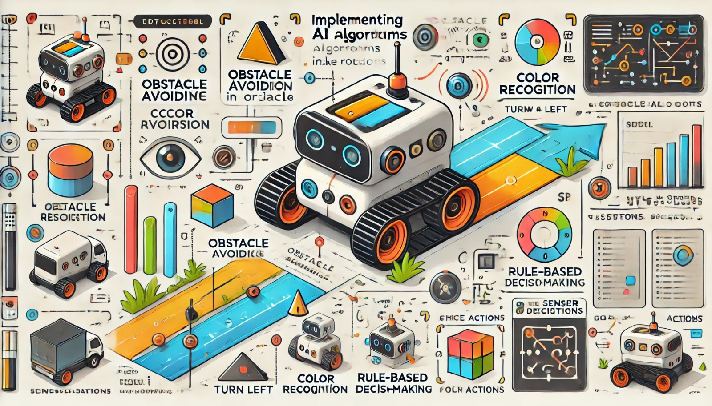

### Aula 23: Implementação de Algoritmos Simples de IA em Robôs

Hoje, vamos ver como a Inteligência Artificial (IA) pode ser aplicada de forma prática em robôs usando algoritmos simples. Esses algoritmos permitem que os robôs tomem decisões com base em dados, tornando-os mais autônomos e capazes de interagir com o ambiente de maneira inteligente. Vamos explorar alguns conceitos e implementar exemplos práticos de algoritmos de IA para controle de movimento, reconhecimento de padrões e tomada de decisão.

---

### 1. Algoritmos Simples de IA e Suas Funções em Robótica

Em robótica, algoritmos de IA podem ajudar o robô a realizar tarefas como:
- **Desvio de obstáculos:** Evitar colisões com objetos usando sensores.
- **Reconhecimento de padrões simples:** Identificar cores, formas ou objetos básicos.
- **Tomada de decisão baseada em regras:** Decidir entre diferentes ações com base nas informações coletadas.

Esses algoritmos são básicos, mas essenciais para o desenvolvimento de robôs autônomos. Eles representam os primeiros passos para a criação de sistemas de IA mais complexos.

---

### 2. Algoritmos Comuns de IA para Robôs

Vamos ver três algoritmos básicos de IA que podem ser aplicados em robótica para diferentes tipos de tarefas.

#### 2.1 Algoritmo de Desvio de Obstáculos

Esse algoritmo permite que o robô detecte obstáculos e tome decisões para evitá-los. Para isso, ele utiliza **sensores de distância**, como sensores ultrassônicos ou infravermelhos.

**Como funciona:**
1. O robô lê o valor dos sensores de distância.
2. Se um obstáculo for detectado (isto é, se a distância estiver abaixo de um valor seguro), o robô gira ou muda de direção para evitá-lo.
3. Caso contrário, o robô continua seu movimento.

**Exemplo de Código em Python:**
```python
# Leitura do sensor de distância
distancia = sensor_distancia.getValue()

if distancia < 30:  # Se a distância for menor que 30 cm
    motor_esquerdo.setVelocity(-2.0)  # Gira para evitar o obstáculo
    motor_direito.setVelocity(2.0)
else:
    motor_esquerdo.setVelocity(3.0)  # Continua em frente
    motor_direito.setVelocity(3.0)
```

#### 2.2 Algoritmo de Reconhecimento de Cor Simples

Alguns robôs podem usar um sensor de cor para reconhecer padrões simples, como a cor de uma linha no chão, e seguir essa linha ou identificar objetos.

**Como funciona:**
1. O robô usa um **sensor de cor** para detectar a cor do objeto ou linha.
2. Se a cor detectada for, por exemplo, preta, o robô segue a linha preta no chão.
3. Caso contrário, ele ajusta a direção até encontrar a cor correta.

**Exemplo de Código em Python:**
```python
# Leitura do sensor de cor
cor_detectada = sensor_cor.getColor()

if cor_detectada == "preto":  # Se a cor detectada for preta
    motor_esquerdo.setVelocity(3.0)  # Continua em frente
    motor_direito.setVelocity(3.0)
else:
    motor_esquerdo.setVelocity(2.0)  # Ajusta a direção
    motor_direito.setVelocity(1.0)
```

#### 2.3 Algoritmo de Tomada de Decisão por Regras

No algoritmo de tomada de decisão, o robô decide entre várias ações com base em condições específicas. Esse tipo de lógica de regras é comum em sistemas de IA iniciais, onde o robô executa ações diferentes com base em uma série de condições.

**Como funciona:**
1. O robô verifica diferentes condições, como a leitura de sensores.
2. Ele escolhe uma ação com base nessas condições, como girar, parar, avançar ou ajustar a velocidade.

**Exemplo de Código em Python:**
```python
# Leitura dos sensores
distancia = sensor_distancia.getValue()
temperatura = sensor_temperatura.getValue()

if distancia < 20 and temperatura > 30:  # Se a distância for curta e a temperatura alta
    motor_esquerdo.setVelocity(0)  # Para o robô
    motor_direito.setVelocity(0)
elif distancia < 20:  # Se só a distância for curta
    motor_esquerdo.setVelocity(-3.0)  # Gira para desviar
    motor_direito.setVelocity(3.0)
else:
    motor_esquerdo.setVelocity(3.0)  # Continua em frente
    motor_direito.setVelocity(3.0)
```

---

### 3. Implementando os Algoritmos no Webots

No Webots, você pode implementar esses algoritmos usando um robô simples com sensores básicos. Siga esses passos para criar o projeto:

1. **Monte o Robô no Webots:** Crie um robô com sensores de distância e um sensor de cor.
2. **Escolha o Algoritmo:** Decida qual dos algoritmos quer testar (desvio de obstáculos, reconhecimento de cor, ou tomada de decisão).
3. **Insira o Código:** Abra o editor de controle no Webots e insira o código do algoritmo escolhido.
4. **Teste a Simulação:** Execute a simulação e observe como o robô reage ao ambiente.

---

### Aplicações Práticas dos Algoritmos em Robótica

1. **Robôs de Limpeza:** Usam algoritmos de desvio de obstáculos para evitar bater em móveis e paredes.
2. **Robôs de Linha de Produção:** Usam reconhecimento de cor para separar produtos por categoria ou detectar falhas.
3. **Robôs Guias:** Utilizam tomada de decisão por regras para definir trajetórias, ajustar a velocidade e parar conforme necessário.

Esses exemplos práticos mostram como algoritmos simples de IA permitem que o robô tenha um comportamento básico e adaptável.

---

### Conclusão

Nesta aula, vimos como implementar algoritmos simples de IA em robôs, utilizando sensores e controlando os motores para criar reações ao ambiente. Esses algoritmos representam os primeiros passos na criação de robôs inteligentes e autônomos. Conforme avançamos, podemos integrar mais algoritmos e aumentar a complexidade para que os robôs respondam de maneira mais avançada.

---

### Exercícios de Fixação

1. **Qual é a principal função do algoritmo de desvio de obstáculos em um robô?**
   - A) Fazer o robô reconhecer cores
   - B) Evitar colisões com objetos
   - C) Aumentar a velocidade do robô
   - D) Melhorar a aparência do robô

2. **Um sensor de cor em um robô é útil para:**
   - A) Detectar a presença de humanos
   - B) Medir a distância de objetos
   - C) Identificar cores para seguir uma linha ou detectar objetos
   - D) Ajustar a velocidade do robô automaticamente

3. **No algoritmo de tomada de decisão por regras, o robô:**
   - A) Ajusta a cor de suas partes
   - B) Escolhe entre várias ações com base em condições específicas
   - C) Sempre segue uma linha reta
   - D) Fica parado até receber comandos externos

4. **Qual dos seguintes algoritmos permite que um robô siga uma linha preta?**
   - A) Tomada de decisão por regras
   - B) Reconhecimento de cor
   - C) Desvio de obstáculos
   - D) Otimização de rota

5. **Em qual situação o robô usaria a lógica de "Se... então..."?**
   - A) Em um ambiente totalmente aberto sem obstáculos
   - B) Ao seguir um caminho sem variação de direção
   - C) Quando precisa decidir o que fazer com base nas leituras dos sensores
   - D) Somente quando precisa desligar-se

6. **Qual é o principal objetivo do aprendizado por reforço em robótica?**
   - A) Identificar cores em objetos
   - B) Ajustar a aparência do robô
   - C) Aprender com recompensas e punições para melhorar o desempenho
   - D) Medir a distância de objetos automaticamente

7. **Em um robô que usa desvio de obstáculos, o sensor de distância ajuda a:**
   - A) Verificar a cor dos objetos
   - B) Detectar obstáculos e calcular a distância até eles
   - C) Medir a temperatura do ambiente
   - D) Controlar a velocidade sem variação

8. **Qual dos seguintes robôs utilizaria reconhecimento de cor?**
   - A) Robô de segurança
   - B) Robô de entrega em domicílio
   - C) Robô de linha de produção para separar produtos
   - D) Robô de limpeza automática

9. **Em um robô que utiliza IA para seguir uma linha no chão, qual sensor é mais adequado?**
   - A) Sensor de cor
   - B) Sensor de toque
   - C) Sensor de temperatura
   - D) Sensor de luz

10. **Um robô que toma decisões com base nas leituras de vários sensores está usando qual algoritmo?**
    - A) Desvio de obstáculos
    - B) Aprendizado supervisionado
    - C) Tomada de decisão por regras
    - D) Reconhecimento de padrões

Esses exercícios reforçam o entendimento sobre os algoritmos de IA em robótica e suas aplicações

. Boa sorte!