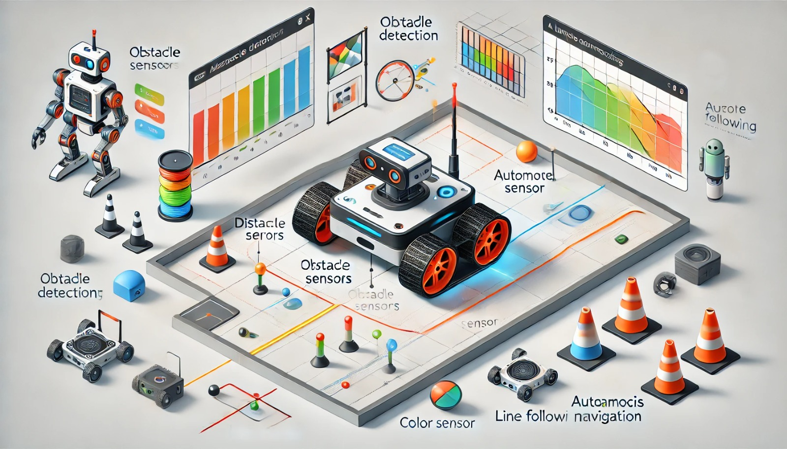

### Aula 24: Prática no Webots – Simulação de um Robô com Capacidades Autônomas Básicas

Nesta aula, vamos avançar no uso do **Webots** para simular um robô com capacidades autônomas básicas. Com o que aprendemos até agora, vamos projetar um robô que seja capaz de se mover de forma independente, detectar e desviar de obstáculos, e seguir uma linha. Esse projeto integrará os conceitos de sensores, motores e algoritmos simples de IA que foram introduzidos nas aulas anteriores.

---

### Objetivo da Aula

Simular um robô com capacidades autônomas básicas no Webots. O robô deverá:
- Navegar de forma autônoma pelo ambiente.
- Detectar e desviar de obstáculos.
- Seguir uma linha predefinida no chão.

### Passo a Passo para Criar o Robô Autônomo no Webots

#### 1. Configurando o Ambiente no Webots

1. **Abra o Webots** e crie um novo projeto.
2. **Selecione o ambiente de simulação**: Você pode escolher um cenário com obstáculos ou criar um ambiente personalizado.
3. **Adicione uma linha predefinida** no chão (geralmente uma linha preta sobre o fundo claro) para que o robô possa seguir. Isso será útil para a prática de seguir linha.

#### 2. Criando o Robô e Adicionando Componentes

**Componentes do Robô:**
- **Motores nas rodas**: Para o movimento.
- **Sensores de distância**: Para detectar obstáculos.
- **Sensor de cor**: Para seguir a linha.

1. **Adicione o robô ao ambiente**: Escolha um modelo básico, como o e-puck, e ajuste sua posição inicial no ambiente.
2. **Motores**: Configure os motores das rodas para controlar o movimento do robô.
3. **Sensores de distância**: Adicione sensores nas laterais e na frente do robô para detectar objetos próximos.
4. **Sensor de cor**: Posicione um sensor de cor na parte inferior do robô, permitindo que ele detecte a linha no chão.

#### 3. Implementando o Código de Controle no Webots

Vamos agora escrever o código para que o robô possa realizar as tarefas de navegação autônoma.

**Código de Controle em Python:**

No Webots, crie um arquivo de controle em Python para o robô e adicione o código a seguir:

```python
from controller import Robot

# Inicialização
tempo_passo = 64  # Tempo de passo em milissegundos
robot = Robot()

# Configuração dos motores
motor_esquerdo = robot.getDevice("left wheel motor")
motor_direito = robot.getDevice("right wheel motor")
motor_esquerdo.setPosition(float('inf'))  # Definindo para controle de velocidade
motor_direito.setPosition(float('inf'))
motor_esquerdo.setVelocity(0.0)
motor_direito.setVelocity(0.0)

# Configuração dos sensores de distância
sensor_frente = robot.getDevice("ps0")
sensor_esquerda = robot.getDevice("ps1")
sensor_direita = robot.getDevice("ps2")
sensor_frente.enable(tempo_passo)
sensor_esquerda.enable(tempo_passo)
sensor_direita.enable(tempo_passo)

# Configuração do sensor de cor
sensor_cor = robot.getDevice("color sensor")
sensor_cor.enable(tempo_passo)

# Função para desviar de obstáculos
def desviar_obstaculo():
    if sensor_frente.getValue() < 50:
        motor_esquerdo.setVelocity(-2.0)
        motor_direito.setVelocity(2.0)
    elif sensor_esquerda.getValue() < 50:
        motor_esquerdo.setVelocity(2.0)
        motor_direito.setVelocity(-2.0)
    elif sensor_direita.getValue() < 50:
        motor_esquerdo.setVelocity(-2.0)
        motor_direito.setVelocity(2.0)
    else:
        motor_esquerdo.setVelocity(3.0)
        motor_direito.setVelocity(3.0)

# Função para seguir linha
def seguir_linha():
    cor = sensor_cor.getValue()
    if cor == "preto":  # Quando o sensor detectar a linha preta
        motor_esquerdo.setVelocity(3.0)
        motor_direito.setVelocity(3.0)
    else:
        motor_esquerdo.setVelocity(2.0)  # Ajusta a direção
        motor_direito.setVelocity(1.0)

# Loop principal
while robot.step(tempo_passo) != -1:
    desviar_obstaculo()  # Função para desvio de obstáculos
    seguir_linha()       # Função para seguir linha
```

### Explicação do Código

1. **Configuração dos Motores**: Os motores das rodas são configurados para permitir o controle de velocidade.
2. **Desvio de Obstáculos**: A função `desviar_obstaculo()` usa os sensores de distância para verificar se há um obstáculo próximo. Se houver, o robô ajusta sua direção para evitar a colisão.
3. **Seguir Linha**: A função `seguir_linha()` usa o sensor de cor para identificar a linha preta. Quando o sensor detecta a linha, o robô continua em frente. Se o sensor não detectar a linha, ele ajusta sua direção para tentar encontrá-la novamente.

### Testando a Simulação

1. **Inicie a Simulação**: No Webots, clique em "Play" para iniciar a simulação.
2. **Observe o Comportamento do Robô**: O robô deve começar a se mover, detectando a linha preta e seguindo-a. Se houver um obstáculo, ele deve desviar e retomar o caminho.
3. **Ajuste os Parâmetros**: Experimente ajustar os valores de velocidade e sensibilidade dos sensores para melhorar o desempenho do robô.

### Dicas para Melhorar a Simulação

- **Sensibilidade dos Sensores**: Ajuste os valores de detecção dos sensores de distância para que o robô detecte obstáculos com mais precisão.
- **Aprimoramento do Seguidor de Linha**: Use algoritmos mais avançados, como PID, para que o robô siga a linha de maneira mais suave e estável.
- **Experimentação com Velocidade**: Ajuste a velocidade para ver como o robô responde em diferentes cenários.

### Expansão do Projeto

Se desejar, você pode expandir este projeto básico com outras funcionalidades:
- **Adição de um Sensor de Ultrassom**: Para detectar obstáculos em diferentes ângulos.
- **Comportamento de Ponto de Parada**: Configure o robô para parar quando alcançar um determinado ponto na linha.
- **Reconhecimento de Objetos com Câmera**: Use uma câmera para detectar formas ou cores específicas e criar reações mais complexas.

### Conclusão

Neste projeto, você implementou um robô com capacidades autônomas básicas, simulando um comportamento de desvio de obstáculos e seguindo uma linha. Essas habilidades são fundamentais para robôs móveis e ilustram como algoritmos simples de IA, combinados com sensores, permitem a navegação e a interação com o ambiente.

### Exercícios de Fixação

1. **Qual é a função dos sensores de distância no robô?**
   - A) Detectar a linha preta no chão
   - B) Medir a temperatura do ambiente
   - C) Detectar obstáculos próximos e ajudar a evitar colisões
   - D) Controlar a velocidade do robô

2. **O sensor de cor no robô é utilizado para:**
   - A) Medir a distância de objetos
   - B) Seguir uma linha específica no chão
   - C) Ajustar a altura do robô
   - D) Detectar a presença de obstáculos

3. **O que acontece quando o sensor de distância detecta um obstáculo próximo?**
   - A) O robô acelera para ultrapassar o obstáculo
   - B) O robô para completamente
   - C) O robô ajusta a direção para evitar a colisão
   - D) O robô reduz o tamanho

4. **Qual é o papel do algoritmo de "seguir linha" no robô?**
   - A) Controlar a velocidade
   - B) Manter o robô em um caminho específico
   - C) Parar o robô em situações de risco
   - D) Detectar obstáculos

5. **Em que situação o robô usa o algoritmo de desvio de obstáculos?**
   - A) Quando detecta uma linha no chão
   - B) Quando detecta um obstáculo próximo
   - C) Quando a velocidade do motor aumenta
   - D) Quando há pouca luz no ambiente

6. **No Webots, o que permite ajustar a direção do robô para desviar de obstáculos?**
   - A) Motor de cor
   - B) Função de controle do sensor de cor
   - C) Configuração do sensor de distância e ajuste da velocidade do motor
   - D) Comando de parada

7. **O que acontece se o sensor de cor não encontrar a linha preta?**
   - A) O robô para imediatamente
   - B) O robô continua em linha reta
   - C) O robô ajusta a direção até encontrar a linha novamente
   - D) O robô aumenta a velocidade

8. **Qual ferramenta no

 Webots é usada para programar o robô?**
   - A) Simulador de distância
   - B) Editor de controle
   - C) Motor de simulação
   - D) Configurador de cores

9. **O que representa o "tempo de passo" no Webots?**
   - A) A velocidade máxima do robô
   - B) O intervalo de tempo entre cada atualização da simulação
   - C) A cor do sensor de linha
   - D) O tamanho dos objetos na simulação

10. **Qual é o primeiro passo para criar uma simulação no Webots?**
    - A) Adicionar sensores de distância
    - B) Criar o ambiente e adicionar o robô
    - C) Programar o código de controle
    - D) Configurar a velocidade dos motores

Esses exercícios ajudarão a consolidar o entendimento sobre a simulação de robôs autônomos básicos e as configurações no Webots.