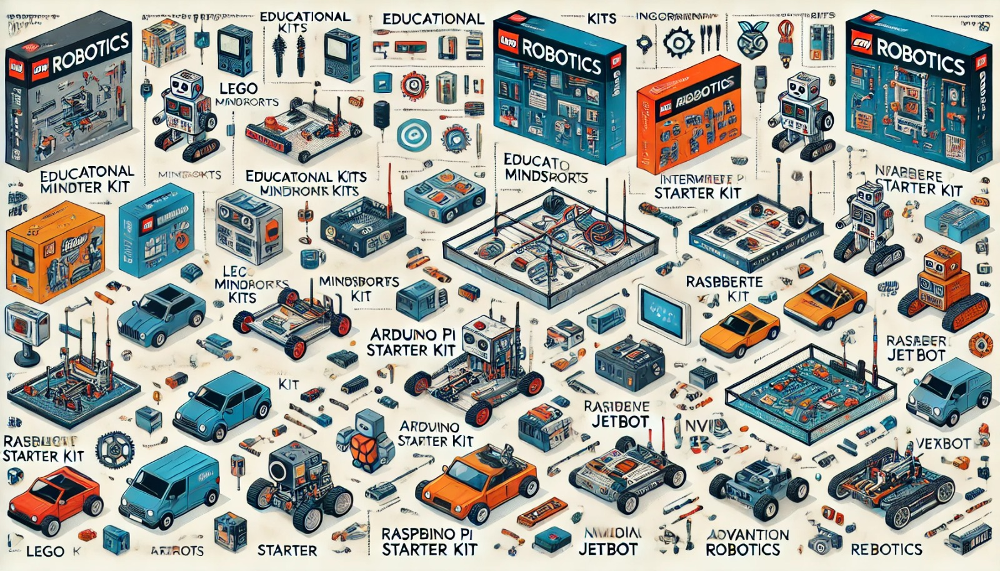

### Aula 25: Visão Geral dos Kits de Robótica Disponíveis no Mercado

Nesta aula, vamos explorar diferentes **kits de robótica** disponíveis para iniciantes e entusiastas da área. Esses kits facilitam o aprendizado de conceitos básicos e avançados de robótica, permitindo que usuários experimentem a montagem, programação e operação de robôs. Cada kit possui características específicas e pode ser voltado para diferentes níveis de habilidade e objetivos, desde a educação básica até projetos mais avançados.

---

### 1. O Que é um Kit de Robótica?

Um **kit de robótica** é um conjunto de componentes eletrônicos, mecânicos e de software que permite a construção e a programação de robôs. Os kits geralmente incluem motores, sensores, estruturas mecânicas, microcontroladores (como Arduino ou Raspberry Pi), e um guia de instruções. Eles são projetados para simplificar o processo de criação de robôs, mesmo para quem está iniciando, e são uma excelente ferramenta para o aprendizado prático.

---

### 2. Tipos de Kits de Robótica

Os kits de robótica podem ser classificados com base na complexidade, nos componentes e no público-alvo:

#### 2.1 Kits Educacionais

Esses kits são voltados para o aprendizado de robótica em ambiente escolar e geralmente têm uma montagem simples e um software amigável.

- **LEGO Mindstorms:** Um dos kits mais populares no ensino de robótica. Inclui peças LEGO, motores e sensores, além de uma interface de programação visual. Ideal para crianças e adolescentes.
- **mBot (Makeblock):** Focado em introduzir a robótica e a programação, o mBot vem com sensores, motores e uma estrutura robusta. A programação é realizada através de uma interface gráfica, como o Scratch.
- **Tinkerbots:** Com uma montagem modular, é fácil para crianças criarem robôs que se movem e respondem a comandos simples. Programação visual e suporte a comandos básicos de movimento tornam esse kit ideal para iniciantes.

#### 2.2 Kits para Projetos e Aprendizado Intermediário

Esses kits são projetados para quem já possui um conhecimento básico em eletrônica e programação e deseja explorar projetos mais desafiadores.

- **Arduino Starter Kit:** Um kit introdutório com componentes eletrônicos, como LEDs, sensores e motores, que permite criar diferentes projetos. Muito utilizado em escolas e cursos de tecnologia.
- **Raspberry Pi Robotics Kit:** Inclui uma placa Raspberry Pi, sensores e acessórios, permitindo a criação de robôs programáveis em Python. Ideal para quem quer aprender sobre programação e Internet das Coisas (IoT).
- **SparkFun Inventor's Kit:** Um kit intermediário com uma placa Arduino e vários componentes. O SparkFun é conhecido por sua documentação detalhada e tutoriais para ajudar no aprendizado de eletrônica e robótica.

#### 2.3 Kits Avançados e de Pesquisa

Para usuários avançados, esses kits oferecem uma estrutura mais complexa e são usados em pesquisa e desenvolvimento.

- **TurtleBot (ROS):** Um robô programável com suporte ao Robot Operating System (ROS). Utilizado para pesquisa, ele é capaz de realizar tarefas avançadas, como mapeamento e navegação autônoma.
- **NVIDIA JetBot:** Baseado na plataforma Jetson Nano, o JetBot é um robô avançado que pode ser programado para aprendizado de máquina e visão computacional. Usado em projetos de IA e robótica autônoma.
- **Bioloid Premium Kit:** Kit robótico modular que permite criar diferentes tipos de robôs, incluindo robôs bípedes. É programável e inclui sensores de força, câmeras e suporte para programação em C++.

#### 2.4 Kits para Competição

Esses kits são projetados para competições de robótica, onde os robôs devem realizar tarefas específicas, como seguir uma linha ou desviar de obstáculos.

- **VEX Robotics:** Projetado para competições escolares e universitárias, com peças modulares e flexíveis. O VEX é popular em competições como a VEX Robotics Competition.
- **FIRST Robotics Kit:** Desenvolvido para competições da FIRST Robotics, este kit inclui peças robustas e controladores que permitem a criação de robôs para desafios específicos.
- **Sumobot Kits:** Kits compactos para criação de robôs de sumô, projetados para competições de robôs que devem empurrar o oponente para fora de uma arena. 

---

### 3. Critérios para Escolher um Kit de Robótica

Ao escolher um kit de robótica, é importante considerar alguns critérios:

- **Nível de Experiência:** Kits educacionais e modulares são indicados para iniciantes, enquanto kits avançados e com suporte a programação em Python e C++ são mais adequados para usuários intermediários e avançados.
- **Objetivo do Projeto:** Se você deseja aprender programação, kits como o Arduino Starter Kit são boas opções. Para pesquisa em robótica, o TurtleBot e o JetBot são mais indicados.
- **Orçamento:** Os preços variam muito. Kits básicos, como mBot e LEGO, são mais acessíveis. Já os kits avançados, como o NVIDIA JetBot, são mais caros.
- **Comunidade e Suporte:** Kits com documentação, tutoriais e uma comunidade ativa (como Arduino e Raspberry Pi) tornam o aprendizado mais acessível.

---

### 4. Exemplos de Aplicações de Kits de Robótica

1. **Ensino e Aprendizagem**: Kits como o LEGO Mindstorms e o Arduino Starter Kit são amplamente utilizados em escolas e cursos de robótica para introduzir alunos ao mundo da programação e eletrônica.
2. **Competição**: Kits como o VEX e FIRST Robotics são usados em competições, desenvolvendo habilidades de resolução de problemas e trabalho em equipe.
3. **Pesquisa e Desenvolvimento**: Kits como o TurtleBot e NVIDIA JetBot são ideais para pesquisa acadêmica e desenvolvimento de robôs autônomos e inteligentes.
4. **Projetos de IA e Visão Computacional**: Kits avançados como o JetBot permitem a implementação de algoritmos de visão computacional e aprendizado de máquina, essenciais para robôs que precisam detectar objetos e tomar decisões complexas.

---

### Conclusão

Existem muitos kits de robótica disponíveis no mercado, cada um com características e finalidades distintas. Escolher o kit certo depende do seu nível de experiência, orçamento e objetivo. Independentemente do kit escolhido, todos eles oferecem uma excelente oportunidade para aprender, experimentar e desenvolver habilidades práticas em robótica.

---

### Exercícios de Fixação

1. **Qual kit de robótica é mais indicado para crianças iniciantes na robótica?**
   - A) Arduino Starter Kit
   - B) LEGO Mindstorms
   - C) NVIDIA JetBot
   - D) TurtleBot

2. **O kit de robótica mBot é popular por:**
   - A) Suporte para IA avançada
   - B) Suas peças de metal resistentes
   - C) Ter uma interface de programação visual amigável
   - D) Focar em robôs autônomos para pesquisa

3. **Qual dos seguintes kits é mais indicado para projetos de pesquisa em robótica?**
   - A) Tinkerbots
   - B) TurtleBot
   - C) mBot
   - D) VEX Robotics

4. **Qual kit de robótica é ideal para aprendizado de eletrônica e possui uma comunidade ativa?**
   - A) LEGO Mindstorms
   - B) Raspberry Pi Robotics Kit
   - C) VEX Robotics
   - D) SparkFun Inventor's Kit

5. **Os kits de robótica Sumobot são projetados para:**
   - A) Competições de robôs de sumô
   - B) Simulações de IA
   - C) Controle de robôs com IA
   - D) Criação de robôs bípedes

6. **Qual dos seguintes kits usa a plataforma Jetson Nano e é ideal para aprendizado de visão computacional?**
   - A) TurtleBot
   - B) NVIDIA JetBot
   - C) Bioloid Premium Kit
   - D) mBot

7. **Qual kit é conhecido pela flexibilidade e uso em competições educacionais?**
   - A) VEX Robotics
   - B) Arduino Starter Kit
   - C) Tinkerbots
   - D) SparkFun Inventor's Kit

8. **O Arduino Starter Kit é uma boa opção para quem quer aprender:**
   - A) IA avançada
   - B) Programação em blocos
   - C) Eletrônica e programação básica
   - D) Robótica bípede

9. **Qual critério é importante ao escolher um kit de robótica?**
   - A) Apenas o preço
   - B) A quantidade de peças
   - C) O nível de experiência e objetivo do projeto
   - D) O tamanho dos componentes

10. **Kits como o TurtleBot e o JetBot são voltados para:**
    - A) Crianças pequenas
    - B) Competições de robótica
    - C) Pesquisa e desenvolvimento em robótica autônoma
    - D) Montagem de estruturas básicas

Esses exercícios ajudam a consolidar o entendimento sobre os diferentes kits de robótica disponíveis e suas aplicações práticas.