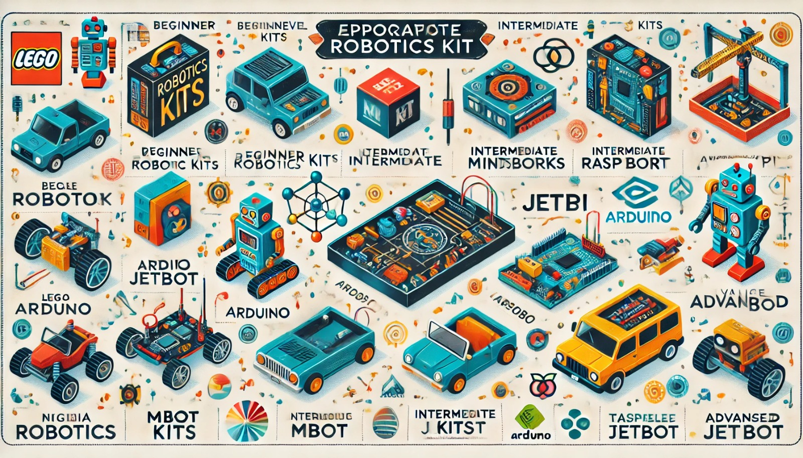

### Aula 26: Seleção e Utilização de um Kit de Robótica Adequado para Projetos

Nesta aula, vamos abordar como selecionar o kit de robótica mais adequado para um projeto específico, considerando fatores como o nível de conhecimento, os objetivos do projeto e o tipo de robô que queremos construir. Também vamos discutir o que esperar de cada tipo de kit e como utilizá-lo para maximizar o aprendizado e a experiência prática.

---

### 1. Por Que a Escolha do Kit É Importante?

Escolher o kit de robótica certo é essencial para garantir que ele atenda às necessidades do projeto e proporcione uma experiência de aprendizado adequada. A escolha de um kit impacta diretamente:
- **A complexidade do projeto**: Um kit mais simples pode ser ideal para iniciantes, enquanto kits avançados permitem explorar conceitos mais profundos, como IA e controle autônomo.
- **Os tipos de sensores e atuadores disponíveis**: A presença de sensores de distância, motores e câmeras influencia as capacidades do robô.
- **A compatibilidade com outras ferramentas**: Alguns kits funcionam melhor em simulação, enquanto outros exigem programação em uma IDE específica.

---

### 2. Critérios para Escolher um Kit de Robótica

#### 2.1 Objetivo do Projeto

Definir o objetivo do projeto ajuda a restringir as opções de kits. Pergunte-se:
- O projeto é educacional, focado em aprender conceitos básicos?
- O robô precisa ser autônomo e navegar no ambiente?
- Será um projeto focado em sensores e controle básico, ou incluirá aprendizado de máquina e visão computacional?

#### 2.2 Nível de Conhecimento e Experiência

O nível de experiência do usuário também é um fator importante:
- **Iniciantes**: Kits que utilizam programação visual, como LEGO Mindstorms ou mBot, são indicados para quem está começando.
- **Intermediários**: Kits como Arduino e Raspberry Pi são ótimos para quem já possui algum conhecimento em programação e eletrônica.
- **Avançados**: Kits como o NVIDIA JetBot ou TurtleBot permitem a criação de projetos de robótica mais complexos, ideais para pesquisa e desenvolvimento.

#### 2.3 Orçamento

Os preços dos kits variam bastante:
- Kits educacionais e para iniciantes geralmente têm preços acessíveis.
- Kits avançados, como o JetBot, possuem um custo mais alto, devido à tecnologia e aos recursos que oferecem.

#### 2.4 Compatibilidade com Simulação

Para quem quer simular projetos antes de construir fisicamente, considerar a compatibilidade com simuladores como Webots ou Tinkercad é fundamental:
- **Tinkercad**: Excelente para simulação de Arduino e circuitos simples.
- **Webots**: Mais indicado para simulação de robôs móveis e autônomos com capacidades avançadas.

---

### 3. Tipos de Kits de Robótica e Como Utilizá-los

#### 3.1 Kits Educacionais para Iniciantes

- **LEGO Mindstorms**: Ideal para iniciantes, com peças modulares, sensores básicos e uma interface de programação visual.
   - **Utilização**: Permite que iniciantes construam robôs básicos e programem comportamentos simples. A montagem modular facilita a experimentação.

- **mBot (Makeblock)**: Um robô simples com sensores de linha, distância e LED.
   - **Utilização**: Indicado para criar projetos de robôs que seguem linha e desviam de obstáculos. A programação é feita em Scratch, facilitando o aprendizado.

#### 3.2 Kits de Nível Intermediário

- **Arduino Starter Kit**: Inclui sensores, LEDs, motores e uma placa Arduino. Ideal para projetos de controle e automação.
   - **Utilização**: Perfeito para quem deseja aprender eletrônica e programação básica, criando projetos de controle de sensores e atuadores. Pode ser simulado no Tinkercad.

- **Raspberry Pi Robotics Kit**: Permite o uso do Raspberry Pi como controlador principal e tem suporte para Python.
   - **Utilização**: Ideal para projetos que envolvem IoT e integração com a internet. Excelente para quem quer explorar a robótica e o processamento de dados.

#### 3.3 Kits Avançados para Pesquisa e Desenvolvimento

- **NVIDIA JetBot**: Baseado na plataforma Jetson Nano, permite aplicações avançadas de IA, como reconhecimento de objetos e navegação autônoma.
   - **Utilização**: Indicado para projetos de visão computacional e aprendizado de máquina. É adequado para alunos avançados e projetos de pesquisa.

- **TurtleBot**: Compatível com ROS (Robot Operating System), um sistema popular em robótica.
   - **Utilização**: Ideal para projetos que envolvem mapeamento, navegação e controle autônomo. Muito utilizado em pesquisas acadêmicas e desenvolvimento de robôs autônomos.

---

### 4. Como Utilizar o Kit Escolhido

Após escolher o kit de robótica adequado, o próximo passo é aprender a usá-lo de forma eficaz.

#### Passos Básicos para Utilização de Qualquer Kit:

1. **Estudo do Manual e da Documentação**: Ler o manual e a documentação do kit é essencial para entender as funcionalidades dos componentes.
2. **Montagem Física**: Siga os tutoriais para montar o robô ou o circuito. Muitos kits oferecem instruções detalhadas.
3. **Programação do Robô**: Escolha uma linguagem compatível (como Scratch, Python ou C++) e programe os primeiros comandos.
4. **Teste e Depuração**: Teste o projeto e ajuste a programação conforme necessário. Verifique conexões e a resposta dos sensores.

#### Exemplos Práticos de Utilização

- **Com Arduino**: Construa um robô seguidor de linha, programando o Arduino para ler sensores de cor e ajustar a direção.
- **Com Webots**: Simule um robô que evita obstáculos usando sensores de distância e controle de movimento em Python.
- **Com Raspberry Pi**: Programe o robô para capturar imagens e enviar os dados para um servidor, integrando IoT ao projeto.

---

### Conclusão

Escolher o kit de robótica correto faz toda a diferença no sucesso do projeto. Considerando o objetivo, o nível de conhecimento e a compatibilidade com simulação, você pode selecionar um kit que permitirá aplicar e aprimorar seus conhecimentos em robótica. A prática com o kit escolhido não apenas aumenta a habilidade prática, mas também fornece uma base sólida para projetos mais avançados no futuro.

---

### Exercícios de Fixação

1. **Qual critério é essencial ao selecionar um kit de robótica?**
   - A) O tamanho das peças
   - B) O nível de conhecimento do usuário
   - C) A quantidade de sensores
   - D) A cor do kit

2. **O kit LEGO Mindstorms é mais indicado para:**
   - A) Usuários avançados que querem trabalhar com IA
   - B) Iniciantes que querem aprender conceitos básicos de robótica
   - C) Projetos de visão computacional
   - D) Pesquisas acadêmicas avançadas

3. **Para um projeto de robótica com controle de sensores e IoT, qual kit é mais indicado?**
   - A) mBot
   - B) Raspberry Pi Robotics Kit
   - C) TurtleBot
   - D) Arduino Starter Kit

4. **Qual kit é adequado para simulação de projetos em visão computacional e aprendizado de máquina?**
   - A) VEX Robotics
   - B) NVIDIA JetBot
   - C) Tinkerbots
   - D) mBot

5. **Para projetos de linha de produção em robótica educacional, o kit mais indicado seria:**
   - A) Arduino Starter Kit
   - B) Tinkerbots
   - C) LEGO Mindstorms
   - D) TurtleBot

6. **Qual dos seguintes kits é mais indicado para criação de um robô seguidor de linha simples?**
   - A) NVIDIA JetBot
   - B) TurtleBot
   - C) mBot
   - D) Raspberry Pi

7. **Para quem deseja programar um robô autônomo avançado com mapeamento e navegação, o kit mais indicado é:**
   - A) VEX Robotics
   - B) Tinkerbots
   - C) TurtleBot
   - D) mBot

8. **A plataforma Webots é mais adequada para simular projetos de:**
   - A) Circuitos básicos com Arduino
   - B) Robôs autônomos com sensores e navegação
   - C) Competição de robôs de sumô
   - D) Eletrônica avançada

9. **Qual dos seguintes kits permite a simulação de circuitos simples e é ideal para iniciantes?**
   - A) Tinkercad com Arduino
   - B) Webots com Raspberry Pi
   - C) TurtleBot com Jetson Nano
   - D) SparkFun Inventor's Kit

10. **Qual kit de robótica é amplamente utilizado em pesquisas acadêmicas para mapeamento e controle autônomo?**
    - A) LEGO Mindstorms
    - B) Arduino Starter Kit
    - C) TurtleBot
    - D) VEX Robotics

Esses exercícios reforçam os conceitos sobre a seleção e utilização de kits de robótica, ajudando a consolidar as opções mais adequadas para cada tipo de projeto.