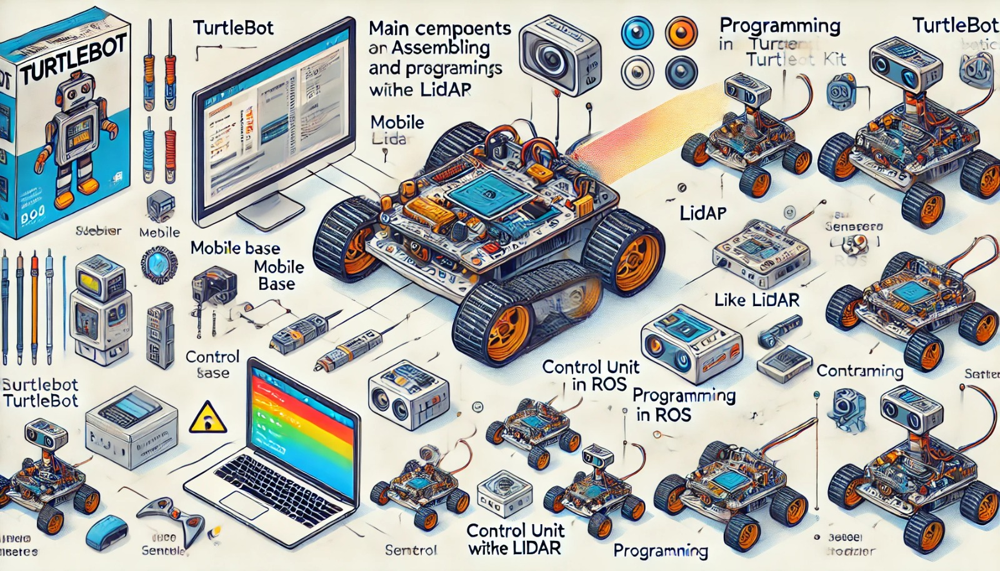

### Aula 27: Montagem e Programação de Robôs Usando o Kit TurtleBot

Na aula de hoje, vamos nos concentrar no **TurtleBot**, um dos kits de robótica mais populares para pesquisa e desenvolvimento em robótica móvel. O TurtleBot é amplamente utilizado em projetos que envolvem navegação autônoma, mapeamento e interação com o ambiente, além de ser compatível com o **Robot Operating System (ROS)** e o **simulador Webots**, o que facilita a simulação de projetos antes da implementação física.

---

### 1. O Que é o TurtleBot?

O **TurtleBot** é um kit de robótica desenvolvido para permitir que usuários explorem conceitos avançados de robótica de maneira prática. Ele foi projetado para suportar projetos de navegação autônoma e mapeamento de ambientes, sendo amplamente utilizado em pesquisas, competições e educação.

**Principais características do TurtleBot:**
- **Compatibilidade com ROS:** Permite programar e controlar o TurtleBot usando o ROS, uma plataforma amplamente utilizada para programação de robôs autônomos.
- **Sensores Integrados:** Inclui sensores de distância, sensores de toque e, em alguns modelos, câmeras RGBD (para visão de profundidade).
- **Compatibilidade com Simuladores:** O TurtleBot é compatível com o Webots e outros simuladores, permitindo que os usuários testem o código em um ambiente virtual antes de implementá-lo fisicamente.

---

### 2. Componentes do TurtleBot

O TurtleBot possui diversos componentes que facilitam a programação e a interação com o ambiente. Os principais incluem:

- **Base Móvel:** Responsável pelo movimento do robô e equipada com rodas controladas por motores DC. Ela permite ao TurtleBot realizar movimentos em diferentes direções e alcançar velocidade ajustável.
- **Sensores de Distância (Lidar):** Utilizados para detectar obstáculos e medir distâncias ao redor do robô. Esses sensores são essenciais para a navegação autônoma e o mapeamento de ambientes.
- **Câmera RGBD (opcional em alguns modelos):** Permite ao robô capturar imagens em profundidade e reconhecer objetos, útil em projetos de visão computacional.
- **Controlador ROS:** O TurtleBot é projetado para ser controlado pelo ROS, o que facilita a programação de tarefas autônomas complexas.

---

### 3. Configuração e Montagem do TurtleBot

Para começar a utilizar o TurtleBot, siga estes passos básicos de configuração e montagem:

#### Passo 1: Montagem Física

1. **Monte a base móvel**: Conecte as rodas e o sistema de tração à base do TurtleBot.
2. **Instale a bateria**: Conecte a bateria na base móvel. Verifique que ela esteja carregada para permitir o funcionamento dos motores e dos sensores.
3. **Fixe os sensores**: Se o modelo tiver um sensor Lidar ou câmera, fixe-os em suas posições corretas para uma leitura precisa do ambiente.
4. **Instale o controlador**: Conecte o microcontrolador com o ROS pré-instalado ao TurtleBot.

#### Passo 2: Configuração de Software

1. **Instale o ROS**: Se ainda não estiver instalado, baixe e configure o ROS no computador que irá controlar o TurtleBot.
2. **Conecte o TurtleBot ao Computador**: Utilize uma conexão Wi-Fi ou cabo USB para comunicar o TurtleBot com o ROS.
3. **Teste os Sensores e Motores**: Execute comandos básicos para testar o funcionamento dos sensores e motores, garantindo que tudo esteja configurado corretamente.

---

### 4. Programação do TurtleBot com ROS

Agora que o TurtleBot está configurado, vamos aprender a programar algumas funcionalidades básicas com o ROS.

#### Movimentação Básica

Para controlar o movimento do TurtleBot, você pode enviar comandos de velocidade e direção através do ROS. Vamos criar um programa simples para mover o TurtleBot para frente, girar e parar.

**Exemplo de Código em Python:**
```python
import rospy
from geometry_msgs.msg import Twist

# Inicialização do nó no ROS
rospy.init_node('turtlebot_control')

# Definir o publicador para enviar comandos de velocidade
velocidade_pub = rospy.Publisher('/cmd_vel', Twist, queue_size=10)
velocidade = Twist()

# Função para mover o robô para frente
def mover_frente():
    velocidade.linear.x = 0.2  # Velocidade para frente
    velocidade.angular.z = 0.0  # Sem rotação
    velocidade_pub.publish(velocidade)

# Função para girar o robô
def girar():
    velocidade.linear.x = 0.0
    velocidade.angular.z = 0.5  # Gira em torno do próprio eixo
    velocidade_pub.publish(velocidade)

# Função para parar o robô
def parar():
    velocidade.linear.x = 0.0
    velocidade.angular.z = 0.0
    velocidade_pub.publish(velocidade)

# Loop principal
while not rospy.is_shutdown():
    mover_frente()
    rospy.sleep(2)
    girar()
    rospy.sleep(1)
    parar()
    rospy.sleep(1)
```

#### Desvio de Obstáculos com Lidar

Podemos programar o TurtleBot para detectar obstáculos à frente e desviar deles usando o sensor Lidar.

**Exemplo de Código para Desvio de Obstáculos:**
```python
import rospy
from sensor_msgs.msg import LaserScan
from geometry_msgs.msg import Twist

# Inicialização do nó no ROS
rospy.init_node('turtlebot_obstaculo')

# Definir o publicador para comandos de movimento
velocidade_pub = rospy.Publisher('/cmd_vel', Twist, queue_size=10)
velocidade = Twist()

# Função para lidar com leituras do sensor Lidar
def lidar_callback(data):
    # Distância mínima à frente
    distancia_frente = min(min(data.ranges[0:20]), min(data.ranges[340:360]))

    # Se a distância for menor que 0.5, o robô gira
    if distancia_frente < 0.5:
        velocidade.linear.x = 0.0
        velocidade.angular.z = 0.5
    else:
        velocidade.linear.x = 0.2
        velocidade.angular.z = 0.0
    velocidade_pub.publish(velocidade)

# Assinar o tópico do Lidar e definir a função de callback
rospy.Subscriber('/scan', LaserScan, lidar_callback)

# Loop principal
rospy.spin()
```

Esse código lê a distância dos objetos à frente e faz o TurtleBot girar caso encontre um obstáculo muito próximo.

---

### 5. Teste do TurtleBot no Simulador Webots

Para testar o TurtleBot no **Webots**, siga esses passos:

1. **Crie o ambiente de simulação no Webots**: Adicione o modelo do TurtleBot ao ambiente.
2. **Carregue o Código no ROS**: Execute o código Python com o ROS no computador e conecte-o ao Webots.
3. **Inicie a Simulação**: Teste os comandos de movimento e desvio de obstáculos no Webots para verificar se o TurtleBot está reagindo corretamente.

A simulação permite ajustar a programação antes de transferir o código para o TurtleBot físico.

---

### Conclusão

O TurtleBot é um kit poderoso e versátil para explorar robótica autônoma, especialmente em ambientes controlados ou de pesquisa. Com ele, é possível implementar diversas funcionalidades usando ROS, realizar simulações realistas no Webots e trabalhar com mapeamento, navegação e visão computacional.

---

### Exercícios de Fixação

1. **Qual sistema operacional de robótica é usado para programar o TurtleBot?**
   - A) Windows OS
   - B) ROS (Robot Operating System)
   - C) Linux Kernel
   - D) Android OS

2. **Qual sensor é usado no TurtleBot para detecção de obstáculos?**
   - A) Sensor de temperatura
   - B) Sensor de toque
   - C) Sensor Lidar
   - D) Sensor de som

3. **O que faz o código de movimento básico no TurtleBot?**
   - A) Aciona uma sirene de segurança
   - B) Envia comandos para as rodas do robô, controlando direção e velocidade
   - C) Permite o TurtleBot detectar objetos coloridos
   - D) Gera um mapa do ambiente ao redor

4. **Para que serve o simulador Webots no uso com o TurtleBot?**
   - A) Realizar medições de energia
   - B) Testar a programação do robô em um ambiente virtual
   - C) Controlar a velocidade máxima do robô
   - D) Configurar os sensores do TurtleBot fisicamente

5. **Qual linguagem de programação é geralmente utilizada para programar o TurtleBot no ROS?**
   - A) Java
   - B) JavaScript
   - C) Python
   - D) HTML

Esses exercícios ajudam a consolidar o conhecimento sobre o uso do TurtleBot para programação e simulação de robôs autônomos com ROS e Webots.