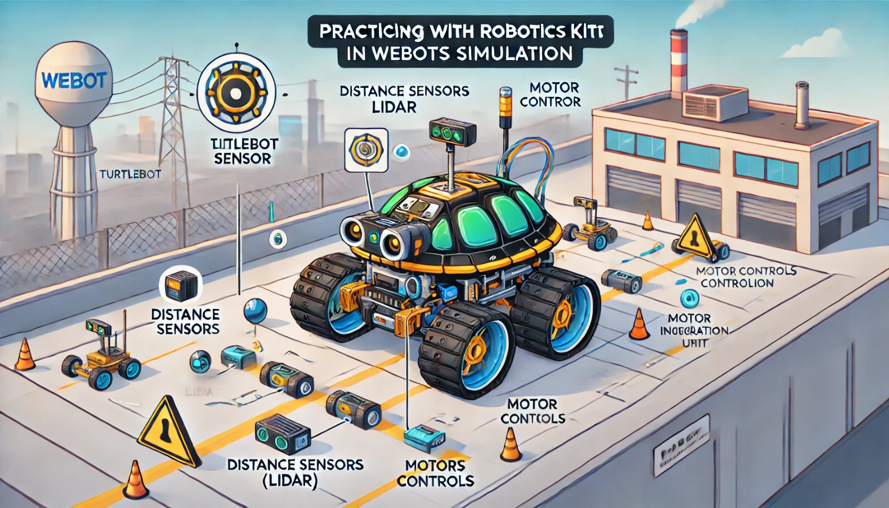

### Aula 28: Prática no Webots – Simulação com Kits de Robótica

Hoje, vamos aplicar nossos conhecimentos na prática usando o **Webots** para simular um robô TurtleBot com funcionalidades autônomas. O objetivo desta aula é consolidar conceitos de montagem, programação e navegação autônoma por meio da simulação de um projeto completo no Webots, replicando o que o TurtleBot faria em um ambiente físico.

---

### 1. Objetivo da Simulação com o Webots

O Webots é uma poderosa plataforma de simulação para robótica, permitindo que testemos código e comportamento do robô em um ambiente virtual antes de implementá-lo fisicamente. Com o Webots, podemos simular movimentos, detectar obstáculos, seguir trajetórias e muito mais, tudo com a física realista do ambiente.

---

### 2. Configurando o Ambiente de Simulação no Webots

#### Passo 1: Iniciando um Projeto

1. **Abra o Webots** e selecione “New Project Directory” para criar um novo projeto.
2. **Escolha o ambiente**: No Webots, podemos selecionar um ambiente pré-definido ou criar um ambiente personalizado com obstáculos, linhas e diferentes áreas de simulação.
3. **Adicione o TurtleBot ao ambiente**: No catálogo de robôs do Webots, selecione o modelo de TurtleBot e posicione-o no ambiente de simulação.

#### Passo 2: Configuração do TurtleBot

1. **Sensores de Obstáculos (Lidar)**: Verifique se o TurtleBot tem o sensor Lidar habilitado para detectar obstáculos e medir a distância ao redor.
2. **Câmera (opcional)**: Se o projeto incluir visão computacional, configure a câmera RGBD do TurtleBot para detectar e capturar imagens.
3. **Motores nas Rodas**: Configure as rodas para permitir o controle de movimento no ambiente simulado.

---

### 3. Programando o TurtleBot no Webots

No Webots, o TurtleBot pode ser programado usando **Python** com integração ao **ROS** para controlar a navegação, desvio de obstáculos e ações específicas no ambiente. Vamos começar com dois exemplos práticos: movimentação básica e desvio de obstáculos.

#### Exemplo 1: Movimentação Básica

Vamos programar o TurtleBot para mover-se para frente, girar e parar após um intervalo de tempo.

**Código em Python:**
```python
import rospy
from geometry_msgs.msg import Twist

# Inicializando o nó no ROS
rospy.init_node('turtlebot_simulacao_movimento')

# Definir o publicador para comandos de movimento
velocidade_pub = rospy.Publisher('/cmd_vel', Twist, queue_size=10)
velocidade = Twist()

# Função para mover o TurtleBot para frente
def mover_frente():
    velocidade.linear.x = 0.2  # Velocidade linear para frente
    velocidade.angular.z = 0.0  # Sem rotação
    velocidade_pub.publish(velocidade)

# Função para girar o TurtleBot
def girar():
    velocidade.linear.x = 0.0
    velocidade.angular.z = 0.5  # Gira em torno do próprio eixo
    velocidade_pub.publish(velocidade)

# Função para parar o TurtleBot
def parar():
    velocidade.linear.x = 0.0
    velocidade.angular.z = 0.0
    velocidade_pub.publish(velocidade)

# Loop principal para mover, girar e parar
while not rospy.is_shutdown():
    mover_frente()
    rospy.sleep(2)
    girar()
    rospy.sleep(1)
    parar()
    rospy.sleep(1)
```

#### Exemplo 2: Desvio de Obstáculos com Sensor Lidar

Aqui, vamos programar o TurtleBot para detectar e desviar de obstáculos usando o sensor Lidar. Essa função é essencial para a navegação autônoma.

**Código em Python para Desvio de Obstáculos:**
```python
import rospy
from sensor_msgs.msg import LaserScan
from geometry_msgs.msg import Twist

# Inicializando o nó no ROS
rospy.init_node('turtlebot_simulacao_obstaculos')

# Configurando o publicador de velocidade
velocidade_pub = rospy.Publisher('/cmd_vel', Twist, queue_size=10)
velocidade = Twist()

# Função para desviar de obstáculos com Lidar
def lidar_callback(data):
    distancia_frente = min(min(data.ranges[0:20]), min(data.ranges[340:360]))

    if distancia_frente < 0.5:
        velocidade.linear.x = 0.0
        velocidade.angular.z = 0.5
    else:
        velocidade.linear.x = 0.2
        velocidade.angular.z = 0.0
    velocidade_pub.publish(velocidade)

# Assinando o tópico do Lidar e executando a função de desvio
rospy.Subscriber('/scan', LaserScan, lidar_callback)

# Mantendo o programa em execução
rospy.spin()
```

Esse código monitora continuamente a distância à frente do TurtleBot, e, ao detectar um obstáculo, ele gira para evitar a colisão.

---

### 4. Testando a Simulação no Webots

1. **Inicie a Simulação**: Clique em “Play” no Webots para começar a simulação. Observe o TurtleBot enquanto ele executa o código de movimento e desvio de obstáculos.
2. **Ajuste Parâmetros**: Teste diferentes valores de velocidade e distância de detecção no código para observar como o TurtleBot reage.
3. **Analise o Comportamento**: Verifique se o TurtleBot desvia corretamente dos obstáculos e se o movimento corresponde ao código programado.

A simulação permite visualizar o comportamento do TurtleBot em um ambiente controlado, permitindo ajustes no código antes de implementá-lo em um robô físico.

---

### 5. Expandindo a Simulação

Com o Webots, podemos adicionar funcionalidades mais complexas ao TurtleBot, como:

- **Mapeamento de Ambientes (SLAM)**: Utilizando o sensor Lidar e o ROS, podemos implementar algoritmos de SLAM para que o TurtleBot crie um mapa do ambiente enquanto se move.
- **Navegação Autônoma**: Adicione objetivos e use o ROS para programar o TurtleBot para se mover de um ponto a outro, evitando obstáculos automaticamente.
- **Visão Computacional**: Com a câmera do TurtleBot, é possível realizar reconhecimento de objetos, como detectar e reagir a cores ou formas específicas no ambiente.

---

### Conclusão

Nesta aula, aprendemos a usar o Webots para simular um TurtleBot em um ambiente virtual, aplicando conceitos de movimento autônomo e desvio de obstáculos. A prática com simulação é uma excelente maneira de testar funcionalidades antes de implementá-las no robô físico, reduzindo erros e ajustando a programação com mais precisão.

### Exercícios de Fixação

1. **Qual é a principal vantagem de simular o TurtleBot no Webots antes de aplicá-lo fisicamente?**
   - A) Reduzir custos de energia
   - B) Verificar o código em um ambiente virtual e ajustar o comportamento
   - C) Aumentar a velocidade do robô
   - D) Melhorar a aparência do robô

2. **Qual sensor é utilizado no TurtleBot para desviar de obstáculos?**
   - A) Sensor de temperatura
   - B) Sensor Lidar
   - C) Sensor de pressão
   - D) Sensor de cor

3. **O código de desvio de obstáculos faz o TurtleBot:**
   - A) Acelerar para passar por objetos
   - B) Parar imediatamente ao encontrar qualquer objeto
   - C) Girar para evitar a colisão com obstáculos próximos
   - D) Seguir uma linha preta no chão

4. **Para que serve o nó `rospy.spin()` no código?**
   - A) Para encerrar a execução do programa
   - B) Para manter o programa em execução e monitorar continuamente o sensor
   - C) Para aumentar a velocidade do TurtleBot
   - D) Para configurar os motores

5. **Qual é o propósito de ajustar a variável `distancia_frente` no código de desvio de obstáculos?**
   - A) Calcular a temperatura ao redor do TurtleBot
   - B) Definir a velocidade máxima do TurtleBot
   - C) Monitorar a distância entre o TurtleBot e objetos à frente
   - D) Alterar a cor do TurtleBot

Esses exercícios ajudam a consolidar o entendimento sobre a prática de simulação com o TurtleBot no Webots, preparando o aluno para projetos mais avançados de robótica autônoma.