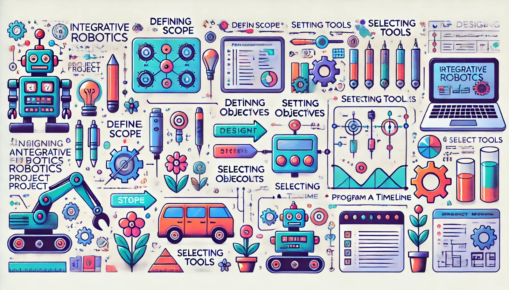

### Aula 29: Planejamento e Design de um Projeto Integrador

Nesta aula, vamos iniciar o desenvolvimento de um **Projeto Integrador**. Esse projeto será uma oportunidade para aplicar de forma prática os conhecimentos adquiridos ao longo do curso. O planejamento e o design são etapas essenciais para garantir que o projeto seja bem estruturado, com objetivos claros e alcançáveis. Vamos aprender a definir metas, escolher o escopo e organizar as etapas de desenvolvimento de forma eficiente.

---

### 1. Objetivo do Projeto Integrador

O Projeto Integrador tem como objetivo unir todos os conhecimentos trabalhados durante o curso, como montagem de robôs, programação, simulação e testes. No final, o projeto deve:
- Resolver um problema específico ou realizar uma tarefa autônoma.
- Utilizar sensores e atuadores para interação com o ambiente.
- Ser programado para navegar, tomar decisões e, se necessário, realizar ações autônomas.

**Exemplo de Projeto Integrador**: Criar um robô que navegue em um ambiente, detecte obstáculos e siga um caminho específico, como uma linha no chão ou pontos predefinidos.

---

### 2. Etapas do Planejamento do Projeto

Um bom projeto começa com um planejamento detalhado, que ajuda a organizar ideias, estabelecer metas e definir o escopo de trabalho. As principais etapas incluem:

#### 2.1 Definição do Escopo do Projeto

O escopo define o que o projeto deve alcançar e as funcionalidades que ele incluirá. Pergunte-se:
- **Qual é a principal função do robô?** (ex.: navegação autônoma, desvio de obstáculos, reconhecimento de objetos)
- **Quais habilidades e sensores serão necessários?** (ex.: Lidar para desvio de obstáculos, câmera para reconhecimento de objetos)
- **Quais serão as limitações?** (ex.: o robô funcionará apenas em ambientes fechados ou com um tempo de operação específico)

#### 2.2 Objetivos do Projeto

Definir objetivos claros e mensuráveis ajuda a garantir que o projeto será concluído com sucesso. Um objetivo deve ser específico, atingível e ter um propósito claro.

**Exemplo de Objetivos**:
- O robô deve ser capaz de navegar de forma autônoma em um ambiente simulado e físico.
- O robô deve detectar e desviar de obstáculos.
- O robô deve seguir uma linha ou rota específica dentro do ambiente.

#### 2.3 Escolha das Ferramentas e Kits

Selecione as ferramentas e kits necessários para o projeto. No caso do nosso curso, o **TurtleBot** e o **simulador Webots** serão utilizados para a maior parte do projeto. As ferramentas podem incluir:
- **Kits de robótica**: TurtleBot para simulação e testes físicos.
- **Simulador Webots**: Para testar funcionalidades antes da implementação física.
- **Plataforma de Programação (ROS)**: Para programar o robô e controlar seus movimentos e sensores.

#### 2.4 Criação de um Cronograma

Um cronograma bem estruturado permite que o projeto avance dentro do tempo disponível, dividindo as etapas de maneira prática.

**Exemplo de Cronograma para um Projeto de 4 Semanas**:
- **Semana 1**: Definição do escopo, objetivos e configuração do ambiente.
- **Semana 2**: Montagem do robô e desenvolvimento inicial do código de movimentação.
- **Semana 3**: Implementação dos sensores e ajustes de desvio de obstáculos.
- **Semana 4**: Testes finais, ajustes e apresentação do projeto.

---

### 3. Design do Projeto Integrador

O design do projeto envolve planejar a aparência e a funcionalidade do robô e definir como ele vai interagir com o ambiente.

#### 3.1 Estrutura do Robô

No TurtleBot, a estrutura do robô já está pré-definida, mas podemos adicionar componentes como:
- **Sensores de Obstáculos**: Posicionados para que o robô detecte obstáculos ao redor.
- **Sensor de Cor ou Câmera**: Para detecção de linhas ou reconhecimento de objetos.
- **Bateria e Controlador**: Certifique-se de que estão posicionados corretamente para o equilíbrio do robô.

#### 3.2 Fluxo de Comportamento do Robô

Defina as etapas que o robô deve seguir durante a operação. Um exemplo de fluxo de comportamento pode incluir:

1. **Inicialização**: O robô ativa seus sensores e se prepara para a navegação.
2. **Navegação Autônoma**: O robô começa a se mover pelo ambiente, seguindo uma linha ou caminho predefinido.
3. **Desvio de Obstáculos**: Ao detectar um obstáculo, o robô ajusta sua rota para evitar colisões.
4. **Conclusão do Percurso**: O robô chega ao destino final e para.

#### 3.3 Planejamento do Código

Antes de programar, defina a estrutura do código e as funções necessárias:
- **Função de Movimento**: Controla a velocidade e direção.
- **Função de Desvio de Obstáculos**: Lê os sensores e ajusta a direção quando necessário.
- **Função de Navegação em Linha**: Segue uma linha predefinida no chão, se aplicável.

---

### 4. Teste do Projeto no Webots

Com o design do projeto definido, comece a testar o código no simulador Webots. Use o ambiente de simulação para ajustar as funções e garantir que o robô está executando conforme esperado.

#### Passos para o Teste

1. **Simulação Inicial**: Carregue o ambiente no Webots e posicione o TurtleBot. Execute o código e observe o comportamento do robô.
2. **Ajustes Finais**: Modifique a programação conforme necessário para corrigir erros e melhorar a eficiência.
3. **Testes com Cenários Diferentes**: Adicione diferentes obstáculos e condições para ver como o robô se adapta.

#### Análise e Feedback

Revise o desempenho do robô após os testes. Tome notas sobre o que pode ser aprimorado e ajuste o código até que o robô execute suas funções com sucesso.

---

### 5. Implementação Física

Após a validação do projeto no Webots, implemente o projeto no TurtleBot físico para observar seu funcionamento no ambiente real. 

1. **Transferência do Código**: Carregue o código no TurtleBot físico usando a plataforma ROS.
2. **Teste no Ambiente Real**: Coloque o TurtleBot em um ambiente controlado e observe sua navegação, desvio de obstáculos e outras funções.
3. **Ajustes Finais**: Faça ajustes finos conforme necessário para que o robô funcione adequadamente em um ambiente real.

---

### Conclusão

O planejamento e o design do Projeto Integrador são etapas fundamentais para garantir que o robô execute todas as funcionalidades desejadas. Com um bom planejamento e testes no Webots, você pode implementar o projeto físico de maneira mais eficiente, reduzindo erros e maximizando o sucesso da operação.

### Exercícios de Fixação

1. **Qual é o primeiro passo ao planejar um projeto de robótica?**
   - A) Testar o robô no ambiente real
   - B) Definir o escopo e os objetivos do projeto
   - C) Ajustar o código para controle
   - D) Programar o robô

2. **O que define o escopo do projeto?**
   - A) Os sensores e motores disponíveis
   - B) O tempo de execução do robô
   - C) As funcionalidades e objetivos específicos que o projeto deve alcançar
   - D) A cor do robô

3. **Qual ferramenta usamos para testar o projeto antes da implementação física?**
   - A) Webots
   - B) Tinkercad
   - C) Scratch
   - D) Unity

4. **Por que é importante testar o código no simulador antes de implementá-lo fisicamente?**
   - A) Para garantir que o robô seja esteticamente agradável
   - B) Para corrigir erros e ajustar o comportamento em um ambiente controlado
   - C) Para reduzir o consumo de bateria
   - D) Para melhorar a cor do robô

5. **Qual é o objetivo de um cronograma no planejamento de um projeto de robótica?**
   - A) Determinar as cores do robô
   - B) Ajudar a organizar e dividir as etapas do projeto no tempo disponível
   - C) Aumentar a velocidade do robô
   - D) Reduzir o número de sensores utilizados

Esses exercícios ajudam a consolidar o entendimento sobre o planejamento e design do Projeto Integrador, garantindo que todas as etapas essenciais sejam contempladas antes da execução prática.