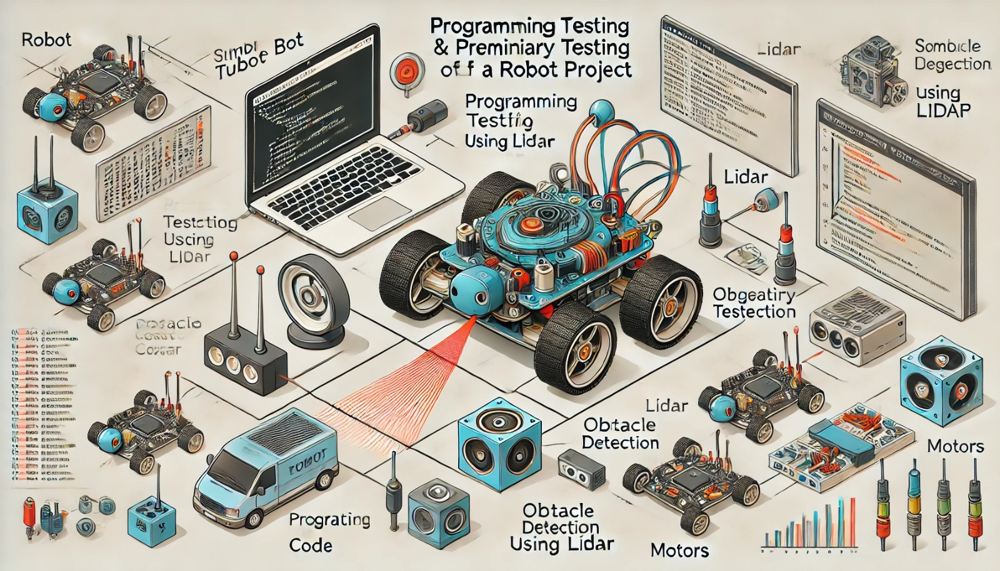

### Aula 31: Continuação do Desenvolvimento – Programação e Teste Preliminar

Na aula de hoje, vamos avançar na **programação** do robô, focando nas funcionalidades autônomas e no comportamento esperado. Após a programação inicial, realizaremos um **teste preliminar** no ambiente de simulação para verificar se cada função está operando conforme planejado. Essa etapa é crucial para identificar e corrigir erros antes de passar para testes completos.

---

### 1. Programação do Robô: Funcionalidades Essenciais

Nesta fase, a programação deve focar nas funções principais que o robô deve executar. No nosso projeto com o TurtleBot, vamos programar funcionalidades como:

1. **Movimentação Básica**: Controlar a velocidade e direção do robô.
2. **Desvio de Obstáculos**: Detectar obstáculos usando o sensor Lidar e ajustar a direção para evitá-los.
3. **Navegação em Linha ou Ponto de Controle**: Programar o robô para seguir uma linha ou alcançar pontos específicos no ambiente.
4. **Resposta a Condições do Ambiente**: Configurar o robô para reagir a diferentes condições, como mudanças no trajeto ou obstáculos inesperados.

Essas funções formam a base para o comportamento autônomo do robô e permitirão que ele interaja com o ambiente de forma inteligente.

---

### 2. Implementação das Funções no ROS

Usando o ROS, vamos programar cada uma das funções essenciais. Abaixo, seguem exemplos de código para algumas dessas funcionalidades.

#### 2.1 Movimentação Básica

Para programar o movimento do robô, podemos ajustar as velocidades linear e angular para definir a direção e a velocidade.

**Exemplo de Código em Python**:
```python
import rospy
from geometry_msgs.msg import Twist

# Inicializando o nó
rospy.init_node('turtlebot_movimento')

# Definindo o publicador para controlar a velocidade
velocidade_pub = rospy.Publisher('/cmd_vel', Twist, queue_size=10)
velocidade = Twist()

# Função para mover o robô para frente
def mover_frente():
    velocidade.linear.x = 0.2
    velocidade.angular.z = 0.0
    velocidade_pub.publish(velocidade)

# Função para parar o robô
def parar():
    velocidade.linear.x = 0.0
    velocidade.angular.z = 0.0
    velocidade_pub.publish(velocidade)

# Movendo o robô para frente por 2 segundos e depois parando
mover_frente()
rospy.sleep(2)
parar()
```

#### 2.2 Desvio de Obstáculos

Para que o robô detecte e desvie de obstáculos, podemos usar o sensor Lidar. O robô ajustará sua rota automaticamente ao encontrar um obstáculo.

**Exemplo de Código para Desvio de Obstáculos**:
```python
import rospy
from sensor_msgs.msg import LaserScan
from geometry_msgs.msg import Twist

# Inicializando o nó
rospy.init_node('turtlebot_desvio_obstaculos')

# Configuração do publicador de velocidade
velocidade_pub = rospy.Publisher('/cmd_vel', Twist, queue_size=10)
velocidade = Twist()

# Função de callback do sensor Lidar
def lidar_callback(data):
    distancia_frente = min(min(data.ranges[0:20]), min(data.ranges[340:360]))

    # Desvia se a distância for menor que 0.5 metros
    if distancia_frente < 0.5:
        velocidade.linear.x = 0.0
        velocidade.angular.z = 0.5
    else:
        velocidade.linear.x = 0.2
        velocidade.angular.z = 0.0
    velocidade_pub.publish(velocidade)

# Assinando o tópico do Lidar e executando a função de desvio
rospy.Subscriber('/scan', LaserScan, lidar_callback)

# Loop principal
rospy.spin()
```

Este código permite que o robô pare e gire ao detectar um obstáculo, retomando o movimento quando o caminho estiver livre.

---

### 3. Teste Preliminar no Webots

Após implementar as funcionalidades básicas, é importante realizar um teste preliminar no simulador Webots para identificar possíveis problemas e garantir que o robô responde corretamente aos comandos.

#### Passo a Passo para Teste Preliminar

1. **Inicie a Simulação no Webots**: Carregue o TurtleBot no ambiente de simulação, garantindo que ele esteja configurado com os sensores e motores.
2. **Teste das Funções Separadamente**:
   - **Movimentação Básica**: Verifique se o robô se move para frente e para ao comando.
   - **Desvio de Obstáculos**: Posicione objetos no ambiente e observe se o robô ajusta sua direção para desviar deles.
3. **Observação do Comportamento**: Durante o teste, observe o comportamento do robô e anote possíveis problemas, como:
   - Desvio inadequado de obstáculos.
   - Movimentos bruscos ou imprecisos.
   - Respostas lentas ou atrasadas aos comandos.

4. **Ajustes no Código**: Com base nas observações, ajuste os valores de velocidade, sensibilidade dos sensores e lógica de comportamento para otimizar o desempenho do robô.

---

### 4. Solução de Problemas Comuns

Durante o teste preliminar, podem surgir problemas que exigem ajustes no código ou na configuração dos componentes. Aqui estão alguns problemas comuns e suas soluções:

- **O robô não desvia de obstáculos**: Verifique se o sensor Lidar está funcionando corretamente e se a lógica de desvio está configurada no código.
- **Movimento instável ou impreciso**: Ajuste a velocidade e a taxa de giro para obter uma movimentação mais suave.
- **Respostas lentas**: Certifique-se de que os sensores estão lendo dados em tempo real e que o código está otimizado para resposta rápida.

---

### 5. Preparação para o Teste Completo

Após o teste preliminar, o robô deve estar ajustado e pronto para um teste completo, onde todas as funcionalidades serão testadas juntas. O teste completo ocorrerá após este ajuste inicial e incluirá cenários mais complexos e condições realistas.

1. **Garanta a Estabilidade do Código**: Revise o código para garantir que ele funcione sem erros.
2. **Otimize os Sensores e Motores**: Ajuste os parâmetros de sensibilidade e velocidade para obter um desempenho otimizado.
3. **Prepare o Ambiente de Teste Completo**: No Webots, crie um ambiente mais complexo com obstáculos adicionais para realizar o teste final.

---

### Conclusão

O teste preliminar é uma etapa essencial para verificar se as funcionalidades básicas do robô estão integradas e funcionando como esperado. Ao identificar e corrigir problemas no teste preliminar, aumentamos a eficiência e a precisão do robô, facilitando a transição para o teste completo em um ambiente mais complexo.

### Exercícios de Fixação

1. **Qual é o objetivo do teste preliminar no desenvolvimento de um robô?**
   - A) Verificar se o robô está bonito
   - B) Identificar problemas nas funcionalidades básicas e corrigir antes do teste completo
   - C) Aumentar a velocidade do robô
   - D) Melhorar a aparência do robô

2. **Qual componente é essencial para que o robô desvie de obstáculos?**
   - A) Sensor de temperatura
   - B) Sensor Lidar
   - C) Sensor de cor
   - D) Motor traseiro

3. **Qual é uma das primeiras funcionalidades a serem testadas no robô?**
   - A) Desvio de obstáculos
   - B) Ajuste da altura
   - C) Pintura do robô
   - D) Resfriamento dos motores

4. **O que deve ser feito se o robô não desviar de obstáculos durante o teste?**
   - A) Substituir o robô
   - B) Ajustar o código para garantir que o sensor Lidar está funcionando e que a lógica de desvio está correta
   - C) Mudar a cor do ambiente
   - D) Retirar o sensor Lidar

5. **Qual é a principal função da etapa de movimentação básica?**
   - A) Configurar o design do robô
   - B) Controlar a velocidade e direção do robô para testes iniciais
   - C) Melhorar o sensor de cor
   - D) Aumentar o número de motores do robô

Esses exercícios ajudam a consolidar o entendimento sobre a importância da programação e do teste preliminar, garantindo que o robô esteja pronto para um teste completo e funcional.