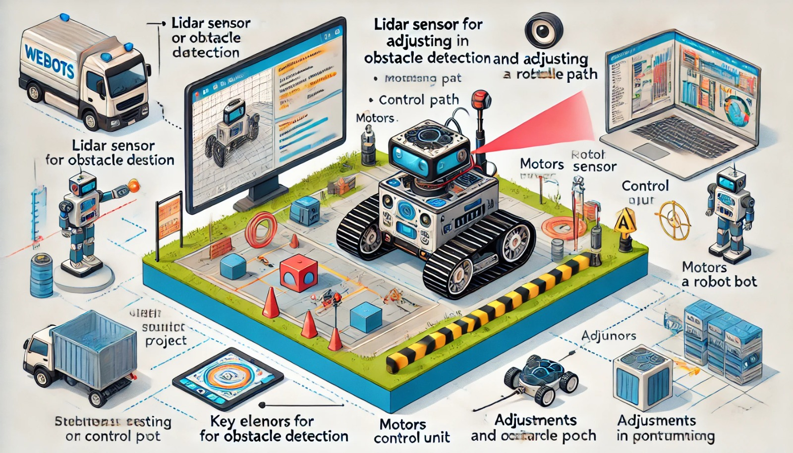

### Aula 32: Prática no Webots – Simulação e Ajustes do Projeto

Nesta aula, vamos realizar uma **simulação completa do projeto no Webots** e ajustar o robô para garantir que ele execute suas funções de forma eficiente e precisa. Essa etapa é essencial para validar o funcionamento do robô em condições próximas à realidade e fazer ajustes finos antes da implementação no ambiente físico. Vamos observar o comportamento do robô em diferentes cenários, fazer testes com obstáculos e ajustar o código conforme necessário.

---

### 1. Preparação para a Simulação Completa no Webots

Antes de iniciar a simulação completa, é importante garantir que todos os componentes estejam configurados e funcionando corretamente:

- **Sensores**: O sensor Lidar, sensor de cor ou câmera e quaisquer outros sensores devem estar conectados e respondendo aos comandos.
- **Motores**: Certifique-se de que os motores estão configurados para controlar a velocidade e a direção do robô com precisão.
- **Controlador (ROS)**: O controlador do robô deve estar configurado para receber dados dos sensores e enviar comandos para os atuadores.

No Webots, prepare um ambiente com obstáculos e trajetórias para que o robô possa demonstrar as funcionalidades programadas, como desvio de obstáculos e navegação em linha.

---

### 2. Realizando a Simulação Completa no Webots

#### Passo 1: Carregar o Projeto e Iniciar a Simulação

1. **Carregue o robô e o ambiente** no Webots e inicie a simulação.
2. **Observe o Comportamento Inicial**: Veja como o robô responde ao ambiente assim que começa a simulação. Verifique se ele detecta obstáculos, ajusta sua direção e segue a trajetória programada.

#### Passo 2: Teste de Desvio de Obstáculos

Coloque obstáculos em diferentes posições no ambiente e observe como o robô reage:
- **Verifique a Sensibilidade do Sensor Lidar**: Observe se o sensor detecta os obstáculos a uma distância adequada.
- **Ajuste a Lógica de Desvio**: Se o robô se aproxima demais dos obstáculos antes de desviar, ajuste o código para aumentar a distância de detecção.

**Exemplo de Ajuste no Código para Desvio**:
```python
# Exemplo de ajuste no código de desvio de obstáculos
distancia_minima = 0.6  # Aumentando a distância de desvio para 0.6 metros

def lidar_callback(data):
    distancia_frente = min(min(data.ranges[0:20]), min(data.ranges[340:360]))

    if distancia_frente < distancia_minima:
        velocidade.linear.x = 0.0
        velocidade.angular.z = 0.5
    else:
        velocidade.linear.x = 0.2
        velocidade.angular.z = 0.0
    velocidade_pub.publish(velocidade)
```

#### Passo 3: Teste de Navegação em Linha ou Ponto de Controle

Se o robô estiver programado para seguir uma linha ou percorrer pontos predefinidos:
- **Verifique a Precisão do Trajeto**: Observe se o robô segue a linha ou atinge os pontos com precisão.
- **Ajuste a Sensibilidade do Sensor de Cor ou Câmera**: Caso o robô perca a linha ou os pontos de controle, ajuste a sensibilidade do sensor para melhorar a precisão.

#### Passo 4: Teste de Comportamento Autônomo

Simule cenários em que o robô precisa tomar decisões, como mudar de direção ao encontrar um obstáculo ou recalcular a rota. Observe se ele:
- **Reage corretamente a mudanças no ambiente**.
- **Mantém o controle da velocidade e direção** ao navegar entre obstáculos.

---

### 3. Análise e Ajuste de Desempenho

Após os testes iniciais, revise o desempenho do robô e identifique possíveis ajustes para otimizar a simulação.

#### Dicas para Ajustes:

- **Sensibilidade dos Sensores**: Ajuste a distância de detecção do Lidar e a sensibilidade do sensor de cor ou câmera para obter uma leitura mais precisa.
- **Velocidade do Robô**: Experimente diferentes velocidades para melhorar a estabilidade e precisão da navegação.
- **Ajuste da Lógica de Controle**: Revise o código para otimizar a lógica de tomada de decisão, como desvio de obstáculos e controle de movimento.

---

### 4. Teste com Cenários Variados

Para garantir que o robô funcione bem em diferentes condições, realize testes com cenários variados no Webots:

- **Cenário com Obstáculos Múltiplos**: Posicione vários obstáculos e verifique se o robô consegue navegar sem colisões.
- **Cenário com Rotas Complexas**: Adicione trajetórias mais complexas para testar a capacidade do robô de seguir rotas e ajustar seu movimento conforme necessário.
- **Teste de Persistência**: Deixe o robô funcionando por um tempo mais longo para verificar a consistência do comportamento.

---

### 5. Documentação dos Resultados

À medida que realiza os testes, documente as observações e os ajustes feitos para cada cenário. Isso é útil para:

- **Registrar o desempenho do robô** em diferentes condições.
- **Listar problemas encontrados e ajustes realizados** para melhorar a eficiência.
- **Anotar melhorias futuras** que podem ser implementadas após os testes.

---

### Conclusão

A simulação completa no Webots e os ajustes do projeto são essenciais para garantir que o robô funcione como esperado em diferentes cenários. Esta etapa permite que identifiquemos e resolvamos problemas de maneira eficaz, antes de passar para a fase final de implementação no ambiente físico.

### Exercícios de Fixação

1. **Qual é o objetivo principal da simulação completa no Webots?**
   - A) Ajustar a aparência do robô
   - B) Verificar o funcionamento do robô em cenários variados e ajustar o desempenho
   - C) Reduzir o consumo de energia
   - D) Melhorar o design do robô

2. **O que deve ser feito se o robô não desviar de obstáculos adequadamente?**
   - A) Aumentar a sensibilidade do sensor Lidar e ajustar a lógica de desvio no código
   - B) Retirar o sensor Lidar
   - C) Aumentar a velocidade do robô
   - D) Ignorar os obstáculos

3. **Qual é uma das vantagens de testar o robô em cenários variados?**
   - A) Aumenta o tamanho do robô
   - B) Garante que o robô funcione bem em diferentes condições
   - C) Melhora a cor do robô
   - D) Diminui o peso do robô

4. **Por que é importante documentar os resultados dos testes?**
   - A) Para melhorar a aparência do relatório
   - B) Para registrar o desempenho e facilitar futuros ajustes e melhorias
   - C) Para aumentar o valor do robô
   - D) Para reduzir a necessidade de sensores

5. **Se o robô não segue a linha corretamente, o que pode ser feito?**
   - A) Ignorar a linha
   - B) Aumentar a sensibilidade do sensor de cor ou câmera
   - C) Diminuir a velocidade
   - D) Aumentar o tamanho do robô

Esses exercícios ajudam a consolidar o entendimento sobre a prática de simulação e ajustes, garantindo que o robô esteja pronto para desempenhar suas funções com eficiência.