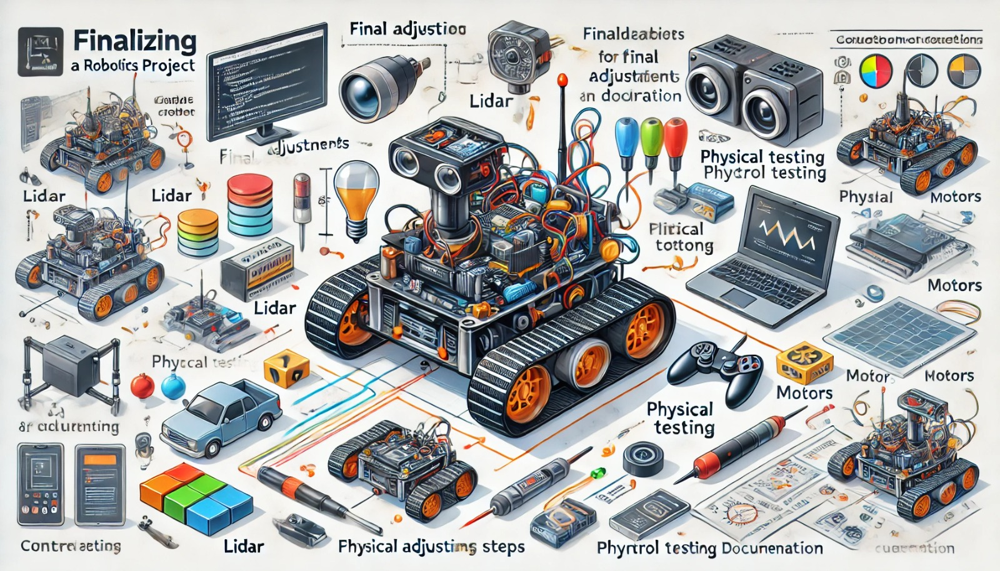

### Aula 33: Finalização do Desenvolvimento do Projeto

Nesta aula, vamos concluir o desenvolvimento do Projeto Integrador, realizando os últimos ajustes e testes para garantir que o robô esteja totalmente funcional e pronto para operar no ambiente físico. A etapa de finalização envolve consolidar tudo o que foi trabalhado até agora: desde a integração de componentes e programação, até a simulação e ajustes finos. Este é o momento de verificar todos os detalhes e documentar os resultados para a apresentação final do projeto.

---

### 1. Verificação Final dos Componentes e Configurações

Antes de realizar os testes finais, é essencial verificar se todos os componentes estão configurados e funcionando corretamente:

- **Sensores**: Confirme que o sensor Lidar, câmera, sensores de cor e outros estão capturando dados de forma precisa e constante.
- **Atuadores e Motores**: Verifique a resposta dos motores, garantindo que o robô consiga se mover em todas as direções e ajustar a velocidade conforme necessário.
- **Controlador e Código**: Revise o código para assegurar que todas as funções estão implementadas e operacionais, como desvio de obstáculos e navegação autônoma.

Esse processo de verificação final é crucial para evitar problemas durante a operação do robô no ambiente real.

---

### 2. Teste Completo em Simulação

Realize um teste completo no simulador Webots com todas as funcionalidades do robô para assegurar que ele está executando todas as tarefas conforme o planejado. 

#### Passo a Passo para o Teste Completo:

1. **Inicie o Webots com o ambiente completo**: Certifique-se de que todos os elementos, como obstáculos e trajetórias, estão configurados.
2. **Teste cada funcionalidade individualmente**:
   - **Desvio de obstáculos**: Posicione obstáculos em locais aleatórios e verifique se o robô os detecta e desvia corretamente.
   - **Navegação em linha ou caminho específico**: Verifique se o robô segue a linha ou rota designada sem perder a direção.
3. **Observar e Anotar Resultados**: Anote qualquer problema, como falhas de resposta dos sensores ou movimentos imprecisos, e faça ajustes conforme necessário.

Esse teste final em simulação ajuda a identificar ajustes que podem ainda ser necessários antes do teste em ambiente físico.

---

### 3. Ajustes Finais no Código

Após o teste completo, faça ajustes finais no código para otimizar o desempenho do robô. Alguns aspectos a serem considerados incluem:

- **Calibração dos Sensores**: Ajuste a sensibilidade dos sensores para garantir que o robô responda de forma precisa ao ambiente.
- **Ajuste de Velocidade e Movimento**: Altere os valores de velocidade e rotação para obter uma movimentação suave e controlada.
- **Otimização da Lógica de Decisão**: Verifique se a lógica de desvio e navegação está fluida e eficiente, para que o robô execute todas as funções sem atrasos.

#### Exemplo de Ajuste Final para Desvio de Obstáculos:

```python
# Ajustando a distância mínima para desvio de obstáculos
distancia_minima = 0.7  # Distância ajustada para resposta mais rápida

def lidar_callback(data):
    distancia_frente = min(min(data.ranges[0:20]), min(data.ranges[340:360]))

    if distancia_frente < distancia_minima:
        velocidade.linear.x = 0.0
        velocidade.angular.z = 0.5  # Aumentando a rotação para desvio mais rápido
    else:
        velocidade.linear.x = 0.2
        velocidade.angular.z = 0.0
    velocidade_pub.publish(velocidade)
```

Esse ajuste permite que o robô reaja mais rapidamente a obstáculos próximos, garantindo maior segurança e fluidez.

---

### 4. Teste no Ambiente Físico

Com os ajustes realizados na simulação, é hora de transferir o código para o robô físico e realizar o teste no ambiente real. 

#### Passos para o Teste Físico:

1. **Transferir o Código para o Controlador do Robô**: Utilize a plataforma ROS para carregar o código atualizado no TurtleBot.
2. **Preparar o Ambiente Real**: Reproduza o ambiente de simulação na vida real, com obstáculos e trajetórias semelhantes.
3. **Iniciar o Teste**:
   - Observe como o robô reage aos obstáculos e se consegue seguir as rotas designadas.
   - Verifique se o comportamento do robô no ambiente físico é similar ao que foi testado na simulação.

4. **Registrar o Desempenho**: Anote qualquer divergência entre o desempenho em simulação e no mundo real. Isso pode ocorrer devido a fatores como iluminação e pequenas diferenças na sensibilidade dos sensores.

---

### 5. Documentação do Projeto

A documentação final é uma parte essencial do projeto, pois descreve todo o processo, desde a concepção até a finalização, permitindo que outros possam entender e reproduzir o trabalho. 

**Conteúdos para a Documentação:**
- **Descrição do Projeto**: Explique o objetivo do robô e suas principais funcionalidades.
- **Diagrama de Componentes**: Inclua um diagrama mostrando a integração dos sensores, atuadores e controlador.
- **Código Final**: Documente o código, com comentários explicando as principais funções e a lógica de decisão.
- **Resultados dos Testes**: Descreva os resultados obtidos nos testes de simulação e físico, incluindo ajustes e melhorias realizadas.
- **Observações e Melhorias Futuras**: Liste sugestões para possíveis aprimoramentos no projeto.

---

### Conclusão

A finalização do projeto integra todas as etapas do desenvolvimento, permitindo que o robô esteja pronto para operar de forma autônoma no ambiente físico. A fase de testes e ajustes garante que o robô esteja otimizado e funcional, enquanto a documentação preserva o conhecimento gerado, facilitando melhorias futuras.

### Exercícios de Fixação

1. **Qual é o objetivo da verificação final dos componentes?**
   - A) Melhorar a aparência do robô
   - B) Garantir que todos os sensores e motores estejam funcionando corretamente
   - C) Ajustar a cor do robô
   - D) Aumentar o peso do robô

2. **O que deve ser feito se o robô não desviar de obstáculos no teste físico?**
   - A) Retirar o sensor Lidar
   - B) Ajustar a sensibilidade do sensor Lidar e revisar o código de desvio
   - C) Substituir o robô
   - D) Aumentar a velocidade do robô

3. **Qual é a importância da documentação final do projeto?**
   - A) Melhorar o design do robô
   - B) Facilitar a reprodução e o entendimento do projeto por outras pessoas
   - C) Aumentar a velocidade do robô
   - D) Ajustar a cor do robô

4. **Por que é importante realizar o teste completo em simulação antes do teste físico?**
   - A) Para reduzir a necessidade de sensores
   - B) Para identificar problemas e ajustar o código em um ambiente seguro
   - C) Para melhorar a aparência do robô
   - D) Para ajustar o tamanho do robô

5. **Qual informação é essencial incluir na documentação do projeto?**
   - A) Apenas o nome do robô
   - B) Resultados dos testes e código final com explicações
   - C) A cor preferida do robô
   - D) Tamanho do robô

Esses exercícios ajudam a consolidar o conhecimento sobre a finalização do projeto, garantindo que o robô esteja pronto para operar no ambiente real com toda a documentação necessária.