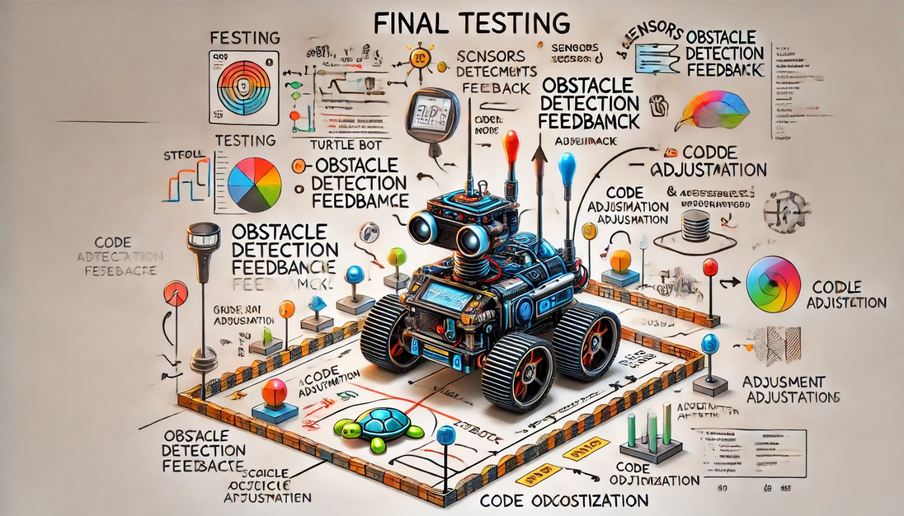

### Aula 34: Testes Finais e Ajustes Baseados em Feedback

Nesta aula, vamos realizar os **testes finais do robô** no ambiente físico, observando seu desempenho para identificar ajustes e melhorias. Além dos testes, vamos coletar feedback de colegas e professores, utilizando as observações para aprimorar o projeto. Esta etapa de refinamento é essencial para garantir que o robô atinja todos os objetivos propostos, operando de forma eficiente e confiável.

---

### 1. Preparação para os Testes Finais

Para garantir que os testes finais sejam completos e detalhados, é importante preparar o ambiente e revisar todos os componentes do robô:

- **Configuração do Ambiente de Teste**: Reproduza um cenário que o robô enfrentará na prática, como uma área com obstáculos, trajetórias específicas e diferentes condições de iluminação.
- **Checklist de Componentes**: Confirme que todos os sensores, motores e a bateria do robô estão em pleno funcionamento.
- **Código Final**: Garanta que a versão mais recente do código esteja carregada no controlador do robô e que os ajustes anteriores tenham sido aplicados.

Uma preparação cuidadosa ajuda a evitar problemas inesperados durante os testes e facilita a análise do desempenho.

---

### 2. Execução dos Testes Finais

Com o ambiente e o robô preparados, inicie a execução dos testes, observando cada função essencial para garantir que o robô opera conforme planejado.

#### Passo 1: Teste de Desvio de Obstáculos

- **Posicione Obstáculos**: Coloque obstáculos em diferentes posições e observe se o robô detecta e desvia corretamente.
- **Ajuste de Distância**: Se o robô se aproxima muito dos obstáculos antes de desviar, ajuste a sensibilidade do sensor Lidar.

#### Passo 2: Teste de Navegação

- **Seguimento de Linha ou Rota Específica**: Verifique se o robô consegue seguir uma linha ou rota designada sem perder a direção.
- **Estabilidade de Movimento**: Observe se o robô mantém uma velocidade constante e se ajusta corretamente em curvas ou mudanças de trajetória.

#### Passo 3: Teste de Autonomia

- **Cenários Complexos**: Coloque o robô em um ambiente que simule situações desafiadoras, como obstáculos móveis ou trajetórias complexas, para avaliar sua capacidade de tomada de decisão autônoma.

Esses testes garantem que o robô está preparado para lidar com diferentes condições e que todas as funcionalidades respondem adequadamente.

---

### 3. Coleta de Feedback

Durante e após os testes, colete feedback de colegas, professores e outras pessoas que acompanham o projeto. O feedback externo é valioso para identificar aspectos que podem ter sido negligenciados e para aprimorar o desempenho do robô.

#### Formas de Coletar Feedback

- **Observações Diretas**: Peça a observadores que identifiquem problemas, comportamentos inesperados ou áreas de melhoria.
- **Perguntas Específicas**: Faça perguntas como:
  - O robô desvia de obstáculos de maneira confiável?
  - A velocidade e precisão da navegação atendem às expectativas?
  - Existem ajustes que poderiam melhorar o desempenho?
- **Análise Crítica**: Solicite opiniões sobre possíveis melhorias na eficiência do código, na precisão dos sensores ou no design do robô.

Documente todo o feedback recebido para utilizá-lo na fase de ajustes.

---

### 4. Ajustes Baseados no Feedback

Após coletar o feedback, revise as observações e planeje ajustes específicos para aprimorar o projeto. Alguns ajustes comuns incluem:

#### 4.1 Ajustes na Sensibilidade dos Sensores

Se o robô teve dificuldade em detectar obstáculos ou manter a rota, ajuste a sensibilidade dos sensores. Por exemplo:
- **Ajuste da Distância de Detecção no Sensor Lidar**: Aumente ou diminua a distância mínima de desvio para obter uma resposta mais precisa.

#### 4.2 Otimização do Código

Se o robô apresentou respostas lentas ou comportamentos imprecisos, revise o código para melhorar a eficiência:
- **Reduzir o Tempo de Resposta**: Minimize os atrasos entre as leituras dos sensores e a execução de comandos.
- **Aprimorar a Lógica de Controle**: Verifique a lógica de desvio e ajuste para que o robô tome decisões mais rápidas e assertivas.

#### 4.3 Ajuste de Velocidade e Movimento

Caso o robô tenha se movimentado de forma instável, ajuste os parâmetros de velocidade e rotação para uma movimentação mais suave e controlada.

---

### 5. Documentação dos Resultados e Ajustes

Após realizar os ajustes, documente os resultados dos testes e as melhorias implementadas com base no feedback. A documentação final do projeto deve incluir:

- **Resultados dos Testes**: Resumo dos testes realizados e as observações feitas durante a execução.
- **Lista de Ajustes e Melhorias**: Detalhamento de todos os ajustes realizados após o feedback, incluindo alterações no código e configurações dos sensores.
- **Observações Finais**: Comentários sobre o desempenho final do robô e sugestões de possíveis melhorias futuras.

Essa documentação completa ajuda a registrar o aprendizado e a evolução do projeto, servindo de referência para projetos futuros.

---

### Conclusão

A etapa de testes finais e ajustes baseados em feedback permite que o projeto seja refinado e concluído com sucesso, garantindo que o robô esteja funcional e preparado para o ambiente real. O processo de coleta e aplicação de feedback promove a melhoria contínua, maximizando o desempenho do robô e atendendo aos objetivos do projeto.

### Exercícios de Fixação

1. **Qual é o objetivo dos testes finais?**
   - A) Verificar se o robô está com a aparência correta
   - B) Garantir que o robô funcione de forma eficiente e confiável no ambiente físico
   - C) Reduzir a velocidade do robô
   - D) Ajustar a cor do robô

2. **Qual é uma das perguntas úteis para coletar feedback?**
   - A) O robô está com a cor correta?
   - B) O robô desvia de obstáculos de maneira confiável?
   - C) O tamanho do robô é adequado?
   - D) O peso do robô é suficiente?

3. **O que fazer se o robô não detecta obstáculos com precisão?**
   - A) Ignorar o problema
   - B) Ajustar a sensibilidade do sensor Lidar
   - C) Aumentar a velocidade do robô
   - D) Mudar o design do robô

4. **Por que a documentação dos resultados dos testes é importante?**
   - A) Para aumentar a velocidade do robô
   - B) Para registrar o aprendizado e as melhorias realizadas no projeto
   - C) Para melhorar a cor do robô
   - D) Para diminuir o peso do robô

5. **Qual é o próximo passo após coletar o feedback?**
   - A) Ajustar a cor do robô
   - B) Realizar ajustes específicos no projeto com base no feedback
   - C) Aumentar o peso do robô
   - D) Diminuir o tamanho do robô

Esses exercícios ajudam a consolidar o entendimento sobre a importância dos testes finais e dos ajustes baseados em feedback, garantindo um projeto final bem-sucedido e funcional.