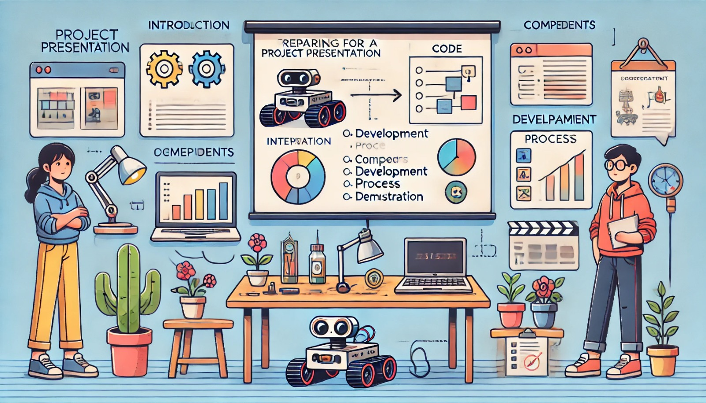

### Aula 35: Preparação para a Apresentação do Projeto

Na última etapa do Projeto Integrador, vamos nos concentrar na **preparação para a apresentação**. Esta é uma oportunidade para mostrar o trabalho realizado, compartilhar os resultados e descrever o processo de desenvolvimento. Uma apresentação eficaz ajuda a demonstrar as habilidades adquiridas, destacando a funcionalidade e os desafios enfrentados ao longo do projeto.

---

### 1. Estrutura da Apresentação

Uma boa apresentação é clara, objetiva e organizada. A estrutura ideal deve incluir:

1. **Introdução ao Projeto**
   - Explique o propósito do robô: Quais problemas ele resolve ou quais tarefas executa?
   - Apresente o objetivo principal do projeto e o que ele pretende alcançar.

2. **Descrição dos Componentes e Ferramentas**
   - Liste os principais componentes usados, como sensores, motores, controlador (ROS), e as ferramentas utilizadas, como o Webots para simulação.
   - Descreva brevemente a função de cada componente no robô.

3. **Processo de Desenvolvimento**
   - Detalhe as etapas do desenvolvimento, desde o planejamento inicial até a integração dos componentes, simulação, e testes.
   - Fale sobre os desafios enfrentados e como eles foram superados.

4. **Demonstração das Funcionalidades**
   - Apresente as principais funcionalidades do robô, como desvio de obstáculos, navegação e autonomia.
   - Mostre imagens ou vídeos dos testes realizados (se possível) para demonstrar essas funcionalidades.

5. **Ajustes e Melhorias**
   - Descreva os ajustes feitos com base no feedback e nos testes finais, como alterações na sensibilidade dos sensores ou no código.
   - Comente sobre as melhorias implementadas para garantir que o robô funcionasse de forma eficiente e precisa.

6. **Conclusão e Resultados Finais**
   - Resuma os resultados finais do projeto, destacando o sucesso na execução das funcionalidades e a aprendizagem obtida.
   - Fale sobre os próximos passos ou possíveis melhorias futuras para o robô.

---

### 2. Preparação dos Materiais para a Apresentação

Para que a apresentação seja visualmente atraente e fácil de seguir, prepare materiais como:

- **Slides**: Organize as informações em uma apresentação de slides, usando tópicos, imagens, e gráficos para ilustrar cada etapa.
- **Imagens e Vídeos**: Inclua imagens do robô em ação e vídeos dos testes para mostrar suas funcionalidades em tempo real.
- **Diagramas e Esquemas**: Crie diagramas dos componentes do robô e fluxos de lógica para ajudar a explicar a integração e o funcionamento do sistema.
- **Código**: Mostre trechos do código (de forma resumida) para destacar partes importantes, como a lógica de desvio de obstáculos e controle de movimento.

### 3. Prática da Apresentação

Antes da apresentação final, é essencial praticar para garantir que tudo saia conforme planejado.

#### Dicas para Prática:

- **Tempo**: Cronometre a apresentação para que ela seja concisa e se encaixe no tempo disponível.
- **Clareza**: Pratique a explicação de termos técnicos de forma clara, para que todos compreendam.
- **Demonstração**: Se possível, faça uma demonstração ao vivo das funcionalidades do robô, ou prepare um vídeo para mostrar seu funcionamento.

### 4. Preparação para Perguntas

Após a apresentação, esteja preparado para responder perguntas sobre o projeto. Algumas perguntas comuns podem incluir:

- **Quais foram os maiores desafios no desenvolvimento do robô?**
- **Como você resolveu problemas específicos, como desvio de obstáculos ou estabilidade de navegação?**
- **Quais melhorias futuras você considera importantes para o projeto?**

Responder com confiança mostra domínio sobre o projeto e as soluções aplicadas.

---

### 5. Checklist Final para a Apresentação

Antes da apresentação, revise o seguinte checklist:

- **Slides Organizados**: Certifique-se de que os slides estão em ordem e que todas as informações essenciais estão incluídas.
- **Materiais de Apoio Preparados**: Imagens, vídeos e diagramas devem estar prontos e fáceis de acessar durante a apresentação.
- **Prática Concluída**: Realize uma prática final para garantir que o conteúdo está claro e no tempo certo.
- **Pronto para Perguntas**: Esteja preparado para responder perguntas e explicar o processo de desenvolvimento.

---

### Conclusão

A preparação para a apresentação final é a última etapa de um projeto bem-sucedido. Apresentar o robô e suas funcionalidades de forma clara e estruturada permite compartilhar o conhecimento adquirido, destacar as habilidades desenvolvidas e demonstrar o sucesso do projeto.

### Exercícios de Fixação

1. **Qual é o objetivo principal da apresentação do projeto?**
   - A) Mostrar a aparência do robô
   - B) Demonstrar o desenvolvimento, funcionalidades e resultados do projeto
   - C) Ajustar a cor do robô
   - D) Aumentar a velocidade do robô

2. **Qual informação é importante incluir na introdução do projeto?**
   - A) Apenas o nome do robô
   - B) O propósito do robô e o que ele pretende alcançar
   - C) O peso do robô
   - D) A cor preferida do robô

3. **Por que é importante praticar a apresentação antes do dia final?**
   - A) Para ajustar a aparência dos slides
   - B) Para garantir que a apresentação seja clara e esteja dentro do tempo disponível
   - C) Para reduzir o tamanho dos slides
   - D) Para aumentar a complexidade do conteúdo

4. **Quais materiais são úteis para uma apresentação visualmente atraente?**
   - A) Apenas texto
   - B) Imagens, vídeos, diagramas e trechos de código
   - C) Somente vídeos
   - D) Apenas diagramas

5. **Qual é uma pergunta comum que você pode se preparar para responder?**
   - A) Qual é o peso do robô?
   - B) Quais foram os principais desafios no desenvolvimento do robô?
   - C) Qual é a cor do robô?
   - D) Quem criou o robô?

Esses exercícios ajudam a consolidar a importância da preparação para uma apresentação eficaz, garantindo que todos os aspectos do projeto sejam abordados e explicados com clareza.