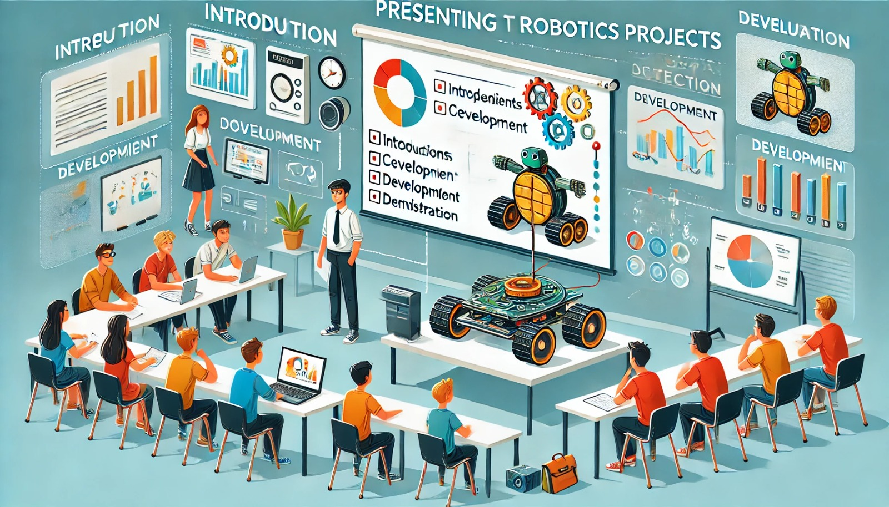

### Aula 36: Apresentação dos Projetos dos Alunos

Hoje, chegamos ao momento culminante do curso, onde cada aluno ou grupo de alunos terá a oportunidade de **apresentar seu Projeto Integrador**. Esta é uma ocasião para compartilhar o trabalho desenvolvido, demonstrar as funcionalidades do robô, e discutir os desafios enfrentados e as soluções encontradas. Além disso, as apresentações promovem a troca de ideias, permitindo que todos os participantes aprendam com as abordagens e inovações dos colegas.

---

### 1. Estrutura da Apresentação dos Alunos

Para garantir que todas as apresentações sejam bem organizadas e informativas, siga uma estrutura básica:

1. **Introdução ao Projeto**
   - Explique o objetivo do robô: Qual problema ele resolve ou tarefa realiza?
   - Apresente o propósito do projeto e os objetivos que ele pretende alcançar.

2. **Descrição dos Componentes**
   - Liste os principais componentes utilizados, como sensores, atuadores e controlador.
   - Explique brevemente a função de cada componente e como ele contribui para o funcionamento do robô.

3. **Desenvolvimento e Processos**
   - Descreva as etapas de desenvolvimento, desde a fase de planejamento e montagem, até a integração dos sensores e atuadores.
   - Fale sobre os principais desafios enfrentados ao longo do processo e como foram superados.

4. **Demonstração do Robô**
   - Mostre o robô em ação, executando suas principais funcionalidades. Se possível, faça uma demonstração ao vivo ou apresente um vídeo do robô realizando tarefas.
   - Destaque as funções principais, como navegação, desvio de obstáculos e qualquer recurso autônomo.

5. **Ajustes e Melhorias**
   - Fale sobre os ajustes realizados, seja para melhorar o desempenho do robô ou para solucionar problemas encontrados durante os testes.
   - Comente sobre melhorias futuras ou sugestões para aprimorar o projeto.

6. **Conclusão**
   - Faça um resumo dos resultados finais, destacando o que foi aprendido durante o desenvolvimento do projeto.
   - Discuta o que você faria de diferente em um próximo projeto, com base nas lições aprendidas.

---

### 2. Critérios de Avaliação

As apresentações serão avaliadas com base em alguns critérios, que incluem:

- **Clareza e Organização**: A apresentação é fácil de seguir, com uma estrutura lógica?
- **Conteúdo Técnico**: O aluno demonstrou conhecimento técnico sobre os componentes e a programação do robô?
- **Demonstração das Funcionalidades**: O robô consegue executar as tarefas propostas e demonstrar suas funcionalidades com sucesso?
- **Resolução de Problemas**: O aluno foi capaz de identificar e solucionar problemas ao longo do desenvolvimento?
- **Inovação e Criatividade**: O projeto inclui alguma inovação ou abordagem criativa que o diferencia?

Cada grupo receberá feedback construtivo para que possa refletir sobre os pontos fortes e as áreas de melhoria.

---

### 3. Feedback dos Colegas

Após cada apresentação, os colegas terão a oportunidade de dar um breve feedback, comentando o que acharam interessante ou sugerindo melhorias. Essa troca é valiosa, pois permite que cada aluno aprenda com diferentes abordagens e pontos de vista.

Alguns exemplos de perguntas para o feedback incluem:
- **O que mais chamou sua atenção no projeto?**
- **Houve alguma funcionalidade ou solução que você achou criativa?**
- **Quais melhorias você sugeriria para o projeto?**

Esse momento de troca e feedback é fundamental para que cada aluno avalie seu trabalho de forma construtiva.

---

### 4. Documentação Final do Projeto

Cada aluno ou grupo deve entregar uma documentação final do projeto, incluindo:

- **Objetivo do Projeto**: Descrição do propósito do robô e das principais funcionalidades.
- **Componentes e Ferramentas Utilizadas**: Lista de sensores, atuadores, e software empregados no desenvolvimento.
- **Desenvolvimento e Processo**: Resumo das etapas de desenvolvimento, com detalhes sobre os desafios e soluções encontradas.
- **Resultados e Conclusões**: Resumo dos resultados finais e o que foi aprendido com o projeto.
- **Possíveis Melhorias Futuras**: Sugestões para aprimorar o projeto no futuro.

A documentação final serve como registro completo do trabalho desenvolvido, sendo uma ferramenta importante de aprendizado e referência para projetos futuros.

---

### Conclusão

A apresentação dos projetos é o momento de coroação do trabalho dos alunos. Ao compartilhar seus projetos, cada aluno demonstra suas habilidades, aprendizado e criatividade. A troca de feedback e a documentação final complementam essa experiência, permitindo que todos reflitam sobre o processo e se preparem para futuros desafios na área da robótica.

### Exercícios de Reflexão

1. **Quais foram os principais desafios que você enfrentou durante o desenvolvimento do seu projeto?**
2. **Quais foram as soluções mais criativas que você aplicou ao projeto?**
3. **O que você aprendeu durante o desenvolvimento do robô que gostaria de aplicar em projetos futuros?**
4. **Que tipo de feedback você recebeu dos colegas e professores e como ele pode ser útil?**
5. **Quais melhorias você faria no seu projeto se tivesse mais tempo ou recursos?**

Essas perguntas ajudam a consolidar o aprendizado e a incentivar a reflexão sobre a experiência completa de desenvolvimento do projeto, promovendo o crescimento e a evolução dos alunos na robótica.