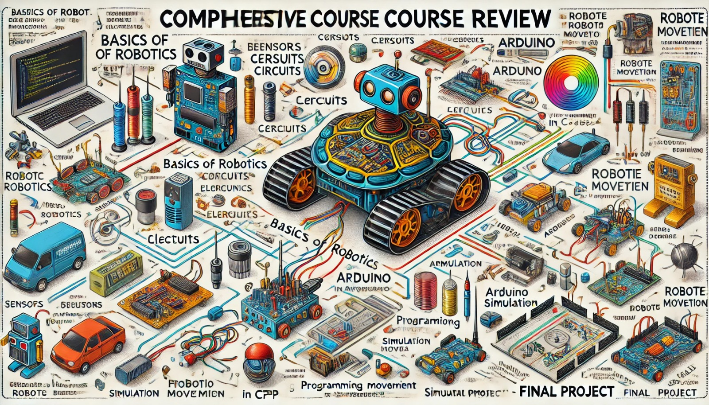

### Aula 37: Revisão Geral do Conteúdo do Curso

Nesta última aula, vamos fazer uma **revisão geral de todos os conteúdos abordados ao longo do curso**. Essa revisão consolidará os conhecimentos adquiridos, reforçando os conceitos fundamentais e preparando os alunos para futuras aplicações em robótica. Vamos recapitular cada módulo, destacando os principais temas e discutindo o que foi aprendido em cada etapa.

---

### 1. Introdução à Robótica e Fundamentos

#### Conceitos Principais
- **O que é Robótica?**: Entendimento dos princípios básicos e a definição de robótica.
- **História e Evolução da Robótica**: Uma visão geral de como a robótica evoluiu e como é utilizada hoje em áreas diversas.
- **Componentes Fundamentais de um Robô**: Estrutura básica de um robô, incluindo sensores, atuadores, controlador e a importância de cada parte.

#### Aplicação
Esses fundamentos ajudaram os alunos a entenderem o papel e o funcionamento de um robô no ambiente em que ele opera.

---

### 2. Eletricidade e Eletrônica Básica

#### Conceitos Principais
- **Eletricidade e Corrente Elétrica**: Diferença entre corrente contínua (CC) e corrente alternada (CA).
- **Condutores, Isolantes e Semicondutores**: Compreensão dos materiais que permitem ou limitam o fluxo de corrente elétrica.
- **Lei de Ohm**: Relação entre tensão, corrente e resistência, fundamental para o dimensionamento dos circuitos.
- **Componentes Eletrônicos**: Como funcionam resistores, capacitores, diodos e transistores.

#### Aplicação
Esses conceitos são a base para a montagem e o entendimento dos circuitos necessários para o funcionamento de qualquer robô.

---

### 3. Circuitos e Ferramentas de Medição

#### Conceitos Principais
- **Circuitos em Série e Paralelo**: Diferença entre esses tipos de circuitos e como calcular parâmetros em cada um.
- **Uso do Multímetro**: Medição de tensão, corrente e resistência nos circuitos.

#### Aplicação
Essa parte do curso forneceu habilidades práticas essenciais para trabalhar com circuitos eletrônicos, permitindo a montagem e o teste de componentes com segurança.

---

### 4. Introdução ao Arduino e Programação em C++

#### Conceitos Principais
- **Configuração do Arduino**: Estrutura básica do Arduino e seus principais componentes.
- **Programação Básica em C++**: Estruturas de controle, como condicionais e loops, que permitem criar programas funcionais.
- **Integração com Sensores**: Como conectar e programar sensores simples para coletar dados do ambiente.

#### Aplicação
Essas habilidades permitiram que os alunos criassem circuitos básicos controlados pelo Arduino, estabelecendo a base para projetos mais complexos.

---

### 5. Programação Avançada e Controle de Movimento

#### Conceitos Principais
- **Funções e Bibliotecas no C++**: Reutilização de código e uso de bibliotecas para controlar sensores e atuadores.
- **Controle de Motores e Movimentação**: Programação do movimento dos robôs, incluindo controle de velocidade e direção.
- **Desvio de Obstáculos**: Programação de funções para que o robô detecte e desvie de obstáculos de forma autônoma.

#### Aplicação
Essas técnicas foram aplicadas em exercícios práticos e no desenvolvimento do Projeto Integrador, permitindo que os robôs tivessem capacidade de navegação autônoma.

---

### 6. Simulação no Webots

#### Conceitos Principais
- **Configuração do Ambiente no Webots**: Criação de um ambiente de simulação para testar funcionalidades do robô.
- **Teste de Funcionalidades em Simulação**: Uso da simulação para testar e ajustar código antes da implementação física.

#### Aplicação
O Webots foi essencial para que os alunos testassem seus robôs em condições controladas, identificando e corrigindo problemas antes de passar para a fase física.

---

### 7. Fundamentos de Inteligência Artificial e Machine Learning

#### Conceitos Principais
- **Introdução à IA e Machine Learning**: Conceitos básicos de IA e como ela pode ser aplicada na robótica.
- **Aplicações Práticas**: Discussão sobre algoritmos simples que permitem ao robô tomar decisões com base em dados sensoriais.

#### Aplicação
Esses conceitos ampliaram o entendimento dos alunos sobre o potencial da robótica autônoma, preparando-os para explorar futuras integrações com IA.

---

### 8. Projeto Integrador: Planejamento, Desenvolvimento e Apresentação

#### Conceitos Principais
- **Planejamento e Design do Projeto**: Definição do escopo, metas e cronograma.
- **Desenvolvimento e Integração de Componentes**: Montagem do robô e integração de sensores, motores e controlador.
- **Teste e Ajustes Finais**: Realização de testes finais e ajustes com base no feedback para otimizar o desempenho.
- **Apresentação do Projeto**: Preparação de uma apresentação para demonstrar as funcionalidades do robô e compartilhar o processo de desenvolvimento.

#### Aplicação
O Projeto Integrador foi a culminação de todos os conceitos aprendidos ao longo do curso, permitindo que cada aluno aplicasse suas habilidades em um projeto completo.

---

### Discussão e Reflexão Final

Para encerrar o curso, reserve um tempo para discutir as experiências dos alunos e as habilidades adquiridas. Pergunte aos alunos:

- **Qual foi o módulo mais desafiador para você? Por quê?**
- **Que habilidades ou conhecimentos você considera mais úteis?**
- **O que você gostaria de aprender mais a fundo em futuros cursos de robótica?**

Essas reflexões ajudam a consolidar o aprendizado e permitem que os alunos compartilhem suas experiências e expectativas futuras.

---

### Conclusão

Esta revisão geral destaca a jornada de aprendizado e desenvolvimento dos alunos, consolidando os conceitos e habilidades fundamentais adquiridos ao longo do curso. Com uma base sólida em robótica, eletrônica e programação, os alunos estão agora preparados para explorar projetos mais complexos e avançar em sua trajetória na robótica.

### Exercícios de Fixação

1. **Qual é a importância dos circuitos em série e paralelo?**
   - A) Permitir a programação de sensores
   - B) Facilitar o controle de motores
   - C) Entender como os componentes se comportam quando conectados de diferentes maneiras
   - D) Definir a velocidade do robô

2. **Para que serve o Webots no desenvolvimento de robôs?**
   - A) Aumentar o consumo de energia
   - B) Facilitar a simulação e o teste das funcionalidades do robô antes da implementação física
   - C) Melhorar a aparência do robô
   - D) Ajustar a cor dos componentes

3. **Qual foi o objetivo do Projeto Integrador?**
   - A) Explorar o design de robôs
   - B) Testar apenas a movimentação dos robôs
   - C) Aplicar todos os conhecimentos adquiridos em um projeto prático e completo
   - D) Melhorar a aparência dos robôs

4. **Como o controle de motores é importante na robótica?**
   - A) Controla a movimentação e a resposta do robô ao ambiente
   - B) Define a aparência do robô
   - C) Melhora a cor dos sensores
   - D) Reduz a velocidade dos atuadores

5. **Qual habilidade você acredita que será mais útil em futuros projetos de robótica?**

Esses exercícios e a reflexão final consolidam os conhecimentos adquiridos e incentivam os alunos a continuar explorando o campo da robótica com confiança e curiosidade.