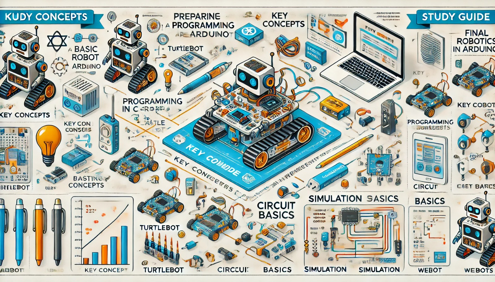

### Aula 38: Preparação para a Avaliação Final

Na penúltima aula, vamos nos preparar para a **avaliação final do curso**. O objetivo é revisar os principais tópicos que serão abordados na avaliação, esclarecer dúvidas e garantir que todos se sintam confiantes para demonstrar o que aprenderam. A avaliação final será uma oportunidade para cada aluno aplicar o conhecimento adquirido e demonstrar seu entendimento sobre os conceitos fundamentais de robótica, eletrônica e programação.

---

### 1. Estrutura da Avaliação Final

A avaliação final abordará os principais temas do curso e será composta por **questões de múltipla escolha e questões práticas** que envolverão análise de código, identificação de componentes e interpretação de circuitos. A estrutura da avaliação incluirá:

- **Parte Teórica**: Questões de múltipla escolha que cobrirão conceitos fundamentais, como componentes eletrônicos, tipos de circuitos, fundamentos de programação e lógica de controle de robôs.
- **Parte Prática**: Questões que exigem interpretação e aplicação de conhecimentos, como a análise de um trecho de código para movimentação do robô, ou o design de um circuito simples para integração de sensores.

### 2. Revisão dos Conteúdos Importantes

Vamos revisar os principais temas do curso, destacando os conceitos e habilidades mais importantes para a avaliação final.

#### 2.1 Fundamentos de Robótica

- **O que é robótica?**: Revisão dos conceitos e definições de robótica.
- **Componentes de um robô**: Estrutura básica de um robô, incluindo sensores, atuadores e controladores.
- **Aplicações da Robótica**: Como os robôs são utilizados em diferentes áreas, como indústria, saúde e pesquisa.

#### 2.2 Eletricidade e Eletrônica Básica

- **Tipos de Corrente**: Diferença entre corrente contínua (CC) e corrente alternada (CA).
- **Circuitos em Série e Paralelo**: Identificação de circuitos e cálculo de parâmetros.
- **Lei de Ohm**: Relação entre tensão, corrente e resistência em circuitos.
- **Componentes Eletrônicos**: Revisão dos principais componentes como resistores, capacitores, diodos e transistores, e suas funções.

#### 2.3 Introdução ao Arduino e Programação em C++

- **Estrutura do Arduino**: Revisão dos pinos de entrada e saída e da estrutura de um código básico em Arduino.
- **Programação em C++**: Estruturas de controle como condicionais (if/else) e loops (for, while).
- **Funções e Bibliotecas**: Criação de funções e uso de bibliotecas para facilitar o controle de sensores e atuadores.

#### 2.4 Controle de Movimentação e Sensores

- **Integração de Sensores**: Como conectar e programar sensores como o sensor Lidar e o sensor de cor.
- **Controle de Motores**: Programação dos motores para controlar a movimentação do robô.
- **Lógica de Desvio de Obstáculos**: Programação do robô para detectar e desviar de obstáculos de forma autônoma.

#### 2.5 Simulação e Testes com Webots

- **Configuração do Ambiente no Webots**: Como criar e configurar o ambiente de simulação.
- **Testes de Funcionalidade em Simulação**: Uso do Webots para testar e ajustar código antes da implementação física.

#### 2.6 Projeto Integrador

- **Planejamento do Projeto**: Como definir o escopo e objetivos do projeto.
- **Desenvolvimento e Integração de Componentes**: Integração dos sensores, atuadores e controlador no robô.
- **Apresentação do Projeto**: Estrutura para demonstrar o projeto final, destacando o processo de desenvolvimento e resultados.

---

### 3. Dicas de Estudo para a Avaliação Final

Aqui estão algumas dicas para ajudar na preparação para a avaliação final:

- **Revisar Anotações e Exercícios**: Revise suas anotações e refaça os exercícios práticos realizados ao longo do curso.
- **Praticar a Programação**: Abra o Arduino IDE e pratique com pequenos trechos de código, testando funcionalidades básicas de controle de sensores e motores.
- **Revisar Circuitos**: Tente redesenhar alguns circuitos vistos no curso, lembrando das conexões e componentes principais.
- **Simular Cenários no Webots**: Se possível, abra o Webots e revise a configuração dos ambientes de simulação, testando funções como desvio de obstáculos e controle de rota.

---

### 4. Sessão de Perguntas e Respostas

Use esta aula para tirar dúvidas sobre qualquer um dos tópicos abordados ao longo do curso. Essa é uma ótima oportunidade para esclarecer conceitos que ainda não estejam totalmente claros.

#### Exemplo de Perguntas Comuns

- **Qual é a função do resistor em um circuito?**
- **Como programar o robô para desviar de um obstáculo?**
- **O que é uma função em C++ e como ela é usada no Arduino?**
- **Qual é a diferença entre um circuito em série e paralelo?**

Responder a essas perguntas e outras dúvidas semelhantes ajudará todos os alunos a se sentirem mais seguros e preparados para a avaliação.

---

### 5. Simulação de Questões da Avaliação Final

Para garantir que todos compreendam o formato da avaliação, vamos realizar uma breve simulação com questões semelhantes às que estarão na prova.

#### Exemplo de Questões de Múltipla Escolha

1. **Qual é a principal função do sensor Lidar em um robô?**
   - A) Controlar a velocidade
   - B) Detectar obstáculos
   - C) Emitir luz
   - D) Melhorar a cor do robô

2. **Em um circuito em série, o que acontece com a resistência total quando adicionamos mais resistores?**
   - A) Diminui
   - B) Aumenta
   - C) Permanece constante
   - D) Depende do tipo de resistência

#### Exemplo de Questão Prática

3. **Analise o trecho de código abaixo e explique o que ele faz:**
   ```cpp
   int sensorValor = analogRead(A0);
   if(sensorValor > 500) {
       digitalWrite(LED_BUILTIN, HIGH);
   } else {
       digitalWrite(LED_BUILTIN, LOW);
   }
   ```
   *Explicação:* Esse código lê o valor de um sensor analógico conectado ao pino A0. Se o valor for maior que 500, o LED acende. Caso contrário, o LED permanece apagado.

Esses exemplos de questões ajudam os alunos a se familiarizarem com o tipo de conteúdo que será avaliado e a praticar o raciocínio aplicado.

---

### Conclusão

Com essa revisão e preparação, todos devem estar prontos para a avaliação final. Esse é o momento de consolidar o aprendizado, revisar os conceitos essenciais e tirar dúvidas. A avaliação final será uma oportunidade para demonstrar o conhecimento adquirido e mostrar o progresso alcançado ao longo do curso.

### Exercícios de Fixação

1. **O que você mais aprendeu neste curso e como pretende usar esse conhecimento no futuro?**
2. **Quais foram os tópicos mais desafiadores para você?**
3. **Há algum conceito ou habilidade que você gostaria de revisar mais detalhadamente antes da avaliação?**

Esses exercícios incentivam os alunos a refletirem sobre seu aprendizado e identificar áreas onde possam precisar de uma revisão