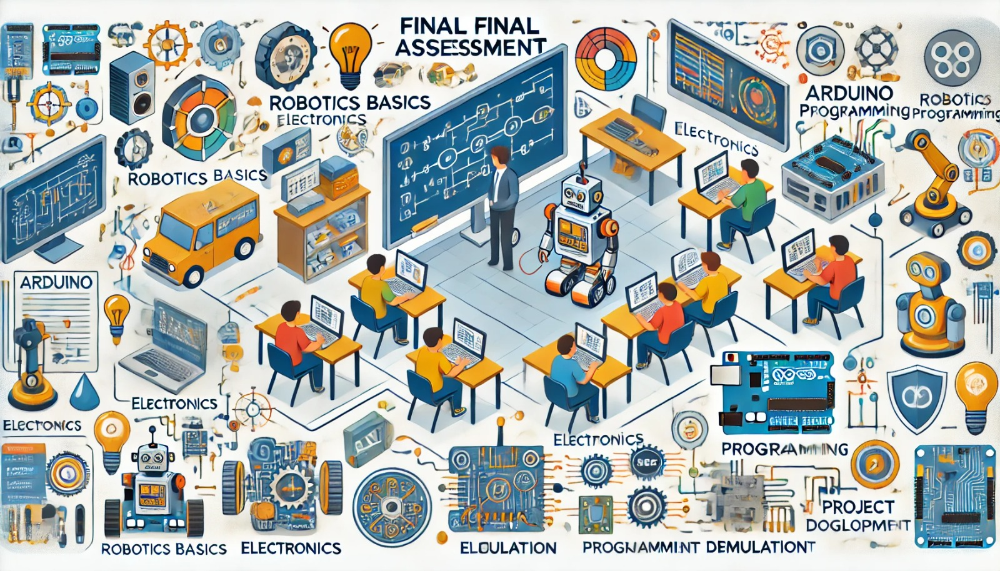

### Aula 39: Avaliação Final

Hoje é o dia da **avaliação final**, uma oportunidade para cada aluno demonstrar o conhecimento adquirido ao longo do curso. A avaliação é estruturada para cobrir todos os principais tópicos abordados, incluindo fundamentos de robótica, eletrônica, programação em C++, simulação e o desenvolvimento do Projeto Integrador. Através dessa avaliação, os alunos poderão refletir sobre seu aprendizado e aplicar as habilidades desenvolvidas.

---

### 1. Estrutura da Avaliação Final

A avaliação será composta por uma combinação de **questões de múltipla escolha, questões práticas e uma análise de código**. As questões foram projetadas para avaliar tanto o conhecimento teórico quanto a capacidade de resolução prática de problemas. A estrutura da avaliação é a seguinte:

1. **Questões Teóricas de Múltipla Escolha**:
   - Focarão em conceitos fundamentais, como tipos de componentes eletrônicos, funcionamento básico de sensores e atuadores, e lógica de controle.

2. **Questões Práticas**:
   - Envolverão a interpretação e a aplicação de conceitos, como a montagem de um circuito simples, análise de um trecho de código para controlar um sensor ou atuador, e cálculos com base na Lei de Ohm.

3. **Questão de Análise de Código**:
   - Apresentará um trecho de código que os alunos deverão interpretar e explicar, com ênfase na lógica e no fluxo de execução do programa.

---

### 2. Temas Cobertos na Avaliação

Os principais temas que serão abordados na avaliação incluem:

- **Fundamentos de Robótica e Componentes de um Robô**:
  - Compreensão dos sensores, atuadores, controladores e suas funções em um robô.

- **Eletricidade e Eletrônica**:
  - Diferença entre corrente contínua e alternada.
  - Circuitos em série e paralelo, e cálculo de parâmetros básicos.
  - Aplicação da Lei de Ohm e identificação de componentes eletrônicos como resistores e capacitores.

- **Programação em C++ para Arduino**:
  - Estrutura de um programa em Arduino.
  - Uso de funções e estruturas de controle como loops e condicionais.
  - Integração com sensores e atuadores.

- **Simulação e Testes no Webots**:
  - Configuração do ambiente de simulação.
  - Teste de funcionalidades básicas como desvio de obstáculos e navegação autônoma.

- **Desenvolvimento do Projeto Integrador**:
  - Aplicação do conhecimento adquirido para planejar, desenvolver e ajustar um robô funcional.

---

### 3. Dicas para Realizar a Avaliação

Antes de iniciar, leia todas as questões com atenção e organize o tempo para garantir que você consiga responder a cada uma delas. Abaixo estão algumas dicas:

- **Leia com Cuidado**: Certifique-se de entender o que cada questão está pedindo. Em questões de múltipla escolha, elimine as respostas incorretas para facilitar a escolha.
- **Revise os Conceitos**: Se encontrar uma questão que parece difícil, pense nos conceitos básicos abordados. Volte aos fundamentos, como componentes eletrônicos ou lógica de programação.
- **Aplique o Conhecimento Prático**: Para as questões práticas, imagine-se montando o circuito ou programando no Arduino. Isso ajuda a visualizar a resposta.
- **Interprete o Código**: Na análise de código, observe atentamente a sequência de comandos e as variáveis usadas. Entenda a lógica de cada parte antes de responder.

---

### 4. Exemplo de Questões para Revisão

Para ajudar, aqui estão alguns exemplos de questões que refletem o tipo de conteúdo presente na avaliação.

#### Exemplo de Questões de Múltipla Escolha

1. **Qual é a função principal de um resistor em um circuito?**
   - A) Aumentar a corrente elétrica
   - B) Regular a tensão
   - C) Reduzir a resistência
   - D) Limitar o fluxo de corrente

2. **Em um circuito em série, o que acontece com a corrente elétrica?**
   - A) Ela se divide igualmente entre todos os componentes
   - B) Ela permanece constante através de todos os componentes
   - C) Ela aumenta em cada componente
   - D) Ela diminui em cada componente

#### Exemplo de Questão Prática

3. **Desenhe um circuito simples que acenda um LED usando um resistor e uma fonte de tensão de 5V. Identifique cada componente e explique a função do resistor.**

#### Exemplo de Análise de Código

4. **Analise o trecho de código abaixo e explique o que ele faz:**
   ```cpp
   int sensorValor = analogRead(A0);
   if(sensorValor > 300) {
       digitalWrite(LED_BUILTIN, HIGH);
   } else {
       digitalWrite(LED_BUILTIN, LOW);
   }
   ```
   *Explicação esperada:* O código lê o valor de um sensor conectado ao pino A0. Se o valor lido for maior que 300, o LED integrado no Arduino é ligado. Caso contrário, o LED é desligado.

---

### 5. Finalização e Reflexão

Após concluir a avaliação, reserve um tempo para refletir sobre o que foi aprendido. Esse curso cobriu uma ampla gama de tópicos, desde a teoria básica até a aplicação prática em um projeto integrador. Pense sobre:

- **Quais habilidades você desenvolveu?**
- **Quais temas foram mais desafiadores e como você os superou?**
- **De que forma você pode aplicar o que aprendeu em futuros projetos ou estudos?**

Essa reflexão ajuda a consolidar o aprendizado e a identificar áreas onde o conhecimento pode ser expandido no futuro.

---

### Conclusão

A avaliação final representa o encerramento de uma jornada de aprendizado e desenvolvimento de habilidades na robótica. Ela reflete o empenho e o progresso de cada aluno e serve como um marco na formação prática e teórica. Desejo a todos boa sorte e sucesso na avaliação!

--- 

### Exercícios de Reflexão Pós-Avaliação

1. **Qual foi a questão que você achou mais fácil? E a mais difícil?**
2. **Se pudesse revisar um tema antes da avaliação, qual escolheria?**
3. **Qual é o principal aprendizado que você leva deste curso?**

Essas reflexões pós-avaliação ajudarão a consolidar o aprendizado e a identificar áreas para estudo contínuo.