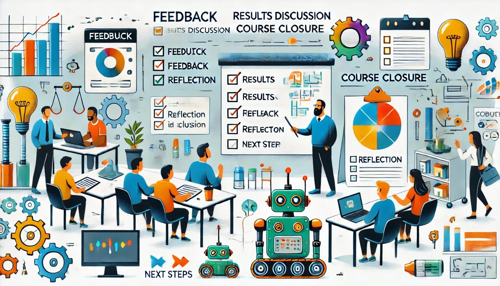

### Aula 40: Feedback, Discussão dos Resultados e Encerramento do Curso

Chegamos à última aula do curso, onde vamos revisar os resultados da avaliação final, discutir o progresso dos alunos e refletir sobre o que foi aprendido. Este é um momento para dar **feedback construtivo**, compartilhar experiências e celebrar o desenvolvimento de cada aluno. Além disso, discutiremos caminhos para continuar avançando na área de robótica.

---

### 1. Revisão dos Resultados da Avaliação Final

Vamos iniciar com uma revisão geral dos resultados da avaliação final, destacando os pontos fortes e as áreas onde os alunos podem focar para aprimorar suas habilidades.

#### Discussão dos Principais Tópicos

- **Desempenho nos Fundamentos de Robótica**: Observações sobre o entendimento dos alunos sobre sensores, atuadores e controladores.
- **Eletricidade e Eletrônica**: Revisão dos resultados nas questões relacionadas a circuitos, componentes e Lei de Ohm.
- **Programação com Arduino**: Feedback sobre a habilidade dos alunos em interpretar e escrever código C++ para controle de robôs.
- **Simulação e Webots**: Desempenho na compreensão e uso do Webots para testes e ajustes de projetos.
- **Projeto Integrador**: Observações sobre o planejamento, desenvolvimento e apresentação dos projetos finais.

Esse feedback ajuda cada aluno a identificar áreas onde podem aprimorar suas habilidades e celebrar suas conquistas.

---

### 2. Feedback Individual e Coletivo

Cada aluno receberá um feedback individual, focando nos seguintes pontos:

- **Pontos Fortes**: Destaque das habilidades e conhecimentos nos quais o aluno se destacou ao longo do curso.
- **Áreas de Melhoria**: Sugestões sobre o que o aluno pode estudar ou praticar mais para continuar avançando na robótica.
- **Contribuição para o Projeto**: Observações sobre a participação e criatividade do aluno no Projeto Integrador.

Além do feedback individual, discutiremos de forma coletiva as observações gerais sobre o desempenho da turma, celebrando as conquistas e incentivando o progresso contínuo.

---

### 3. Reflexão sobre o Curso e Aprendizado

Esta é uma oportunidade para os alunos refletirem sobre sua jornada de aprendizado. Algumas perguntas para orientar a reflexão incluem:

- **Qual foi o aprendizado mais significativo para você neste curso?**
- **Qual foi o maior desafio enfrentado e como você o superou?**
- **Como você pretende usar as habilidades adquiridas em futuros projetos?**

Esse momento de reflexão permite que os alunos consolidem seu aprendizado, reconhecendo seu progresso e identificando suas áreas de interesse na robótica.

---

### 4. Discussão sobre Próximos Passos

Para encerrar, discutiremos possíveis caminhos que os alunos podem seguir para aprofundar seu conhecimento e continuar sua jornada na robótica.

#### Sugestões para Continuidade

- **Projetos Pessoais**: Incentive os alunos a desenvolverem projetos pessoais de robótica para aplicar o que aprenderam e explorar novas ideias.
- **Cursos e Materiais Avançados**: Sugestão de cursos, livros e tutoriais para aprofundar o conhecimento em áreas específicas, como programação avançada de robôs, visão computacional e inteligência artificial aplicada à robótica.
- **Participação em Comunidades de Robótica**: Participar de grupos online, fóruns e competições de robótica pode ser uma excelente forma de aprendizado prático e troca de experiências.

---

### 5. Encerramento e Conclusão do Curso

Para concluir, agradeça a todos pela dedicação e empenho ao longo do curso. Celebre o progresso de cada aluno e reforce a importância de continuar explorando e aprendendo.

**Mensagem Final**: A robótica é uma área que combina criatividade, lógica e habilidades técnicas. A jornada que começou neste curso pode levar cada aluno a novas descobertas e realizações. Lembrem-se de que o aprendizado é contínuo, e cada desafio é uma oportunidade de crescimento. Parabéns a todos por completarem este curso com sucesso!

---

### Exercícios de Reflexão Final

1. **O que você gostaria de explorar mais a fundo em seus próximos estudos em robótica?**
2. **Como você planeja aplicar o que aprendeu em projetos futuros?**
3. **Que conselho você daria a outros que estão começando a aprender robótica?**

Esses exercícios de reflexão final ajudam os alunos a consolidarem sua visão sobre a robótica e a se motivarem para continuar explorando e crescendo na área.