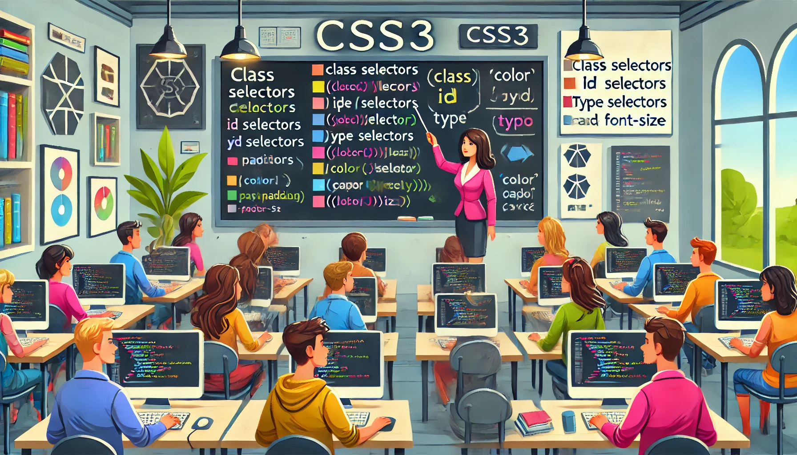

### Aula 2: Revisão de CSS3 (Seletores, Propriedades Básicas)

#### Introdução

CSS3, ou Cascading Style Sheets, é a linguagem utilizada para estilizar e formatar o conteúdo de uma página web escrita em HTML. O CSS permite controlar a aparência de texto, cores, espaçamentos, alinhamentos e muito mais. Nesta aula, vamos revisar os conceitos básicos de seletores e propriedades em CSS3.

#### Seletores CSS

Seletores são padrões usados para selecionar os elementos HTML que você deseja estilizar. Aqui estão alguns dos tipos mais comuns de seletores em CSS:

1. **Seletores de Tipo**: Selecionam todos os elementos de um determinado tipo. Por exemplo, `p` seleciona todos os elementos `<p>`.

```css
p {
    color: blue;
}
```

2. **Seletores de Classe**: Começam com um ponto `.` e são aplicados a elementos que têm um atributo `class`. Por exemplo, `.texto-destaque` seleciona todos os elementos com `class="texto-destaque"`.

```css
.texto-destaque {
    font-weight: bold;
}
```

3. **Seletores de ID**: Começam com uma cerquilha `#` e são aplicados a elementos que têm um atributo `id`. O ID deve ser único dentro de uma página. Por exemplo, `#cabecalho` seleciona o elemento com `id="cabecalho"`.

```css
#cabecalho {
    background-color: gray;
}
```

4. **Seletores Universais**: Utilizados para selecionar todos os elementos na página. O seletor universal é representado por `*`.

```css
* {
    box-sizing: border-box;
}
```

#### Propriedades Básicas

Depois de selecionar um elemento, você pode definir suas propriedades de estilo. Aqui estão algumas propriedades básicas de CSS:

- **Color**: Define a cor do texto.
- **Font-size**: Define o tamanho da fonte.
- **Background-color**: Define a cor de fundo de um elemento.
- **Margin**: Controla o espaço fora dos limites do elemento.
- **Padding**: Controla o espaço dentro dos limites do elemento.

Exemplo de uso de propriedades básicas:

```css
p {
    color: red;
    font-size: 16px;
    background-color: yellow;
    margin: 20px;
    padding: 10px;
}
```

#### Exemplo Prático

Vamos aplicar alguns estilos a uma página HTML simples:

HTML:
```html
<!DOCTYPE html>
<html>
<head>
    <title>Revisão de CSS3</title>
    <link rel="stylesheet" type="text/css" href="estilos.css">
</head>
<body>
    <h1 id="cabecalho">Bem-vindo ao Curso de CSS3!</h1>
    <p class="texto-destaque">CSS é importante para o design de páginas web.</p>
    <p>Aqui você aprende como usar CSS para melhorar sua página.</p>
</body>
</html>
```

CSS (estilos.css):
```css
#cabecalho {
    background-color: navy;
    color: white;
    padding: 10px;
}

.texto-destaque {
    font-size: 18px;
    color: green;
}

p {
    color: black;
    margin: 5px;
}
```

#### Conclusão

Compreender como usar seletores e propriedades básicas em CSS é fundamental para criar páginas web visualmente atraentes e funcionais. Pratique aplicando diferentes estilos aos elementos HTML para ver como você pode transformar completamente a aparência de uma página web.

#### Exercícios Práticos

1. **Estilize um Parágrafo**: Adicione cor, tamanho de fonte e margem a um parágrafo.
2. **Crie um Cabeçalho Estilizado**: Use um ID para adicionar cor de fundo e padding ao cabeçalho da página.
3. **Diferencie Itens com Classe**: Aplique uma classe a dois elementos distintos e dê a eles estilos específicos. 

---

### Atividade de Múltipla Escolha: Revisão de CSS3

Esta atividade é projetada para testar seu entendimento sobre seletores e propriedades básicas do CSS3. Escolha a alternativa correta para cada questão.

#### Questão 1
Qual seletor CSS é usado para aplicar estilos a todos os elementos de um mesmo tipo?
- A) Seletor de classe (`.classe`)
- B) Seletor de ID (`#id`)
- C) Seletor universal (`*`)
- D) Seletor de tipo (`elemento`)

#### Questão 2
O que a propriedade `margin` do CSS controla?
- A) A cor interna de um elemento.
- B) O espaçamento dentro de um elemento.
- C) O espaçamento fora de um elemento.
- D) A borda ao redor de um elemento.

#### Questão 3
Se você quer selecionar um elemento HTML que tenha o atributo `id="titulo"`, qual seletor você deve usar?
- A) `.titulo`
- B) `#titulo`
- C) `titulo`
- D) `*titulo`

#### Questão 4
Qual propriedade CSS é usada para definir o tamanho da fonte de um texto?
- A) `font-style`
- B) `font-weight`
- C) `font-size`
- D) `text-size`

#### Questão 5
Como você aplicaria um estilo apenas aos parágrafos que têm a classe `destaque`?
- A) `p #destaque { }`
- B) `p.destaque { }`
- C) `p = destaque { }`
- D) `.p destaque { }`

#### Questão 6
Qual das seguintes declarações sobre o seletor universal (`*`) é verdadeira?
- A) Seleciona todos os elementos dentro de um elemento específico.
- B) Seleciona apenas elementos que não têm classe ou ID.
- C) Seleciona todos os elementos de uma página.
- D) Seleciona apenas elementos que são links.

#### Questão 7
Qual propriedade é usada para alterar a cor de fundo de um elemento?
- A) `color`
- B) `background-color`
- C) `bgcolor`
- D) `background-style`

#### Questão 8
Se você deseja adicionar espaço entre o conteúdo de um elemento e suas bordas, qual propriedade você deve usar?
- A) `margin`
- B) `padding`
- C) `border`
- D) `spacing`