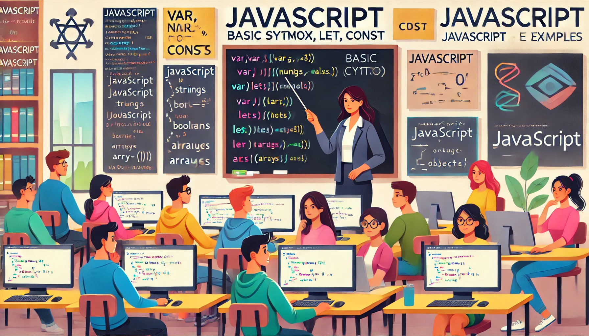

### Aula 3: Revisão de JavaScript (Sintaxe Básica, Variáveis, Tipos de Dados)

#### Introdução

JavaScript é uma linguagem de programação que permite adicionar interatividade a suas páginas web. Ele é usado para criar efeitos dinâmicos, validar formulários, carregar dados de servidores e muito mais. Nesta aula, vamos revisar a sintaxe básica do JavaScript, variáveis e tipos de dados.

#### Sintaxe Básica

A sintaxe do JavaScript é a forma como escrevemos o código para que o navegador entenda o que queremos que ele faça. Aqui estão alguns exemplos básicos de sintaxe:

- **Comentários**: Comentários são linhas de código que não são executadas. Existem comentários de linha única e de múltiplas linhas.

```javascript
// Este é um comentário de linha única

/*
Este é um
comentário de
múltiplas linhas
*/
```

- **Instruções**: As instruções são comandos que dizemos ao JavaScript para executar. Elas geralmente terminam com um ponto e vírgula (`;`).

```javascript
console.log('Olá, Mundo!'); // Exibe 'Olá, Mundo!' no console do navegador
```

#### Variáveis

Variáveis são usadas para armazenar dados que podemos usar e modificar ao longo do nosso código. Em JavaScript, podemos declarar variáveis usando `var`, `let` ou `const`.

- **var**: Utilizado para declarar variáveis de escopo global ou de função.
- **let**: Utilizado para declarar variáveis de escopo de bloco.
- **const**: Utilizado para declarar constantes, ou seja, valores que não mudam.

```javascript
var nome = 'João'; // Variável global ou de função
let idade = 25; // Variável de bloco
const PI = 3.14; // Constante
```

#### Tipos de Dados

JavaScript possui diferentes tipos de dados que podemos usar para armazenar informações. Aqui estão os principais:

- **String**: Texto, delimitado por aspas simples ou duplas.

```javascript
let saudacao = 'Olá, Mundo!';
```

- **Number**: Números, incluindo inteiros e decimais.

```javascript
let idade = 25;
let preco = 19.99;
```

- **Boolean**: Valores lógicos, `true` ou `false`.

```javascript
let ativo = true;
let terminado = false;
```

- **Array**: Lista de valores, delimitados por colchetes.

```javascript
let frutas = ['Maçã', 'Banana', 'Laranja'];
```

- **Object**: Coleção de pares chave-valor, delimitada por chaves.

```javascript
let pessoa = {
    nome: 'João',
    idade: 25,
    ativo: true
};
```

#### Exemplo Prático

Vamos criar um exemplo simples que utiliza variáveis e diferentes tipos de dados.

```javascript
// Declaração de variáveis
let nome = 'Maria';
let idade = 30;
const PI = 3.14;
let frutas = ['Maçã', 'Banana', 'Laranja'];
let pessoa = {
    nome: 'João',
    idade: 25,
    ativo: true
};

// Exibindo informações no console
console.log('Nome:', nome); // Nome: Maria
console.log('Idade:', idade); // Idade: 30
console.log('PI:', PI); // PI: 3.14
console.log('Frutas:', frutas); // Frutas: ['Maçã', 'Banana', 'Laranja']
console.log('Pessoa:', pessoa); // Pessoa: { nome: 'João', idade: 25, ativo: true }
```

#### Conclusão

Entender a sintaxe básica do JavaScript, como declarar variáveis e os diferentes tipos de dados é essencial para começar a programar. Pratique escrevendo pequenos trechos de código e experimentando com variáveis e tipos de dados para ganhar confiança.

#### Exercícios Práticos

1. **Declare e Inicialize Variáveis**: Crie variáveis usando `var`, `let` e `const` para armazenar seu nome, idade e uma lista de suas frutas favoritas.
2. **Exiba Informações**: Use `console.log` para exibir o valor das variáveis que você criou.
3. **Crie um Objeto**: Crie um objeto chamado `carro` com as propriedades `marca`, `modelo` e `ano`, e exiba essas informações no console.

Esses exercícios ajudarão a reforçar os conceitos básicos de JavaScript e preparar você para aprender funcionalidades mais avançadas da linguagem.