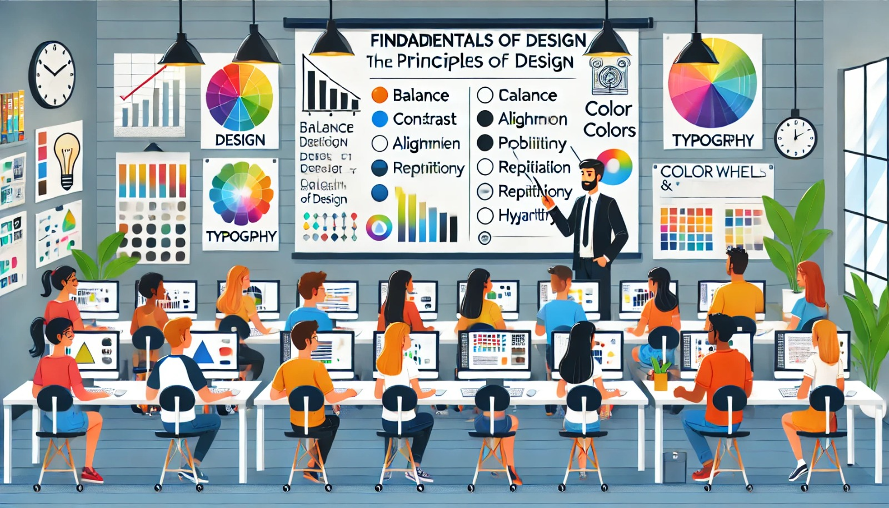

### Aula 4: Revisão de Fundamentos de Design (Princípios de Design, Cores, Tipografia)

#### Introdução

Os fundamentos de design são essenciais para criar sites visualmente atraentes e funcionais. Nesta aula, vamos revisar os princípios básicos de design, a importância das cores e como escolher a tipografia adequada para suas páginas web.

#### Princípios de Design

Os princípios de design são diretrizes que ajudam a criar layouts harmoniosos e eficazes. Aqui estão alguns dos principais:

1. **Equilíbrio**: Refere-se à distribuição visual dos elementos na página. Pode ser simétrico (elementos iguais de ambos os lados) ou assimétrico (elementos diferentes que equilibram a composição).

2. **Contraste**: Utiliza diferenças de cor, forma, tamanho e textura para destacar elementos importantes e guiar o olhar do usuário pela página.

3. **Alinhamento**: Garante que os elementos da página estejam organizados de maneira ordenada, criando uma aparência limpa e estruturada.

4. **Proximidade**: Agrupa elementos relacionados para mostrar que estão conectados. Isso ajuda na organização visual e na facilidade de navegação.

5. **Repetição**: Reutiliza elementos visuais para criar coesão e consistência na página, como cores, fontes e estilos de botões.

6. **Hierarquia**: Organiza os elementos de modo que os mais importantes se destacam mais, ajudando os usuários a entender o que é mais relevante.

#### Cores

A escolha de cores pode afetar significativamente a aparência e a usabilidade do seu site. Aqui estão algumas dicas sobre como usar cores de forma eficaz:

1. **Paleta de Cores**: Escolha uma paleta de cores que combine bem. Ferramentas como Adobe Color e Coolors podem ajudar a criar paletas harmoniosas.

2. **Cores Primárias e Secundárias**: Use uma cor primária para os elementos principais e cores secundárias para complementar e dar destaque.

3. **Contraste**: Certifique-se de que há contraste suficiente entre o texto e o fundo para garantir a legibilidade. Por exemplo, texto claro em fundo escuro ou texto escuro em fundo claro.

4. **Psicologia das Cores**: Diferentes cores podem evocar emoções e sentimentos específicos. Por exemplo, azul é frequentemente associado à confiança e segurança, enquanto vermelho pode significar alerta ou paixão.

5. **Acessibilidade**: Considere a acessibilidade ao escolher suas cores. Certifique-se de que as combinações de cores são legíveis para pessoas com deficiência visual, como daltonismo.

#### Tipografia

A tipografia trata da escolha e do uso das fontes no design. Aqui estão alguns aspectos importantes:

1. **Fontes Serifadas vs. Sem Serifas**: Fontes serifadas têm pequenas linhas decorativas no final das letras (como Times New Roman), enquanto fontes sem serifas não têm essas linhas (como Arial). Fontes sem serifas são geralmente mais fáceis de ler em telas.

2. **Hierarquia Tipográfica**: Use diferentes tamanhos e estilos de fontes para criar uma hierarquia visual. Por exemplo, títulos devem ser maiores e mais destacados que o texto do corpo.

3. **Espaçamento**: Preste atenção ao espaçamento entre linhas (line-height) e entre letras (letter-spacing) para garantir que o texto seja fácil de ler.

4. **Número de Fontes**: Evite usar muitas fontes diferentes. Geralmente, duas ou três fontes diferentes são suficientes para manter o design limpo e coeso.

5. **Legibilidade**: Certifique-se de que o texto é legível em todos os dispositivos, ajustando tamanhos de fonte e espaçamentos conforme necessário.

#### Exemplo Prático

Vamos criar um exemplo simples de uma página que aplica os princípios de design, cores e tipografia:

HTML:
```html
<!DOCTYPE html>
<html lang="pt-BR">
<head>
    <meta charset="UTF-8">
    <meta name="viewport" content="width=device-width, initial-scale=1.0">
    <title>Fundamentos de Design</title>
    <link rel="stylesheet" href="styles.css">
</head>
<body>
    <header>
        <h1>Princípios de Design</h1>
    </header>
    <main>
        <section>
            <h2>Equilíbrio</h2>
            <p>O equilíbrio refere-se à distribuição dos elementos na página...</p>
        </section>
        <section>
            <h2>Contraste</h2>
            <p>O contraste utiliza diferenças de cor, forma e tamanho para destacar...</p>
        </section>
    </main>
    <footer>
        <p>&copy; 2024 Design Web</p>
    </footer>
</body>
</html>
```

CSS (styles.css):
```css
body {
    font-family: Arial, sans-serif;
    color: #333;
    background-color: #f4f4f4;
    margin: 0;
    padding: 0;
    line-height: 1.6;
}

header, footer {
    background-color: #333;
    color: white;
    text-align: center;
    padding: 1em 0;
}

h1 {
    font-size: 2.5em;
}

h2 {
    font-size: 1.5em;
    color: #0056b3;
}

p {
    margin: 0 0 1em;
}

main {
    padding: 1em;
}

section {
    background: white;
    margin: 1em 0;
    padding: 1em;
    border-radius: 8px;
    box-shadow: 0 0 10px rgba(0, 0, 0, 0.1);
}
```

#### Conclusão

Compreender os fundamentos de design, a escolha de cores e a tipografia é crucial para criar páginas web atraentes e funcionais. Pratique aplicando esses conceitos em seus projetos para melhorar a qualidade do seu design.

#### Exercícios Práticos

1. **Crie uma Paleta de Cores**: Use uma ferramenta online para criar uma paleta de cores e aplique-a em um layout simples.
2. **Desenvolva um Layout Balanceado**: Crie um layout de página que demonstre equilíbrio, contraste e alinhamento.
3. **Experimente com Tipografia**: Escolha duas ou três fontes e crie uma hierarquia tipográfica para um pequeno texto.

