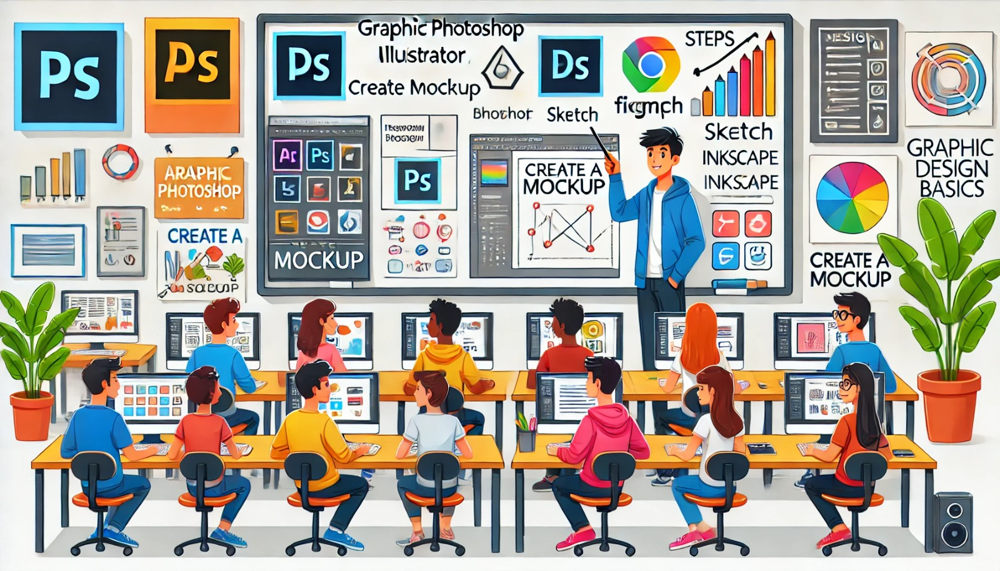

### Aula 5: Revisão de Editoração Gráfica (Ferramentas Básicas, Criação de Mockups)

#### Introdução

A editoração gráfica é essencial para o design de páginas web e outros materiais visuais. Ela envolve o uso de ferramentas para criar layouts, escolher cores, fontes e organizar elementos visuais de forma harmoniosa. Nesta aula, vamos revisar as ferramentas básicas de editoração gráfica e como criar mockups.

#### Ferramentas Básicas de Editoração Gráfica

Existem várias ferramentas que você pode usar para editoração gráfica. Aqui estão algumas das mais populares e suas funções principais:

1. **Adobe Photoshop**: Utilizado para edição de imagens, criação de gráficos e manipulação de fotos. Ele oferece uma vasta gama de ferramentas para ajustar cores, cortar, redimensionar e aplicar efeitos às imagens.

2. **Adobe Illustrator**: Focado em criação de gráficos vetoriais, como logotipos e ícones. Diferente do Photoshop, o Illustrator trabalha com gráficos que podem ser escalados para qualquer tamanho sem perder qualidade.

3. **Figma**: Uma ferramenta baseada na web para design de interface e prototipagem. Permite colaborar em tempo real com outros designers e criar designs interativos.

4. **Sketch**: Similar ao Figma, é uma ferramenta de design de interface para criar layouts e protótipos. Muito popular entre designers de UX/UI.

5. **Inkscape**: Uma alternativa gratuita ao Adobe Illustrator, usada para criar e editar gráficos vetoriais.

#### Criação de Mockups

Mockups são representações visuais de um projeto. Eles ajudam a visualizar como o produto final vai parecer antes de ser desenvolvido. Vamos ver como criar um mockup passo a passo.

1. **Planejamento**: Antes de começar a criar, planeje o que você quer mostrar no mockup. Pode ser uma página web, um aplicativo ou qualquer outro produto visual.

2. **Esboço**: Faça um esboço simples no papel ou em uma ferramenta digital. Isso ajuda a ter uma ideia clara do layout e da organização dos elementos.

3. **Escolha a Ferramenta**: Selecione a ferramenta mais adequada para o seu projeto. Por exemplo, você pode usar o Figma ou o Sketch para design de interfaces ou o Photoshop para um mockup mais detalhado.

4. **Criação**:
   - **Abrir a Ferramenta**: Abra a ferramenta escolhida e crie um novo projeto.
   - **Configurar a Tela**: Defina o tamanho da tela de acordo com o dispositivo que você está projetando (desktop, tablet, smartphone).
   - **Adicionar Elementos**: Comece a adicionar os elementos do seu design (botões, textos, imagens). Organize-os conforme o esboço feito anteriormente.
   - **Estilizar**: Aplique estilos como cores, sombras, bordas e fontes para tornar o mockup visualmente atraente.

5. **Revisão e Ajustes**: Revise seu mockup e faça ajustes conforme necessário. Peça feedback de colegas ou clientes para melhorar o design.

#### Exemplo Prático

Vamos criar um mockup simples de uma página inicial de um site usando o Figma.

**Passo a Passo**:

1. **Acesse o Figma**: Abra o Figma no seu navegador.
2. **Crie um Novo Projeto**: Clique em "New File" para criar um novo projeto.
3. **Defina a Tela**: Selecione o tamanho da tela (por exemplo, Desktop - 1440x1024).
4. **Adicione um Título**: Use a ferramenta de texto para adicionar um título "Bem-vindo ao Meu Site".
5. **Adicione um Botão**: Desenhe um retângulo para criar um botão e adicione o texto "Saiba Mais" dentro do botão.
6. **Insira uma Imagem**: Faça o upload de uma imagem e posicione-a na parte superior da página.
7. **Estilize**: Aplique cores, fontes e outros estilos para deixar o mockup mais atraente.

#### Conclusão

A editoração gráfica e a criação de mockups são habilidades essenciais para qualquer designer. Com as ferramentas certas e um bom planejamento, você pode criar designs impressionantes que ajudam a visualizar o produto final antes de sua implementação.

#### Exercícios Práticos

1. **Escolha uma Ferramenta**: Baixe e instale uma das ferramentas de editoração gráfica mencionadas (como o Figma ou o Inkscape).
2. **Crie um Mockup Simples**: Faça um mockup de uma página inicial de um site ou de uma tela de aplicativo usando a ferramenta escolhida.
3. **Compartilhe e Peça Feedback**: Mostre seu mockup para colegas ou amigos e peça feedback para melhorar seu design.

Praticar essas habilidades ajudará você a se tornar um designer mais eficiente e criativo.