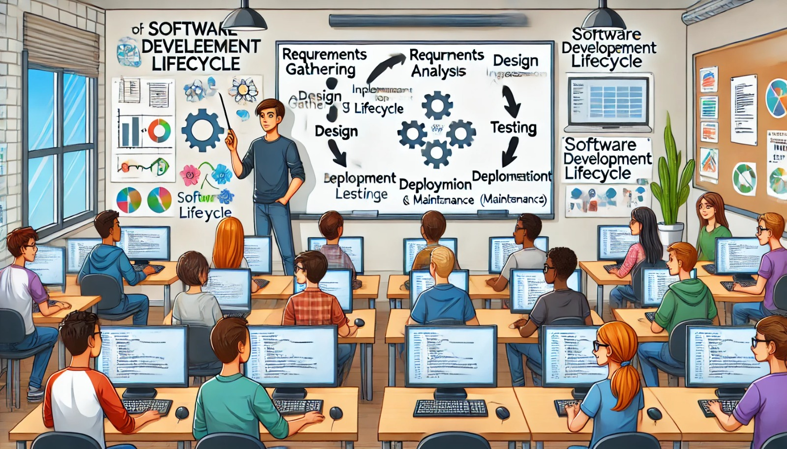

### Aula 6: Revisão de Engenharia de Software (Conceitos Básicos, Ciclo de Vida do Software)

#### Introdução

A engenharia de software é uma área da computação que se concentra no design, desenvolvimento e manutenção de software. Nesta aula, vamos revisar os conceitos básicos de engenharia de software e entender o ciclo de vida do software, que descreve as etapas desde a concepção até a manutenção de um programa.

#### Conceitos Básicos de Engenharia de Software

1. **Software**: Conjunto de instruções que um computador segue para executar tarefas específicas.
2. **Engenharia de Software**: Disciplina que aplica princípios de engenharia ao desenvolvimento de software. O objetivo é criar software de alta qualidade, dentro do prazo e orçamento previstos.

#### Ciclo de Vida do Software

O ciclo de vida do software é o processo que descreve as etapas que um projeto de software atravessa desde o início até o fim. Aqui estão as fases principais:

1. **Levantamento de Requisitos**:
   - **Objetivo**: Entender o que os usuários e stakeholders (partes interessadas) precisam e esperam do software.
   - **Atividades**: Entrevistas, questionários, análise de documentos.
   - **Resultado**: Documento de Requisitos, que descreve detalhadamente o que o software deve fazer.

2. **Análise de Requisitos**:
   - **Objetivo**: Analisar e refinar os requisitos levantados.
   - **Atividades**: Revisão dos requisitos, identificação de requisitos inconsistentes ou incompletos.
   - **Resultado**: Especificação de Requisitos, que serve como base para a próxima fase.

3. **Design (Projeto)**:
   - **Objetivo**: Planejar a estrutura do software, incluindo arquitetura, componentes e interfaces.
   - **Atividades**: Criação de diagramas de arquitetura, design de banco de dados, design de interface do usuário.
   - **Resultado**: Documento de Design, que detalha como o software será implementado.

4. **Implementação (Desenvolvimento)**:
   - **Objetivo**: Codificar o software conforme o design.
   - **Atividades**: Escrita de código-fonte, desenvolvimento de módulos, integração de componentes.
   - **Resultado**: Código-fonte do software.

5. **Testes**:
   - **Objetivo**: Verificar se o software funciona corretamente e atende aos requisitos.
   - **Atividades**: Testes unitários, testes de integração, testes de sistema, testes de aceitação.
   - **Resultado**: Relatórios de Testes, que documentam os defeitos encontrados e as correções aplicadas.

6. **Implantação (Desenvolvimento)**:
   - **Objetivo**: Colocar o software em operação no ambiente de produção.
   - **Atividades**: Configuração do ambiente de produção, instalação do software, treinamento de usuários.
   - **Resultado**: Software em operação.

7. **Manutenção**:
   - **Objetivo**: Corrigir defeitos, melhorar desempenho e adaptar o software a novos requisitos.
   - **Atividades**: Correção de bugs, atualizações, melhorias.
   - **Resultado**: Versões atualizadas do software.

#### Exemplo Prático

Vamos imaginar o desenvolvimento de um aplicativo de lista de tarefas:

1. **Levantamento de Requisitos**: Descobrimos que os usuários precisam de um aplicativo que permita adicionar, editar e excluir tarefas, além de marcar tarefas como concluídas.
2. **Análise de Requisitos**: Refinamos os requisitos para garantir que estão completos e claros.
3. **Design**: Criamos um design para o aplicativo, incluindo a interface do usuário e a estrutura do banco de dados.
4. **Implementação**: Desenvolvemos o código do aplicativo conforme o design.
5. **Testes**: Realizamos testes para garantir que todas as funcionalidades estão funcionando corretamente.
6. **Implantação**: Lançamos o aplicativo na loja de aplicativos para que os usuários possam baixá-lo.
7. **Manutenção**: Corrigimos bugs e lançamos atualizações com novas funcionalidades.

#### Conclusão

Entender os conceitos básicos e o ciclo de vida do software é fundamental para desenvolver software de alta qualidade. Cada fase do ciclo de vida tem um papel importante para garantir que o produto final atenda às expectativas dos usuários e stakeholders.

### Atividade de Fixação de Conteúdo: Revisão de Engenharia de Software

Esta atividade é projetada para testar seu entendimento sobre os conceitos básicos de engenharia de software e o ciclo de vida do software. Leia cada pergunta cuidadosamente e escolha a alternativa correta.

#### Questão 1
Qual das opções abaixo NÃO é uma fase do ciclo de vida do software?
- A) Levantamento de Requisitos
- B) Implementação
- C) Integração com Hardware
- D) Testes

#### Questão 2
O que é o Documento de Requisitos?
- A) Um documento que descreve como o software será implementado.
- B) Um documento que lista as funcionalidades que o software deve ter.
- C) Um documento que detalha os testes realizados no software.
- D) Um documento que descreve o design da interface do usuário.

#### Questão 3
Qual é o principal objetivo da fase de Análise de Requisitos?
- A) Desenvolver o código-fonte do software.
- B) Criar diagramas de arquitetura.
- C) Refinar e detalhar os requisitos levantados.
- D) Implantar o software no ambiente de produção.

#### Questão 4
Durante a fase de Design, qual é uma das principais atividades realizadas?
- A) Especificação de Requisitos
- B) Criação de diagramas de arquitetura
- C) Correção de bugs
- D) Treinamento de usuários

#### Questão 5
Qual fase do ciclo de vida do software envolve a verificação de que o software funciona corretamente e atende aos requisitos?
- A) Levantamento de Requisitos
- B) Design
- C) Implementação
- D) Testes

#### Questão 6
A fase de Manutenção no ciclo de vida do software envolve:
- A) Planejamento e construção do software
- B) Verificação dos requisitos iniciais
- C) Atualizações e correção de bugs
- D) Definição da arquitetura do software

#### Questão 7
Qual é o objetivo da fase de Implantação?
- A) Desenvolver o software.
- B) Colocar o software em operação no ambiente de produção.
- C) Analisar os requisitos do software.
- D) Criar a documentação do software.

#### Questão 8
O que deve ser feito durante a fase de Levantamento de Requisitos?
- A) Desenvolver o código do software.
- B) Entender as necessidades e expectativas dos usuários.
- C) Criar diagramas de banco de dados.
- D) Realizar testes unitários.
