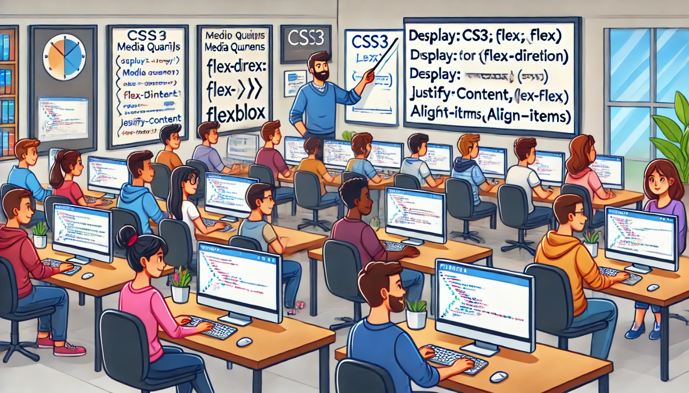

### Aula 8: CSS3: Layout Responsivo (Media Queries, Flexbox)

#### Introdução

Com a variedade de dispositivos disponíveis, como smartphones, tablets e computadores, é essencial que os sites se adaptem a diferentes tamanhos de tela. Isso é feito por meio de layouts responsivos. Nesta aula, vamos aprender sobre media queries e flexbox, duas ferramentas poderosas do CSS3 para criar layouts responsivos.

#### Media Queries

Media queries permitem que você aplique estilos CSS diferentes com base nas características do dispositivo, como largura da tela, altura, resolução, etc. Isso ajuda a criar um design que se adapta a vários tamanhos de tela.

##### Sintaxe Básica

```css
@media (condição) {
  /* estilos aqui */
}
```

##### Exemplo de Media Query

Vamos aplicar um estilo diferente para telas menores que 600px de largura:

```css
/* Estilos para telas maiores */
body {
  font-size: 16px;
}

/* Estilos para telas menores que 600px */
@media (max-width: 600px) {
  body {
    font-size: 14px;
  }
}
```

#### Flexbox

Flexbox é um layout de CSS que permite distribuir o espaço e alinhar itens dentro de um contêiner de forma eficiente. É ideal para criar layouts flexíveis e responsivos.

##### Estrutura Básica do Flexbox

1. **Flex Container**: O elemento pai que possui a propriedade `display: flex;`.
2. **Flex Items**: Os elementos filhos dentro do flex container.

##### Propriedades do Flex Container

- **display: flex;**: Define um elemento como flex container.
- **flex-direction**: Define a direção dos itens no container (row, column, row-reverse, column-reverse).
- **justify-content**: Alinha os itens ao longo do eixo principal (flex-start, flex-end, center, space-between, space-around).
- **align-items**: Alinha os itens ao longo do eixo transversal (flex-start, flex-end, center, baseline, stretch).

##### Propriedades dos Flex Items

- **flex-grow**: Define a capacidade de um item crescer.
- **flex-shrink**: Define a capacidade de um item encolher.
- **flex-basis**: Define o tamanho inicial de um item antes de distribuir o espaço restante.

##### Exemplo Prático com Flexbox

Vamos criar um layout simples usando flexbox:

HTML:
```html
<!DOCTYPE html>
<html lang="pt-BR">
<head>
    <meta charset="UTF-8">
    <meta name="viewport" content="width=device-width, initial-scale=1.0">
    <title>Layout Flexbox</title>
    <link rel="stylesheet" href="styles.css">
</head>
<body>
    <div class="container">
        <div class="item">Item 1</div>
        <div class="item">Item 2</div>
        <div class="item">Item 3</div>
    </div>
</body>
</html>
```

CSS (styles.css):
```css
/* Definindo o container como flex */
.container {
    display: flex;
    justify-content: space-around;
    align-items: center;
    height: 100vh;
}

/* Estilizando os itens */
.item {
    background-color: lightblue;
    padding: 20px;
    margin: 10px;
    border: 2px solid blue;
}

/* Media query para telas menores */
@media (max-width: 600px) {
    .container {
        flex-direction: column;
    }
}
```

#### Conclusão

Entender como usar media queries e flexbox é fundamental para criar layouts responsivos e adaptáveis. Essas ferramentas permitem que seu site fique bonito e funcional em qualquer dispositivo.

#### Exercícios Práticos

1. **Crie um Layout Responsivo**: Use media queries para ajustar o layout de um site para diferentes tamanhos de tela.
2. **Use Flexbox para Alinhar Itens**: Crie um layout de galeria de fotos que se ajuste conforme o tamanho da tela usando flexbox.
3. **Combine Flexbox e Media Queries**: Crie uma página de portfólio que utilize flexbox para o layout e media queries para garantir que ele seja responsivo.

Esses exercícios ajudarão a reforçar seu entendimento sobre layouts responsivos usando CSS3, media queries e flexbox.