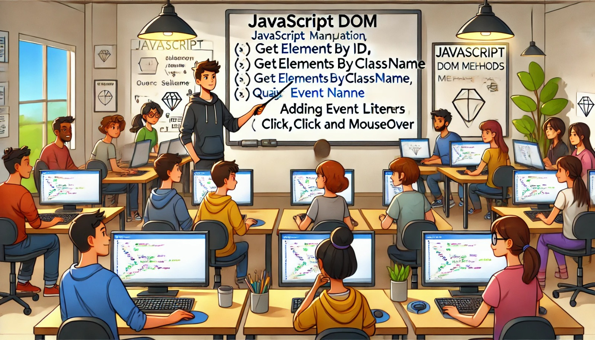

### Aula 9: JavaScript: Manipulação do DOM (Seleção de Elementos, Eventos)

#### Introdução

O Document Object Model (DOM) é uma interface de programação que representa a estrutura de um documento HTML ou XML como uma árvore de objetos. O JavaScript pode acessar e manipular o DOM para alterar a aparência e o conteúdo de uma página web dinamicamente. Nesta aula, vamos aprender como selecionar elementos do DOM e como lidar com eventos.

#### Seleção de Elementos

Para manipular o DOM, primeiro precisamos selecionar os elementos que queremos modificar. Existem várias maneiras de fazer isso em JavaScript.

1. **document.getElementById()**: Seleciona um elemento pelo seu ID.

   ```javascript
   const elemento = document.getElementById('meuElemento');
   ```

2. **document.getElementsByClassName()**: Seleciona todos os elementos com uma determinada classe.

   ```javascript
   const elementos = document.getElementsByClassName('minhaClasse');
   ```

3. **document.getElementsByTagName()**: Seleciona todos os elementos com uma determinada tag.

   ```javascript
   const paragrafos = document.getElementsByTagName('p');
   ```

4. **document.querySelector()**: Seleciona o primeiro elemento que corresponde a um seletor CSS.

   ```javascript
   const primeiroParagrafo = document.querySelector('p');
   ```

5. **document.querySelectorAll()**: Seleciona todos os elementos que correspondem a um seletor CSS.

   ```javascript
   const todosParagrafos = document.querySelectorAll('p');
   ```

#### Manipulação de Elementos

Depois de selecionar um elemento, podemos manipulá-lo de várias maneiras:

1. **Alterar o Conteúdo**: Usamos a propriedade `innerHTML` para alterar o conteúdo HTML de um elemento.

   ```javascript
   const elemento = document.getElementById('meuElemento');
   elemento.innerHTML = 'Novo conteúdo';
   ```

2. **Alterar Estilos**: Usamos a propriedade `style` para alterar os estilos CSS de um elemento.

   ```javascript
   elemento.style.color = 'blue';
   elemento.style.fontSize = '20px';
   ```

3. **Adicionar/Remover Classes**: Usamos a propriedade `classList` para adicionar ou remover classes de um elemento.

   ```javascript
   elemento.classList.add('novaClasse');
   elemento.classList.remove('classeAntiga');
   ```

#### Eventos

Eventos são ações que ocorrem na página web, como cliques, movimentos do mouse, teclas pressionadas, entre outros. Podemos usar JavaScript para responder a esses eventos.

1. **Adicionar um Evento**: Usamos a função `addEventListener()` para anexar um evento a um elemento.

   ```javascript
   const botao = document.getElementById('meuBotao');
   botao.addEventListener('click', function() {
       alert('Botão clicado!');
   });
   ```

2. **Eventos Comuns**:
   - `click`: Ocorre quando um elemento é clicado.
   - `mouseover`: Ocorre quando o mouse passa sobre um elemento.
   - `mouseout`: Ocorre quando o mouse sai de um elemento.
   - `keydown`: Ocorre quando uma tecla é pressionada.
   - `load`: Ocorre quando a página é carregada.

#### Exemplo Prático

Vamos criar um exemplo simples onde um botão muda o texto de um parágrafo quando clicado.

HTML:
```html
<!DOCTYPE html>
<html lang="pt-BR">
<head>
    <meta charset="UTF-8">
    <meta name="viewport" content="width=device-width, initial-scale=1.0">
    <title>Manipulação do DOM</title>
</head>
<body>
    <p id="meuParagrafo">Texto original</p>
    <button id="meuBotao">Clique aqui</button>

    <script src="script.js"></script>
</body>
</html>
```

JavaScript (script.js):
```javascript
// Selecionando os elementos
const paragrafo = document.getElementById('meuParagrafo');
const botao = document.getElementById('meuBotao');

// Adicionando evento de clique ao botão
botao.addEventListener('click', function() {
    // Alterando o texto do parágrafo
    paragrafo.innerHTML = 'Texto alterado!';
});
```

#### Exercícios Práticos

#### Exercício 1: Seleção de Elementos

##### Passo 1: Criação da Pasta e Arquivos

1. **Abra o terminal e crie uma pasta para o projeto:**
   ```sh
   mkdir selecao-elementos
   cd selecao-elementos
   ```

2. **Crie os arquivos HTML e JavaScript:**
   ```sh
   touch index.html script.js
   ```

3. **Abra o Visual Studio Code na pasta do projeto:**
   ```sh
   code .
   ```

##### Passo 2: Escreva o HTML

No arquivo `index.html`, adicione o seguinte conteúdo:

```html
<!DOCTYPE html>
<html lang="pt-BR">
<head>
    <meta charset="UTF-8">
    <meta name="viewport" content="width=device-width, initial-scale=1.0">
    <title>Seleção de Elementos</title>
</head>
<body>
    <h1 id="titulo">Título da Página</h1>
    <p class="texto">Este é um parágrafo de exemplo.</p>
    <p class="texto">Este é outro parágrafo de exemplo.</p>
    <div id="conteiner">
        <p>Parágrafo dentro do contêiner.</p>
    </div>

    <script src="script.js"></script>
</body>
</html>
```

##### Passo 3: Escreva o JavaScript

No arquivo `script.js`, adicione o seguinte conteúdo:

```javascript
// Selecionando o elemento pelo ID
const titulo = document.getElementById('titulo');
titulo.innerHTML = 'Novo Título';

// Selecionando elementos pela classe
const textos = document.getElementsByClassName('texto');
for (const texto of textos) {
    texto.style.color = 'blue';
}

// Selecionando elementos pela tag
const paragrafos = document.getElementsByTagName('p');
for (const paragrafo of paragrafos) {
    paragrafo.style.fontSize = '18px';
}

// Selecionando o primeiro elemento que corresponde ao seletor CSS
const primeiroParagrafo = document.querySelector('p');
primeiroParagrafo.style.fontWeight = 'bold';

// Selecionando todos os elementos que correspondem ao seletor CSS
const todosParagrafos = document.querySelectorAll('p');
todosParagrafos.forEach(paragrafo => {
    paragrafo.style.backgroundColor = 'lightgray';
});
```

#### Exercício 2: Manipulação de Eventos

##### Passo 1: Criação da Pasta e Arquivos

1. **Abra o terminal e crie uma pasta para o projeto:**
   ```sh
   mkdir manipulacao-eventos
   cd manipulacao-eventos
   ```

2. **Crie os arquivos HTML e JavaScript:**
   ```sh
   touch index.html script.js
   ```

3. **Abra o Visual Studio Code na pasta do projeto:**
   ```sh
   code .
   ```

##### Passo 2: Escreva o HTML

No arquivo `index.html`, adicione o seguinte conteúdo:

```html
<!DOCTYPE html>
<html lang="pt-BR">
<head>
    <meta charset="UTF-8">
    <meta name="viewport" content="width=device-width, initial-scale=1.0">
    <title>Manipulação de Eventos</title>
</head>
<body>
    <button id="meuBotao">Clique aqui</button>
    <div id="conteudo">Conteúdo original</div>

    <script src="script.js"></script>
</body>
</html>
```

##### Passo 3: Escreva o JavaScript

No arquivo `script.js`, adicione o seguinte conteúdo:

```javascript
// Selecionando o botão e o div
const botao = document.getElementById('meuBotao');
const conteudo = document.getElementById('conteudo');

// Adicionando evento de clique ao botão
botao.addEventListener('click', function() {
    conteudo.innerHTML = 'Conteúdo alterado!';
});

// Adicionando evento de mouseover ao botão
botao.addEventListener('mouseover', function() {
    botao.style.backgroundColor = 'lightgreen';
});

// Adicionando evento de mouseout ao botão
botao.addEventListener('mouseout', function() {
    botao.style.backgroundColor = '';
});
```

#### Exercício 3: Projeto Prático

##### Passo 1: Criação da Pasta e Arquivos

1. **Abra o terminal e crie uma pasta para o projeto:**
   ```sh
   mkdir formulario-dinamico
   cd formulario-dinamico
   ```

2. **Crie os arquivos HTML e JavaScript:**
   ```sh
   touch index.html script.js
   ```

3. **Abra o Visual Studio Code na pasta do projeto:**
   ```sh
   code .
   ```

##### Passo 2: Escreva o HTML

No arquivo `index.html`, adicione o seguinte conteúdo:

```html
<!DOCTYPE html>
<html lang="pt-BR">
<head>
    <meta charset="UTF-8">
    <meta name="viewport" content="width=device-width, initial-scale=1.0">
    <title>Formulário Dinâmico</title>
</head>
<body>
    <form id="meuFormulario">
        <label for="nome">Nome:</label>
        <input type="text" id="nome" name="nome" required>
        <button type="submit">Enviar</button>
    </form>
    <div id="mensagem"></div>

    <script src="script.js"></script>
</body>
</html>
```

##### Passo 3: Escreva o JavaScript

No arquivo `script.js`, adicione o seguinte conteúdo:

```javascript
// Selecionando o formulário e a div de mensagem
const formulario = document.getElementById('meuFormulario');
const mensagem = document.getElementById('mensagem');

// Adicionando evento de submissão ao formulário
formulario.addEventListener('submit', function(event) {
    event.preventDefault(); // Previne o envio do formulário

    const nome = formulario.elements['nome'].value;
    mensagem.innerHTML = `Bem-vindo, ${nome}!`;
});
```

### Conclusão

Seguindo esses passos, você criou e manipulou elementos do DOM, adicionou eventos e criou um formulário dinâmico usando JavaScript. Esses exercícios práticos ajudarão a reforçar seu entendimento sobre como trabalhar com o DOM e eventos em JavaScript.