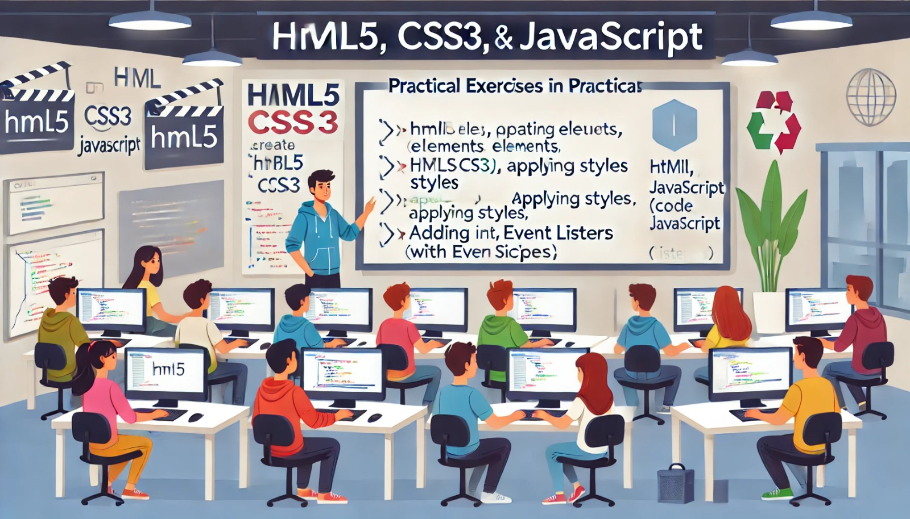

### Aula 10: Exercícios Práticos de HTML5, CSS3 e JavaScript

#### Introdução

Nesta aula, vamos colocar em prática tudo o que aprendemos sobre HTML5, CSS3 e JavaScript. Os exercícios práticos ajudarão você a consolidar seus conhecimentos e a entender melhor como essas tecnologias funcionam juntas para criar páginas web interativas e estilizadas.

#### Exercício 1: Criação de uma Página Web Simples

Vamos criar uma página web simples com HTML5, CSS3 e JavaScript. A página terá um cabeçalho, um parágrafo e um botão que, quando clicado, muda o texto do parágrafo.

##### Passo 1: Estrutura HTML

Crie um arquivo chamado `index.html` e adicione o seguinte conteúdo:

```html
<!DOCTYPE html>
<html lang="pt-BR">
<head>
    <meta charset="UTF-8">
    <meta name="viewport" content="width=device-width, initial-scale=1.0">
    <title>Página Simples</title>
    <link rel="stylesheet" href="styles.css">
</head>
<body>
    <header>
        <h1>Bem-vindo à Minha Página</h1>
    </header>
    <main>
        <p id="paragrafo">Este é um parágrafo inicial.</p>
        <button id="botao">Clique aqui</button>
    </main>
    <script src="script.js"></script>
</body>
</html>
```

##### Passo 2: Estilos CSS

Crie um arquivo chamado `styles.css` e adicione o seguinte conteúdo:

```css
body {
    font-family: Arial, sans-serif;
    margin: 0;
    padding: 0;
    background-color: #f0f0f0;
}

header {
    background-color: #4CAF50;
    color: white;
    text-align: center;
    padding: 1em;
}

main {
    padding: 2em;
    text-align: center;
}

button {
    background-color: #4CAF50;
    color: white;
    border: none;
    padding: 10px 20px;
    cursor: pointer;
    font-size: 16px;
}

button:hover {
    background-color: #45a049;
}
```

##### Passo 3: JavaScript para Interatividade

Crie um arquivo chamado `script.js` e adicione o seguinte conteúdo:

```javascript
// Seleciona o parágrafo e o botão
const paragrafo = document.getElementById('paragrafo');
const botao = document.getElementById('botao');

// Adiciona um evento de clique ao botão
botao.addEventListener('click', function() {
    paragrafo.innerHTML = 'O texto foi alterado após o clique!';
});
```

#### Exercício 2: Página de Formulário

Vamos criar uma página com um formulário simples que valida a entrada do usuário usando HTML5 e JavaScript.

##### Passo 1: Estrutura HTML

Crie um arquivo chamado `formulario.html` e adicione o seguinte conteúdo:

```html
<!DOCTYPE html>
<html lang="pt-BR">
<head>
    <meta charset="UTF-8">
    <meta name="viewport" content="width=device-width, initial-scale=1.0">
    <title>Formulário</title>
    <link rel="stylesheet" href="formulario.css">
</head>
<body>
    <header>
        <h1>Formulário de Contato</h1>
    </header>
    <main>
        <form id="meuFormulario">
            <label for="nome">Nome:</label>
            <input type="text" id="nome" name="nome" required>
            <br>
            <label for="email">Email:</label>
            <input type="email" id="email" name="email" required>
            <br>
            <button type="submit">Enviar</button>
        </form>
        <p id="mensagem"></p>
    </main>
    <script src="formulario.js"></script>
</body>
</html>
```

##### Passo 2: Estilos CSS

Crie um arquivo chamado `formulario.css` e adicione o seguinte conteúdo:

```css
body {
    font-family: Arial, sans-serif;
    margin: 0;
    padding: 0;
    background-color: #f0f0f0;
}

header {
    background-color: #4CAF50;
    color: white;
    text-align: center;
    padding: 1em;
}

main {
    padding: 2em;
    text-align: center;
}

form {
    background-color: white;
    padding: 20px;
    border-radius: 5px;
    box-shadow: 0 0 10px rgba(0, 0, 0, 0.1);
    display: inline-block;
}

label {
    display: block;
    margin-top: 10px;
}

input {
    width: 100%;
    padding: 10px;
    margin-top: 5px;
    margin-bottom: 20px;
    border: 1px solid #ccc;
    border-radius: 3px;
}

button {
    background-color: #4CAF50;
    color: white;
    border: none;
    padding: 10px 20px;
    cursor: pointer;
    font-size: 16px;
}

button:hover {
    background-color: #45a049;
}
```

##### Passo 3: JavaScript para Validação

Crie um arquivo chamado `formulario.js` e adicione o seguinte conteúdo:

```javascript
// Seleciona o formulário e a mensagem
const formulario = document.getElementById('meuFormulario');
const mensagem = document.getElementById('mensagem');

// Adiciona um evento de submissão ao formulário
formulario.addEventListener('submit', function(event) {
    event.preventDefault(); // Previne o envio do formulário

    const nome = formulario.elements['nome'].value;
    const email = formulario.elements['email'].value;

    // Exibe a mensagem de sucesso
    mensagem.innerHTML = `Obrigado, ${nome}! Recebemos seu email: ${email}.`;
});
```

#### Exercício 3: Página Interativa

Vamos criar uma página com uma lista de tarefas onde o usuário pode adicionar e remover tarefas dinamicamente.

##### Passo 1: Estrutura HTML

Crie um arquivo chamado `lista.html` e adicione o seguinte conteúdo:

```html
<!DOCTYPE html>
<html lang="pt-BR">
<head>
    <meta charset="UTF-8">
    <meta name="viewport" content="width=device-width, initial-scale=1.0">
    <title>Lista de Tarefas</title>
    <link rel="stylesheet" href="lista.css">
</head>
<body>
    <header>
        <h1>Lista de Tarefas</h1>
    </header>
    <main>
        <input type="text" id="novaTarefa" placeholder="Adicionar nova tarefa">
        <button id="adicionarTarefa">Adicionar</button>
        <ul id="listaTarefas"></ul>
    </main>
    <script src="lista.js"></script>
</body>
</html>
```

##### Passo 2: Estilos CSS

Crie um arquivo chamado `lista.css` e adicione o seguinte conteúdo:

```css
body {
    font-family: Arial, sans-serif;
    margin: 0;
    padding: 0;
    background-color: #f0f0f0;
}

header {
    background-color: #4CAF50;
    color: white;
    text-align: center;
    padding: 1em;
}

main {
    padding: 2em;
    text-align: center;
}

input[type="text"] {
    width: 200px;
    padding: 10px;
    margin-right: 10px;
    border: 1px solid #ccc;
    border-radius: 3px;
}

button {
    background-color: #4CAF50;
    color: white;
    border: none;
    padding: 10px 20px;
    cursor: pointer;
    font-size: 16px;
}

button:hover {
    background-color: #45a049;
}

ul {
    list-style-type: none;
    padding: 0;
}

li {
    background-color: white;
    margin: 10px 0;
    padding: 10px;
    border: 1px solid #ccc;
    border-radius: 3px;
    display: flex;
    justify-content: space-between;
    align-items: center;
}

li button {
    background-color: red;
    border: none;
    color: white;
    cursor: pointer;
    padding: 5px 10px;
    border-radius: 3px;
}
```

##### Passo 3: JavaScript para Interatividade

Crie um arquivo chamado `lista.js` e adicione o seguinte conteúdo:

```javascript
// Seleciona os elementos
const novaTarefaInput = document.getElementById('novaTarefa');
const adicionarTarefaBtn = document.getElementById('adicionarTarefa');
const listaTarefas = document.getElementById('listaTarefas');

// Adiciona uma nova tarefa
adicionarTarefaBtn.addEventListener('click', function() {
    const tarefaTexto = novaTarefaInput.value;
    if (tarefaTexto === '') {
        alert('Por favor, digite uma tarefa.');
        return;
    }

    const novaTarefa = document.createElement('li');
   

 novaTarefa.innerHTML = `${tarefaTexto} <button class="remover">Remover</button>`;
    listaTarefas.appendChild(novaTarefa);

    novaTarefaInput.value = ''; // Limpa o campo de entrada

    // Adiciona evento para remover a tarefa
    const removerBtn = novaTarefa.querySelector('.remover');
    removerBtn.addEventListener('click', function() {
        listaTarefas.removeChild(novaTarefa);
    });
});
```

### Conclusão

Esses exercícios práticos ajudarão você a consolidar seus conhecimentos em HTML5, CSS3 e JavaScript. Praticar a criação e manipulação de elementos web, adicionar interatividade e estilizar páginas é essencial para se tornar um desenvolvedor web completo.