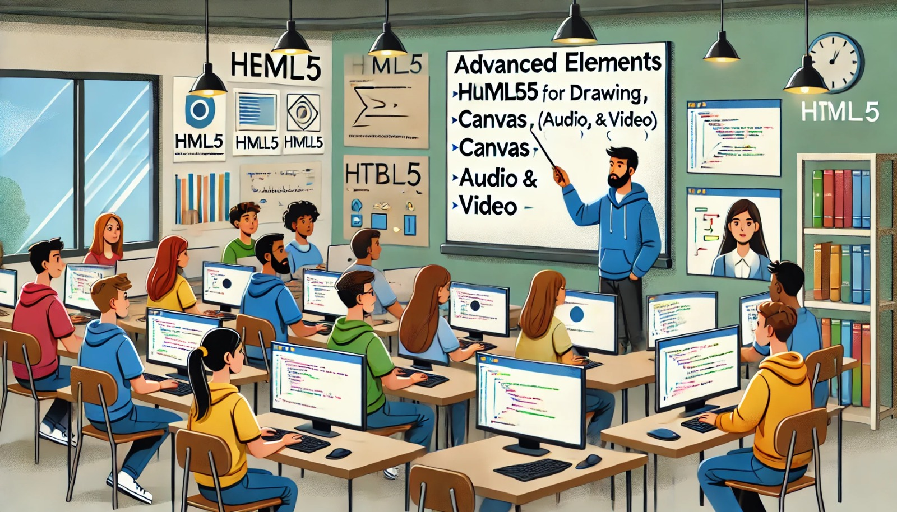

### Aula 11: HTML5: Elementos Avançados (Canvas, Áudio e Vídeo)

#### Introdução

HTML5 trouxe muitos novos elementos que ajudam a criar conteúdos mais interativos e dinâmicos na web. Entre esses elementos, destacam-se o `<canvas>`, que permite desenhar gráficos e animações, e os elementos `<audio>` e `<video>`, que facilitam a incorporação de mídia diretamente na página. Nesta aula, vamos explorar como usar esses elementos avançados.

#### Elemento `<canvas>`

O elemento `<canvas>` é uma área onde você pode desenhar gráficos usando JavaScript. Ele é muito útil para criar desenhos, gráficos, animações e até jogos.

##### Exemplo Básico de Uso do `<canvas>`

1. **HTML**: Crie um espaço na página para o canvas.

   ```html
   <canvas id="meuCanvas" width="400" height="300" style="border:1px solid #000;"></canvas>
   ```

2. **JavaScript**: Use JavaScript para desenhar no canvas.

   ```javascript
   const canvas = document.getElementById('meuCanvas');
   const ctx = canvas.getContext('2d');

   // Desenha um retângulo vermelho
   ctx.fillStyle = 'red';
   ctx.fillRect(50, 50, 150, 100);
   ```

No exemplo acima, o `<canvas>` cria uma área de desenho de 400x300 pixels, e o JavaScript desenha um retângulo vermelho dentro dessa área.

#### Elemento `<audio>`

O elemento `<audio>` permite adicionar arquivos de áudio à sua página web. Você pode incluir controles de reprodução para que os usuários possam reproduzir, pausar e ajustar o volume do áudio.

##### Exemplo Básico de Uso do `<audio>`

1. **HTML**: Insira um arquivo de áudio com controles de reprodução.

   ```html
   <audio controls>
       <source src="audio.mp3" type="audio/mpeg">
       Seu navegador não suporta o elemento de áudio.
   </audio>
   ```

No exemplo acima, o áudio será reproduzido em um player básico que permite ao usuário controlar a reprodução.

#### Elemento `<video>`

O elemento `<video>` é usado para adicionar vídeos à página web. Assim como o `<audio>`, ele pode ter controles de reprodução, e você pode especificar diferentes formatos de vídeo para garantir a compatibilidade com vários navegadores.

##### Exemplo Básico de Uso do `<video>`

1. **HTML**: Insira um vídeo com controles de reprodução.

   ```html
   <video width="400" controls>
       <source src="video.mp4" type="video/mp4">
       Seu navegador não suporta o elemento de vídeo.
   </video>
   ```

No exemplo acima, o vídeo é exibido em um player básico que permite ao usuário controlar a reprodução, além de ajustar o volume e a reprodução em tela cheia.

#### Exercícios Práticos


#### Exercício 1: Canvas Dinâmico

Neste exercício, vamos criar uma animação simples usando o `<canvas>` e JavaScript.

##### Passo 1: Criação da Estrutura do Projeto

1. **Abra o terminal e crie uma pasta para o projeto:**
   ```sh
   mkdir canvas-animacao
   cd canvas-animacao
   ```

2. **Crie os arquivos HTML e JavaScript:**
   ```sh
   touch index.html script.js
   ```

3. **Abra o Visual Studio Code na pasta do projeto:**
   ```sh
   code .
   ```

##### Passo 2: Escreva o HTML

No arquivo `index.html`, adicione o seguinte conteúdo:

```html
<!DOCTYPE html>
<html lang="pt-BR">
<head>
    <meta charset="UTF-8">
    <meta name="viewport" content="width=device-width, initial-scale=1.0">
    <title>Animação com Canvas</title>
</head>
<body>
    <h1>Animação com Canvas</h1>
    <canvas id="meuCanvas" width="400" height="300" style="border:1px solid #000;"></canvas>

    <script src="script.js"></script>
</body>
</html>
```

##### Passo 3: Escreva o JavaScript

No arquivo `script.js`, adicione o seguinte conteúdo para criar uma animação simples de um círculo se movendo:

```javascript
const canvas = document.getElementById('meuCanvas');
const ctx = canvas.getContext('2d');

let x = 50;
let y = 150;
let dx = 2;

function desenharCirculo() {
    ctx.clearRect(0, 0, canvas.width, canvas.height); // Limpa o canvas

    ctx.beginPath();
    ctx.arc(x, y, 20, 0, Math.PI * 2);
    ctx.fillStyle = 'blue';
    ctx.fill();
    ctx.closePath();

    if (x + 20 > canvas.width || x - 20 < 0) {
        dx = -dx; // Inverte a direção
    }

    x += dx; // Move o círculo
}

setInterval(desenharCirculo, 10); // Chama a função a cada 10ms
```

Este código cria um círculo azul que se move de um lado para o outro dentro do canvas.

#### Exercício 2: Player de Áudio Personalizado

Neste exercício, vamos adicionar múltiplas faixas de áudio em uma página e experimentar diferentes configurações de controle.

##### Passo 1: Criação da Estrutura do Projeto

1. **Abra o terminal e crie uma pasta para o projeto:**
   ```sh
   mkdir audio-player
   cd audio-player
   ```

2. **Crie o arquivo HTML:**
   ```sh
   touch index.html
   ```

3. **Abra o Visual Studio Code na pasta do projeto:**
   ```sh
   code .
   ```

##### Passo 2: Baixar Arquivos de Áudio

1. **Procure por arquivos de áudio gratuitos:**
   Existem vários sites onde você pode encontrar arquivos de áudio gratuitos e legais para uso. Alguns exemplos são:
   - https://freemusicarchive.org/
   - https://freesound.org/
   - https://www.youtube.com/audiolibrary/music

2. **Escolha e baixe os arquivos de áudio:**
   - Acesse um dos sites mencionados.
   - Encontre uma faixa de áudio que você goste.
   - Baixe o arquivo de áudio e renomeie-o para `musica1.mp3`, `musica2.mp3` e `musica3.mp3` para facilitar o uso no exercício.

3. **Coloque os arquivos na pasta do projeto:**
   - Mova ou copie os arquivos baixados para a pasta `audio-player` que você criou.

##### Passo 3: Escreva o HTML

No arquivo `index.html`, adicione o seguinte conteúdo:

```html
<!DOCTYPE html>
<html lang="pt-BR">
<head>
    <meta charset="UTF-8">
    <meta name="viewport" content="width=device-width, initial-scale=1.0">
    <title>Player de Áudio</title>
</head>
<body>
    <h1>Player de Áudio Personalizado</h1>

    <audio controls>
        <source src="musica1.mp3" type="audio/mpeg">
        Seu navegador não suporta o elemento de áudio.
    </audio>
    <p>Faixa 1: Música 1</p>

    <audio controls>
        <source src="musica2.mp3" type="audio/mpeg">
        Seu navegador não suporta o elemento de áudio.
    </audio>
    <p>Faixa 2: Música 2</p>

    <audio controls loop>
        <source src="musica3.mp3" type="audio/mpeg">
        Seu navegador não suporta o elemento de áudio.
    </audio>
    <p>Faixa 3: Música 3 (em loop)</p>
</body>
</html>
```

#### Exercício 3: Galeria de Vídeos

Neste exercício, vamos criar uma página com vários vídeos organizados em uma galeria, permitindo que os usuários escolham qual assistir.

##### Passo 1: Criação da Estrutura do Projeto

1. **Abra o terminal e crie uma pasta para o projeto:**
   ```sh
   mkdir galeria-videos
   cd galeria-videos
   ```

2. **Crie o arquivo HTML:**
   ```sh
   touch index.html
   ```

3. **Abra o Visual Studio Code na pasta do projeto:**
   ```sh
   code .
   ```

##### Passo 2: Baixar Arquivos de Vídeo

1. **Procure por vídeos gratuitos:**
   Existem vários sites onde você pode encontrar vídeos gratuitos e legais para uso. Alguns exemplos são:
   - https://www.pexels.com/videos/
   - https://www.videvo.net/
   - https://pixabay.com/videos/

2. **Escolha e baixe os arquivos de vídeo:**
   - Acesse um dos sites mencionados.
   - Encontre vídeos que você queira usar.
   - Baixe os vídeos e renomeie-os para `video1.mp4`, `video2.mp4` e `video3.mp4` para facilitar o uso no exercício.

3. **Coloque os arquivos na pasta do projeto:**
   - Mova ou copie os arquivos baixados para a pasta `galeria-videos` que você criou.

##### Passo 3: Escreva o HTML

No arquivo `index.html`, adicione o seguinte conteúdo:

```html
<!DOCTYPE html>
<html lang="pt-BR">
<head>
    <meta charset="UTF-8">
    <meta name="viewport" content="width=device-width, initial-scale=1.0">
    <title>Galeria de Vídeos</title>
    <style>
        .video-container {
            display: flex;
            flex-wrap: wrap;
            gap: 20px;
            justify-content: center;
        }

        .video-item {
            width: 300px;
        }

        video {
            width: 100%;
            height: auto;
            display: block;
        }
    </style>
</head>
<body>
    <h1>Galeria de Vídeos</h1>
    <div class="video-container">
        <div class="video-item">
            <video controls>
                <source src="video1.mp4" type="video/mp4">
                Seu navegador não suporta o elemento de vídeo.
            </video>
            <p>Vídeo 1</p>
        </div>
        <div class="video-item">
            <video controls>
                <source src="video2.mp4" type="video/mp4">
                Seu navegador não suporta o elemento de vídeo.
            </video>
            <p>Vídeo 2</p>
        </div>
        <div class="video-item">
            <video controls>
                <source src="video3.mp4" type="video/mp4">
                Seu navegador não suporta o elemento de vídeo.
            </video>
            <p>Vídeo 3</p>
        </div>
    </div>
</body>
</html>
```

### Conclusão

Esses exercícios práticos permitem que você explore as capacidades avançadas do HTML5, como criar animações com canvas, personalizar players de áudio e organizar vídeos em uma galeria. As instruções adicionais sobre como baixar arquivos de áudio e vídeo ajudam você a preparar os recursos necessários para executar os exercícios, aprimorando sua habilidade de integrar diferentes tipos de mídia em suas páginas web.