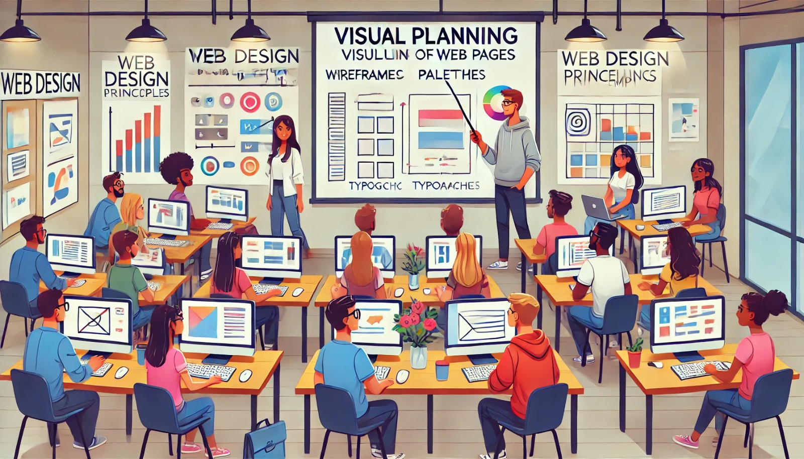

### Aula 14: Fundamentos de Web Design (Planejamento Visual de Páginas)

#### Introdução

O planejamento visual de uma página web é um dos passos mais importantes no processo de criação de um site. Ele envolve decidir como os elementos serão organizados na página, como as cores serão usadas, qual tipografia será aplicada, e como garantir que a navegação seja intuitiva. Um bom planejamento visual não só torna a página esteticamente agradável, mas também melhora a usabilidade e a experiência do usuário.

#### O que é Planejamento Visual?

O planejamento visual de uma página web é o processo de organizar e estruturar os elementos visuais de forma a criar uma interface clara, atraente e funcional. Isso inclui a disposição dos textos, imagens, botões, menus, entre outros elementos que compõem a página.

#### Passos para um Planejamento Visual Eficiente

1. **Definir o Objetivo da Página**
   - Antes de começar a planejar, é importante entender qual é o objetivo principal da página. O que você quer que os visitantes façam? Comprar um produto, ler um artigo, preencher um formulário? Saber o objetivo ajuda a guiar todas as decisões de design.

2. **Organizar o Conteúdo**
   - Liste todo o conteúdo que precisa ser incluído na página, como textos, imagens, vídeos, botões, etc.
   - Organize esse conteúdo de maneira lógica, pensando em como ele deve ser apresentado para guiar o usuário a alcançar o objetivo.

3. **Criar um Wireframe**
   - Um wireframe é um esboço simples do layout da página, que mostra onde cada elemento ficará. Não se preocupe com cores ou detalhes nesta etapa; o objetivo é definir a estrutura.
   - Ferramentas como papel e caneta, ou programas como Figma e Adobe XD, podem ser usados para criar wireframes.

4. **Escolher uma Paleta de Cores**
   - Cores são uma parte fundamental do design visual. Elas afetam o humor do usuário e a usabilidade da página.
   - Escolha uma paleta de cores que reflita a identidade visual do site e que seja agradável aos olhos. Use cores contrastantes para destacar elementos importantes.

5. **Selecionar Tipografias**
   - A escolha da tipografia (fontes) é crucial para a legibilidade e a estética da página.
   - Use fontes que sejam fáceis de ler e que combinem com o estilo do site. Evite usar muitas fontes diferentes; geralmente, duas ou três são suficientes.

6. **Definir a Hierarquia Visual**
   - A hierarquia visual ajuda o usuário a entender o que é mais importante na página. Isso é feito organizando os elementos de forma que os mais importantes se destaquem.
   - Use tamanhos de fonte, negrito, cores e posicionamento para criar uma hierarquia clara.

7. **Planejar a Navegação**
   - A navegação deve ser intuitiva, permitindo que os usuários encontrem facilmente o que estão procurando.
   - Menus, barras de navegação e links devem ser visíveis e fáceis de usar.

8. **Incorporar Elementos Visuais**
   - Use imagens, ícones, e gráficos para complementar o conteúdo textual e tornar a página mais atraente.
   - Certifique-se de que todos os elementos visuais estejam alinhados com o objetivo da página e não sobrecarreguem o usuário.

#### Exemplo Prático

Vamos criar um planejamento visual básico para uma página de "Contato":

1. **Objetivo da Página**: Fazer com que os visitantes entrem em contato através de um formulário.
2. **Conteúdo Necessário**:
   - Título: "Fale Conosco"
   - Texto introdutório: Explicando que o usuário pode entrar em contato preenchendo o formulário.
   - Formulário: Campos para nome, email, assunto, e mensagem.
   - Botão de envio.
   - Informações de contato alternativas: Telefone e endereço.
3. **Wireframe Simples**:
   - Título no topo.
   - Texto introdutório abaixo do título.
   - Formulário no centro da página.
   - Informações de contato ao lado do formulário.
   - Botão de envio abaixo do formulário.

#### Conclusão

O planejamento visual de uma página web é um passo essencial para garantir que o site seja funcional, atrativo e fácil de usar. Seguindo os passos de organização, escolha de cores, tipografia e hierarquia visual, você pode criar layouts que não só sejam bonitos, mas também eficientes em alcançar os objetivos do site.

#### Exercícios Práticos

1. **Crie um Wireframe**: Escolha uma página para um site fictício (por exemplo, uma página "Sobre Nós") e crie um wireframe para ela.
2. **Escolha uma Paleta de Cores**: Baseado no wireframe criado, escolha uma paleta de cores que se alinhe com o tema da página.
3. **Defina a Tipografia**: Escolha duas ou três fontes que você usaria na página e explique o porquê.

Esses exercícios ajudarão a reforçar seu entendimento sobre o planejamento visual de páginas web e a importância de cada decisão no processo de design.