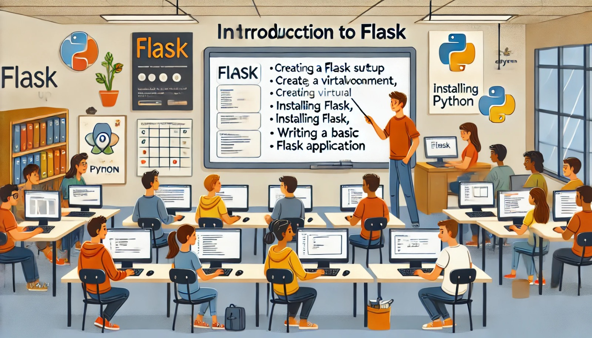

### Aula 15: Introdução ao Flask (Setup do Ambiente, Primeira Aplicação)

#### Introdução

Flask é um micro framework para desenvolvimento web em Python. Ele é simples, flexível e fácil de aprender, sendo uma ótima escolha para quem está começando no desenvolvimento de aplicações web. Nesta aula, vamos configurar o ambiente para trabalhar com Flask e criar nossa primeira aplicação web básica.

#### O que é Flask?

Flask é um framework leve que facilita a criação de aplicações web com Python. Embora seja "micro", o Flask é poderoso e pode ser expandido com várias extensões para adicionar funcionalidades como autenticação, banco de dados e muito mais.

#### Setup do Ambiente

Antes de começarmos a codificar, precisamos configurar o ambiente de desenvolvimento. Vamos instalar o Flask e garantir que tudo esteja funcionando corretamente.

##### Passo 1: Instalar o Python

Se você ainda não tem o Python instalado no seu computador, siga estes passos:

1. **Verifique se o Python já está instalado**:
   - No terminal ou prompt de comando, digite:
     ```sh
     python --version
     ```
   - Se aparecer a versão do Python, você já tem o Python instalado. Caso contrário, continue para o próximo passo.

2. **Instale o Python**:
   - Acesse [python.org](https://www.python.org/) e baixe a versão mais recente do Python.
   - Durante a instalação, certifique-se de marcar a opção "Add Python to PATH".

##### Passo 2: Criar um Ambiente Virtual

Um ambiente virtual isola as dependências do seu projeto, evitando conflitos com outras bibliotecas Python instaladas no sistema.

1. **Crie uma pasta para o seu projeto**:
   ```sh
   mkdir meu_projeto_flask
   cd meu_projeto_flask
   ```

2. **Crie o ambiente virtual**:
   ```sh
   python -m venv venv
   ```

3. **Ative o ambiente virtual**:
   - No Windows:
     ```sh
     venv\Scripts\activate
     ```
   - No macOS/Linux:
     ```sh
     source venv/bin/activate
     ```

4. **Verifique se o ambiente virtual está ativo**:
   - O terminal deve mostrar algo como `(venv)` antes do prompt, indicando que o ambiente está ativo.

##### Passo 3: Instalar o Flask

Com o ambiente virtual ativo, instale o Flask:

```sh
pip install Flask
```

Isso instalará o Flask e suas dependências no ambiente virtual.

#### Criando a Primeira Aplicação com Flask

Agora que o ambiente está configurado, vamos criar nossa primeira aplicação Flask. Será uma aplicação simples que exibe uma mensagem na tela.

##### Passo 1: Criar o Arquivo da Aplicação

1. **No terminal, dentro da pasta do projeto, crie um arquivo chamado `app.py`**:
   ```sh
   touch app.py
   ```

2. **Abra o arquivo `app.py` no editor de texto (como o VS Code) e adicione o seguinte código**:

```python
from flask import Flask

app = Flask(__name__)

@app.route('/')
def home():
    return "Olá, mundo! Este é o meu primeiro aplicativo Flask."

if __name__ == '__main__':
    app.run(debug=True)
```

##### Explicação do Código:

- **`from flask import Flask`**: Importa o framework Flask.
- **`app = Flask(__name__)`**: Cria uma instância da aplicação Flask.
- **`@app.route('/')`**: Define uma rota, ou seja, o caminho que o usuário acessa no navegador. Neste caso, é a página inicial (`/`).
- **`def home():`**: Define uma função que será executada quando a rota for acessada.
- **`return "Olá, mundo! Este é o meu primeiro aplicativo Flask."`**: Retorna o texto que será exibido na página.
- **`if __name__ == '__main__': app.run(debug=True)`**: Executa a aplicação em modo de debug, permitindo que você veja erros e atualizações em tempo real.

##### Passo 2: Executar a Aplicação

1. **No terminal, ainda dentro da pasta do projeto, execute o seguinte comando**:
   ```sh
   python app.py
   ```

2. **Abra o navegador e acesse `http://127.0.0.1:5000/`**:
   - Você verá a mensagem "Olá, mundo! Este é o meu primeiro aplicativo Flask.".

#### Conclusão

Parabéns! Você acabou de criar sua primeira aplicação web com Flask. Aprendemos como configurar o ambiente, instalar o Flask e criar uma aplicação simples. Esse é o primeiro passo para desenvolver aplicações web poderosas com Python e Flask.

#### Exercícios Práticos

1. **Modifique a Mensagem**: Altere o texto da mensagem retornada pela função `home` e observe as mudanças no navegador.
2. **Crie Novas Rotas**: Adicione mais rotas ao aplicativo para exibir diferentes mensagens para diferentes URLs.
3. **Experimente com Templates**: Pesquise como usar templates em Flask para criar páginas HTML mais complexas.

Esses exercícios ajudarão a reforçar seu entendimento sobre como funciona o Flask e como você pode começar a construir suas próprias aplicações web.