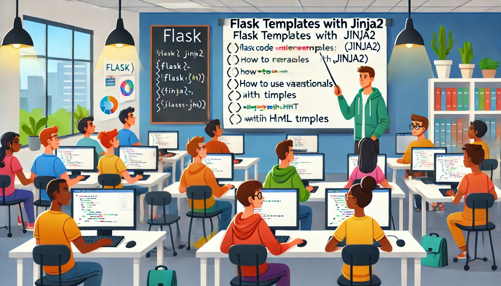

### Aula 18: Flask: Templates com Jinja2

#### Introdução

No Flask, podemos gerar páginas HTML dinâmicas usando templates. Templates são arquivos HTML que podem conter variáveis e lógica de programação, permitindo que o conteúdo seja gerado dinamicamente a partir dos dados enviados pelo servidor. O Flask usa o mecanismo de templates **Jinja2** para criar essas páginas dinâmicas. Nesta aula, vamos aprender como usar Jinja2 para renderizar templates no Flask.

#### O que são Templates?

Templates são arquivos HTML que podem conter variáveis e expressões que são substituídas pelos valores enviados pelo servidor. Isso nos permite criar páginas dinâmicas que exibem diferentes dados dependendo do que o usuário acessa.

Por exemplo, em vez de criar uma página HTML estática para cada usuário, podemos usar um template e enviar o nome do usuário dinamicamente para ser exibido na página.

#### O que é Jinja2?

**Jinja2** é o mecanismo de templates utilizado pelo Flask. Ele permite incluir variáveis e estruturas de controle (como loops e condicionais) dentro do HTML. Isso significa que você pode criar páginas HTML dinâmicas, personalizadas para cada usuário ou situação.

#### Configuração Básica para Templates no Flask

Para usar templates no Flask, precisamos de uma pasta chamada **templates** dentro do nosso projeto. O Flask vai automaticamente buscar os arquivos HTML dentro dessa pasta.

##### Estrutura Básica do Projeto

Aqui está uma estrutura simples de um projeto Flask que usa templates:

```
meu_projeto/
│
├── app/
│   ├── templates/
│   │   └── home.html
│   ├── __init__.py
│   └── routes.py
│
├── run.py
└── venv/
```

1. **`templates/`**: Pasta onde ficam os arquivos HTML.
2. **`home.html`**: Arquivo HTML que será renderizado.
3. **`routes.py`**: Onde criamos as rotas e usamos os templates.

##### Passo 1: Criando um Template

Dentro da pasta `templates`, crie um arquivo chamado `home.html`:

```html
<!DOCTYPE html>
<html lang="pt-BR">
<head>
    <meta charset="UTF-8">
    <meta name="viewport" content="width=device-width, initial-scale=1.0">
    <title>Página Inicial</title>
</head>
<body>
    <h1>Bem-vindo, {{ nome }}!</h1>
    <p>Estamos felizes em tê-lo aqui.</p>
</body>
</html>
```

Aqui, usamos a expressão `{{ nome }}` para incluir uma variável dentro do HTML. O Flask substituirá `{{ nome }}` pelo valor que passarmos na rota.

##### Passo 2: Renderizando o Template

Agora, no arquivo `app/routes.py`, vamos definir a rota para renderizar o template:

```python
from flask import render_template
from app import app

@app.route('/')
def home():
    return render_template('home.html', nome='Maria')
```

Neste código:
- **`render_template`**: Função do Flask que renderiza o template HTML.
- **`home.html`**: O nome do arquivo HTML que será renderizado.
- **`nome='Maria'`**: Passamos a variável `nome` com o valor `'Maria'` para o template. No HTML, a expressão `{{ nome }}` será substituída por "Maria".

##### Passo 3: Executando a Aplicação

No arquivo `run.py`, adicione o seguinte código para rodar a aplicação:

```python
from app import app

if __name__ == "__main__":
    app.run(debug=True)
```

Agora, execute a aplicação no terminal:

```sh
python run.py
```

Abra o navegador e acesse `http://127.0.0.1:5000/`. Você verá a página inicial com a mensagem: **"Bem-vindo, Maria!"**.

#### Estruturas de Controle no Jinja2

Além de variáveis, o Jinja2 permite usar lógica de programação como condicionais e loops dentro dos templates.

##### Exemplo 1: Condicionais

Podemos usar condicionais para exibir conteúdo com base em condições:

```html
<p>
    Olá, Maria! Seja bem-vinda de volta!

    Olá, visitante!
</p>
```

- **``**: Inicia uma condicional.
- **``**: Alternativa se a condição não for verdadeira.
- **``**: Fecha a condicional.

##### Exemplo 2: Loops

Também podemos usar loops para exibir listas de itens:

```html
<ul>
    
        <li>{{ item }}</li>
    
</ul>
```

Neste caso, o Flask vai iterar sobre uma lista de itens e exibir cada um deles como um item de lista `<li>`.

##### Passo 4: Usando Loops e Condicionais

Vamos modificar nossa rota e template para incluir um loop e uma condicional.

No arquivo `routes.py`:

```python
@app.route('/')
def home():
    lista_nomes = ['Maria', 'João', 'Ana']
    return render_template('home.html', lista=lista_nomes)
```

E no arquivo `home.html`:

```html
<!DOCTYPE html>
<html lang="pt-BR">
<head>
    <meta charset="UTF-8">
    <meta name="viewport" content="width=device-width, initial-scale=1.0">
    <title>Página Inicial</title>
</head>
<body>
    <h1>Lista de Nomes:</h1>
    <ul>
        
            <li>{{ nome }}</li>
        
    </ul>
</body>
</html>
```

Quando acessamos a página, o navegador exibirá a lista de nomes: **Maria**, **João** e **Ana**.

#### Conclusão

Usar templates com Jinja2 no Flask permite criar páginas dinâmicas de maneira simples e eficiente. Com a capacidade de passar variáveis e usar lógica de programação como loops e condicionais, podemos criar sites que se adaptam aos dados fornecidos pelo servidor.

#### Exercícios Práticos

1. **Crie um Novo Template**: Crie um template para uma página de "Sobre Nós" e exiba informações sobre a empresa dinamicamente.
2. **Use Condicionais**: Adicione uma condicional que exiba uma mensagem especial se o nome do usuário for "Admin".
3. **Exiba uma Lista**: Crie uma rota que exiba uma lista de produtos usando um loop em um template.

Esses exercícios ajudarão a reforçar seu entendimento sobre o uso de templates com Jinja2 no Flask, permitindo criar páginas web dinâmicas e interativas.

### Resolução dos Exercícios Práticos da Aula 18: Flask: Templates com Jinja2

#### Estrutura do Projeto

Antes de começar, vamos definir a estrutura básica do projeto Flask que será usada para implementar os exercícios:

```
meu_projeto/
│
├── app/
│   ├── templates/
│   │   └── home.html
│   │   └── sobre.html
│   ├── __init__.py
│   └── routes.py
│
├── run.py
└── venv/
```

##### Passo 1: Criando o Ambiente de Desenvolvimento

1. **Crie uma pasta para o projeto:**
   ```sh
   mkdir meu_projeto
   cd meu_projeto
   ```

2. **Crie um ambiente virtual:**
   ```sh
   python -m venv venv
   ```

3. **Ative o ambiente virtual:**
   - No Windows:
     ```sh
     venv\Scripts\activate
     ```
   - No macOS/Linux:
     ```sh
     source venv/bin/activate
     ```

4. **Instale o Flask:**
   ```sh
   pip install Flask
   ```

##### Passo 2: Criando os Arquivos do Projeto

1. **Crie a pasta `app` e as subpastas `templates`:**
   ```sh
   mkdir app
   mkdir app/templates
   ```

2. **Crie os arquivos necessários:**
   ```sh
   touch app/__init__.py app/routes.py run.py
   ```

3. **No arquivo `app/__init__.py`, adicione o seguinte código:**
   ```python
   from flask import Flask

   app = Flask(__name__)

   from app import routes
   ```

##### Passo 3: Implementando o Exercício 1: Criar um Novo Template

O objetivo deste exercício é criar um template para uma página de "Sobre Nós" e exibir informações dinamicamente.

1. **No arquivo `app/routes.py`, adicione a rota para a página "Sobre Nós":**

   ```python
   from flask import render_template
   from app import app

   @app.route('/')
   def home():
       return render_template('home.html')

   @app.route('/sobre')
   def sobre():
       descricao_empresa = "Somos uma empresa dedicada a oferecer soluções inovadoras para nossos clientes."
       return render_template('sobre.html', descricao=descricao_empresa)
   ```

2. **Crie o arquivo `app/templates/sobre.html` e adicione o conteúdo:**

   ```html
   <!DOCTYPE html>
   <html lang="pt-BR">
   <head>
       <meta charset="UTF-8">
       <meta name="viewport" content="width=device-width, initial-scale=1.0">
       <title>Sobre Nós</title>
   </head>
   <body>
       <h1>Sobre Nós</h1>
       <p>{{ descricao }}</p>
   </body>
   </html>
   ```

3. **No arquivo `run.py`, adicione o código para rodar a aplicação:**

   ```python
   from app import app

   if __name__ == "__main__":
       app.run(debug=True)
   ```

4. **Executar o projeto:**
   No terminal, rode o comando:
   ```sh
   python run.py
   ```

   Agora, acesse `http://127.0.0.1:5000/sobre` para ver a página de "Sobre Nós" com o conteúdo dinâmico.

##### Passo 4: Implementando o Exercício 2: Usar Condicionais

O objetivo deste exercício é adicionar uma condicional que exiba uma mensagem especial se o nome do usuário for "Admin".

1. **Modifique a rota `home` no arquivo `routes.py`:**

   ```python
   @app.route('/')
   def home():
       nome_usuario = "Admin"
       return render_template('home.html', nome=nome_usuario)
   ```

2. **Crie o arquivo `app/templates/home.html` e adicione o conteúdo:**

   ```html
   <!DOCTYPE html>
   <html lang="pt-BR">
   <head>
       <meta charset="UTF-8">
       <meta name="viewport" content="width=device-width, initial-scale=1.0">
       <title>Página Inicial</title>
   </head>
   <body>
       <h1>Bem-vindo, {{ nome }}!</h1>
       <p>
           Você é o administrador do sistema.
       
           Bem-vindo ao site, {{ nome }}!
       </p>
   </body>
   </html>
   ```

3. **Acesse a página inicial:**
   Abra o navegador e acesse `http://127.0.0.1:5000/`. Se o nome for "Admin", uma mensagem especial será exibida.

##### Passo 5: Implementando o Exercício 3: Exibir uma Lista

Neste exercício, vamos criar uma rota que exiba uma lista de produtos usando um loop no template.

1. **No arquivo `app/routes.py`, adicione a rota para exibir a lista de produtos:**

   ```python
   @app.route('/produtos')
   def produtos():
       lista_produtos = ['Produto 1', 'Produto 2', 'Produto 3']
       return render_template('produtos.html', produtos=lista_produtos)
   ```

2. **Crie o arquivo `app/templates/produtos.html` e adicione o conteúdo:**

   ```html
   <!DOCTYPE html>
   <html lang="pt-BR">
   <head>
       <meta charset="UTF-8">
       <meta name="viewport" content="width=device-width, initial-scale=1.0">
       <title>Lista de Produtos</title>
   </head>
   <body>
       <h1>Lista de Produtos</h1>
       <ul>
           
               <li>{{ produto }}</li>
           
       </ul>
   </body>
   </html>
   ```

3. **Acesse a lista de produtos:**
   No navegador, acesse `http://127.0.0.1:5000/produtos` para ver a lista de produtos exibida dinamicamente.

### Conclusão

Esses exercícios práticos reforçam o uso de templates com Jinja2 no Flask, mostrando como criar templates dinâmicos, usar condicionais, e exibir listas usando loops. Ao dominar essas técnicas, você pode criar páginas web personalizadas e interativas que se adaptam aos dados fornecidos pelo servidor.