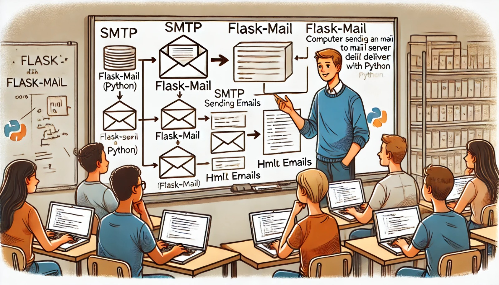

### Aula 22: Flask: Envio de E-mails

#### Introdução

Nesta aula, vamos aprender como enviar e-mails a partir de uma aplicação **Flask**. O envio de e-mails é uma funcionalidade comum em diversas aplicações web, como no envio de emails de confirmação de cadastro, redefinição de senha e notificações.

Para facilitar o envio de e-mails em Flask, utilizamos a biblioteca **Flask-Mail**, que oferece uma integração simples com serviços de email SMTP, permitindo o envio de e-mails de forma eficiente.

#### Configuração do Flask-Mail

##### Passo 1: Instalando Flask-Mail

Primeiro, precisamos instalar a biblioteca **Flask-Mail**. No terminal, execute o seguinte comando:

```bash
pip install Flask-Mail
```

##### Passo 2: Configurando o Flask-Mail

Após instalar o Flask-Mail, vamos configurar nossa aplicação para enviar e-mails. No arquivo principal da aplicação (`app.py` ou similar), adicione as configurações de e-mail.

```python
from flask import Flask
from flask_mail import Mail, Message

app = Flask(__name__)

# Configurações de email (exemplo com Gmail)
app.config['MAIL_SERVER'] = 'smtp.gmail.com'
app.config['MAIL_PORT'] = 587
app.config['MAIL_USE_TLS'] = True
app.config['MAIL_USERNAME'] = 'seuemail@gmail.com'  # Insira seu email aqui
app.config['MAIL_PASSWORD'] = 'suasenha'  # Insira sua senha aqui
app.config['MAIL_DEFAULT_SENDER'] = ('Seu Nome', 'seuemail@gmail.com')

# Inicializar o Flask-Mail
mail = Mail(app)
```

Aqui, configuramos o servidor SMTP do Gmail. Você pode usar qualquer servidor SMTP, como Yahoo, Outlook ou um servidor de e-mail próprio. Certifique-se de ajustar as configurações de acordo com o serviço que você está usando.

##### Passo 3: Enviando um E-mail

Agora que o Flask-Mail está configurado, podemos enviar um e-mail. Vamos criar uma rota que envia um e-mail para o usuário.

```python
@app.route('/enviar_email')
def enviar_email():
    msg = Message(
        'Assunto do Email',  # Assunto do e-mail
        recipients=['destinatario@gmail.com']  # Email do destinatário
    )
    msg.body = 'Este é o corpo do e-mail enviado pela sua aplicação Flask.'
    
    with app.app_context():
        mail.send(msg)
    
    return 'E-mail enviado com sucesso!'
```

Neste exemplo:
- **`Message`**: Cria o objeto de e-mail com o assunto e o destinatário.
- **`msg.body`**: Define o corpo do e-mail.
- **`mail.send(msg)`**: Envia o e-mail.

##### Passo 4: Envio de E-mail com HTML

Você também pode enviar e-mails com conteúdo HTML. Isso é útil para criar e-mails mais sofisticados, com formatação e links.

```python
@app.route('/enviar_email_html')
def enviar_email_html():
    msg = Message(
        'Assunto do Email HTML',
        recipients=['destinatario@gmail.com']
    )
    msg.html = '<h1>Olá!</h1><p>Este é um e-mail com conteúdo <b>HTML</b> enviado pela sua aplicação Flask.</p>'
    
    with app.app_context():
        mail.send(msg)
    
    return 'E-mail HTML enviado com sucesso!'
```

Neste exemplo, usamos o atributo **`msg.html`** para definir o conteúdo HTML do e-mail. Assim, o e-mail pode conter formatação rica.

#### Passo 5: Anexando Arquivos no E-mail

Além de enviar texto e HTML, você pode anexar arquivos ao e-mail, como PDFs, imagens ou qualquer outro tipo de documento.

```python
@app.route('/enviar_email_com_anexo')
def enviar_email_com_anexo():
    msg = Message(
        'E-mail com Anexo',
        recipients=['destinatario@gmail.com']
    )
    msg.body = 'Este e-mail contém um anexo.'
    
    with app.open_resource('caminho/do/arquivo.pdf') as fp:
        msg.attach('arquivo.pdf', 'application/pdf', fp.read())
    
    with app.app_context():
        mail.send(msg)
    
    return 'E-mail com anexo enviado com sucesso!'
```

Neste caso:
- **`msg.attach()`**: Anexa um arquivo ao e-mail. Você deve fornecer o nome do arquivo, o tipo MIME e o conteúdo do arquivo.

### Considerações de Segurança

Quando enviar e-mails a partir da sua aplicação, é importante:
1. **Proteger suas credenciais**: Nunca exponha diretamente o nome de usuário e senha nos arquivos do código. Em vez disso, use variáveis de ambiente para armazenar suas credenciais de e-mail de forma segura.
2. **Usar um servidor de e-mail confiável**: Ao enviar muitos e-mails, considere o uso de serviços de terceiros como SendGrid ou Amazon SES para garantir a confiabilidade e escalabilidade.

---

### Exercícios de Fixação

**Questão 1:** Qual biblioteca facilita o envio de e-mails em uma aplicação Flask?
- (A) Flask-SMTP
- (B) Flask-Mail
- (C) Flask-Email
- (D) Flask-Message

**Resposta correta:** (B)

---

**Questão 2:** Qual dessas configurações é necessária para enviar um e-mail com Flask-Mail usando o servidor Gmail?
- (A) `MAIL_PORT = 2525`
- (B) `MAIL_SERVER = 'smtp.gmail.com'`
- (C) `MAIL_USE_SSL = True`
- (D) `MAIL_USERNAME = 'seuemail@gmail.com'` (Nenhuma senha é necessária)

**Resposta correta:** (B)

---

**Questão 3:** Qual comando é usado para anexar arquivos ao e-mail no Flask-Mail?
- (A) `msg.file()`
- (B) `msg.add_file()`
- (C) `msg.append()`
- (D) `msg.attach()`

**Resposta correta:** (D)

---

**Questão 4:** Qual das opções abaixo permite enviar um e-mail com conteúdo HTML?
- (A) `msg.html = '<html>conteúdo</html>'`
- (B) `msg.body = '<html>conteúdo</html>'`
- (C) `msg.content = '<html>conteúdo</html>'`
- (D) `msg.html_body = '<html>conteúdo</html>'`

**Resposta correta:** (A)

---

**Questão 5:** Qual dessas práticas é recomendada para proteger suas credenciais de e-mail em uma aplicação Flask?
- (A) Armazenar as credenciais diretamente no código.
- (B) Compartilhar suas credenciais com outros desenvolvedores sem restrições.
- (C) Armazenar suas credenciais em variáveis de ambiente.
- (D) Usar qualquer servidor SMTP disponível, sem considerar a segurança.

**Resposta correta:** (C)

---

### Conclusão

Nesta aula, você aprendeu como configurar e usar o **Flask-Mail** para enviar e-mails em sua aplicação Flask. Você viu como enviar e-mails simples, com conteúdo HTML e anexos, além de compreender as melhores práticas de segurança ao usar e-mails em aplicações web. 

Pratique enviando e-mails com diferentes tipos de conteúdo e explore o uso de variáveis de ambiente para proteger suas credenciais!