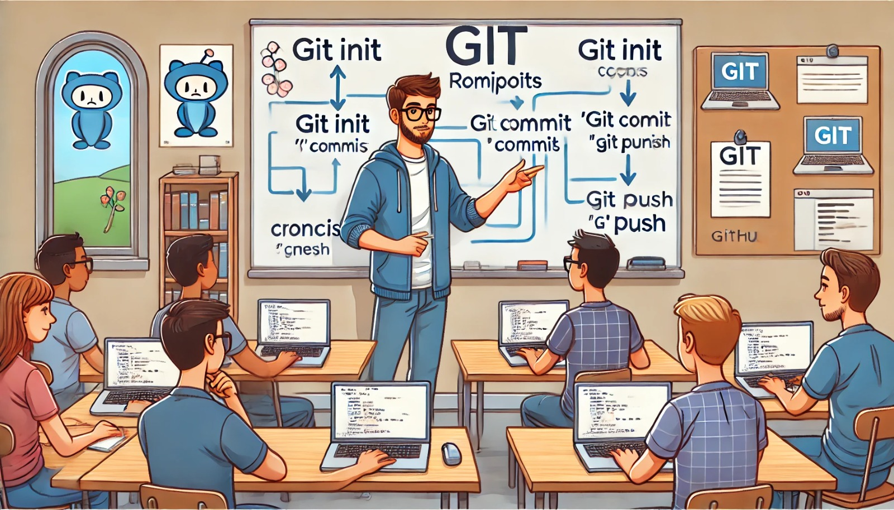

### Aula 24: Introdução ao Git (Conceitos Básicos, Setup)

#### Introdução

Git é um sistema de controle de versão distribuído, amplamente utilizado por desenvolvedores para gerenciar o código-fonte de seus projetos. Ele permite que você rastreie alterações em arquivos ao longo do tempo, colabore com outros desenvolvedores e reverte mudanças quando necessário. Git se tornou uma ferramenta essencial no desenvolvimento de software moderno, sendo usada tanto em pequenos projetos quanto em grandes sistemas.

Nesta aula, vamos cobrir os conceitos básicos do Git e como configurar o ambiente para começar a usar essa poderosa ferramenta de versionamento.

---

#### O que é Git?

Git é um **sistema de controle de versão** que rastreia mudanças em arquivos ao longo do tempo, permitindo que você colabore com outros desenvolvedores, revise o histórico de alterações e gerencie diferentes versões de um projeto. Com o Git, cada desenvolvedor pode trabalhar em uma cópia local de um repositório e, eventualmente, sincronizar suas alterações com um servidor central ou com outros colaboradores.

##### Principais Conceitos do Git:

- **Repositório (Repo)**: É o local onde os arquivos do projeto são armazenados, juntamente com o histórico de mudanças. Pode ser local (no seu computador) ou remoto (como no GitHub).
- **Commit**: Um commit é um "snapshot" do estado dos arquivos em um momento específico. Toda vez que você faz um commit, o Git salva uma nova versão dos arquivos modificados.
- **Branch**: Branches permitem que você trabalhe em diferentes linhas de desenvolvimento dentro do mesmo projeto. A branch principal é geralmente chamada de "main" ou "master".
- **Merge**: O merge é o processo de combinar duas branches diferentes, unificando as mudanças feitas em ambas.
- **Push e Pull**: O **push** envia as suas mudanças locais para um repositório remoto, enquanto o **pull** busca as mudanças de um repositório remoto para o seu repositório local.

---

#### Configurando o Git

Antes de começar a usar o Git, você precisa instalá-lo e configurá-lo no seu ambiente de desenvolvimento.

##### Passo 1: Instalando o Git

Se você ainda não tem o Git instalado, siga os passos abaixo para instalá-lo:

- **Windows**:
  1. Acesse [git-scm.com](https://git-scm.com/) e baixe o instalador para Windows.
  2. Siga as instruções do instalador e escolha as configurações recomendadas.

- **Linux**:
  Execute o seguinte comando no terminal:
  ```bash
  sudo apt-get install git
  ```

- **MacOS**:
  No terminal, execute o comando:
  ```bash
  brew install git
  ```

##### Passo 2: Configurando o Git

Depois de instalar o Git, você precisa configurá-lo com seu nome e endereço de e-mail. O Git utiliza essas informações para identificar quem fez as alterações no código.

No terminal, execute os comandos abaixo:

```bash
git config --global user.name "Seu Nome"
git config --global user.email "seuemail@example.com"
```

Agora o Git está configurado com seu nome e e-mail.

##### Passo 3: Inicializando um Repositório

Para começar a trabalhar com o Git em um projeto, você deve inicializar um repositório.

1. No terminal, navegue até a pasta do seu projeto:
   ```bash
   cd /caminho/para/seu/projeto
   ```
2. Inicialize o repositório Git:
   ```bash
   git init
   ```

Este comando cria uma pasta oculta chamada **`.git`** no seu projeto, onde o Git armazenará todos os dados do repositório.

##### Passo 4: Fazendo um Commit

Depois de inicializar o repositório, você pode adicionar arquivos e salvar um "snapshot" deles (fazer um commit).

1. **Adicionar arquivos ao stage**: Você precisa adicionar os arquivos que deseja incluir no commit:
   ```bash
   git add .
   ```

2. **Fazer o commit**: Agora, faça o commit para salvar as alterações no repositório:
   ```bash
   git commit -m "Primeiro commit"
   ```

##### Passo 5: Conectando a um Repositório Remoto (GitHub)

Para compartilhar seu projeto com outros desenvolvedores, você pode conectar seu repositório local a um repositório remoto, como o GitHub.

1. No GitHub, crie um novo repositório e copie o **URL** do repositório.
2. No terminal, execute:
   ```bash
   git remote add origin https://github.com/seu-usuario/seu-repositorio.git
   ```

3. Envie suas alterações para o GitHub:
   ```bash
   git push -u origin main
   ```

Agora, seu projeto está disponível no GitHub, e você pode colaborar com outros desenvolvedores.

---

### Comandos Básicos do Git

Aqui estão alguns comandos básicos que você vai usar com frequência:

- **git status**: Verifica o status atual do repositório (arquivos modificados, não rastreados, etc.).
  ```bash
  git status
  ```

- **git log**: Exibe o histórico de commits do repositório.
  ```bash
  git log
  ```

- **git checkout -b nome-da-branch**: Cria uma nova branch e muda para ela.
  ```bash
  git checkout -b minha-branch
  ```

- **git merge nome-da-branch**: Mescla a branch especificada com a branch atual.
  ```bash
  git merge minha-branch
  ```

- **git pull**: Busca as últimas mudanças do repositório remoto e as mescla com a branch atual.
  ```bash
  git pull origin main
  ```

---

### Exercícios de Fixação

**Questão 1:** O que é o Git?
- (A) Um sistema de banco de dados para aplicações web.
- (B) Um sistema de controle de versão que rastreia mudanças nos arquivos.
- (C) Um editor de texto para programadores.
- (D) Uma ferramenta para testar o código antes de enviá-lo para produção.

**Resposta correta:** (B)

---

**Questão 2:** Qual comando você utiliza para inicializar um repositório Git em uma pasta?
- (A) `git start`
- (B) `git init`
- (C) `git create`
- (D) `git new`

**Resposta correta:** (B)

---

**Questão 3:** Qual comando salva um "snapshot" das alterações no Git?
- (A) `git commit`
- (B) `git save`
- (C) `git push`
- (D) `git snapshot`

**Resposta correta:** (A)

---

**Questão 4:** O que é um **commit** no Git?
- (A) O processo de conectar o Git a um repositório remoto.
- (B) Um snapshot das alterações feitas no código.
- (C) Um arquivo que contém todos os branches.
- (D) Um servidor que armazena todos os repositórios Git.

**Resposta correta:** (B)

---

**Questão 5:** Qual comando é usado para enviar as mudanças para um repositório remoto, como o GitHub?
- (A) `git add`
- (B) `git commit`
- (C) `git pull`
- (D) `git push`

**Resposta correta:** (D)

---

### Conclusão

Nesta aula, vimos os conceitos fundamentais do **Git**, como repositórios, commits, branches e merges. Também aprendemos a configurar o Git no seu ambiente de trabalho e como conectá-lo a um repositório remoto, como o GitHub. Essas habilidades são essenciais para o desenvolvimento colaborativo de software, ajudando a manter o controle sobre o histórico do código e a colaboração com outros desenvolvedores.

Nos próximos exercícios e projetos, você colocará esses conceitos em prática para ganhar mais confiança no uso do Git.