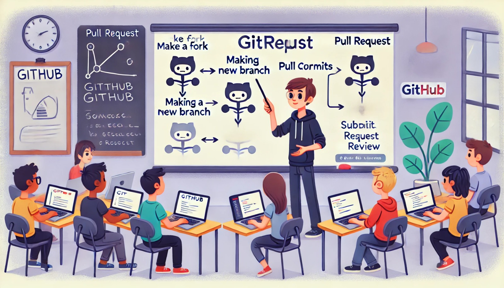

### Aula 27: GitHub: Colaboração e Pull Requests

#### Introdução

Uma das principais vantagens do GitHub é a facilidade de colaboração que ele oferece para desenvolvedores trabalharem juntos em projetos, seja em equipes ou em contribuições de código aberto. Nesta aula, vamos explorar como o **GitHub** facilita a colaboração com o uso de **pull requests** (PRs), um processo que permite que os desenvolvedores revisem, discutam e integrem alterações no código de forma organizada.

---

### O Que é um Pull Request?

Um **pull request (PR)** é uma solicitação para que as alterações feitas em uma branch (normalmente de um fork) sejam revisadas e mescladas na branch principal do repositório (geralmente `main`). Com um PR, os desenvolvedores podem discutir e revisar as mudanças antes de integrá-las, garantindo que o código se mantenha limpo e estável.

#### Quando Usar um Pull Request?

Os pull requests são ideais para:
- Contribuições para projetos de código aberto.
- Integração de novas funcionalidades em projetos colaborativos.
- Revisão de código em equipes de desenvolvimento, facilitando a discussão sobre mudanças.

---

### Fluxo de Trabalho de Colaboração Usando Pull Requests

1. **Fazer um Fork do Repositório**: 
   - No GitHub, faça o **fork** do repositório com o qual você deseja colaborar. Isso criará uma cópia do repositório em seu perfil.

2. **Clonar o Repositório Forkado**:
   - Em seu terminal, clone o repositório para o seu ambiente local:
     ```bash
     git clone https://github.com/seu-usuario/repositorio-forkado.git
     cd repositorio-forkado
     ```

3. **Criar uma Nova Branch**:
   - Crie uma branch para fazer as alterações no código, separando a nova funcionalidade ou correção de erros do código principal:
     ```bash
     git checkout -b minha-nova-branch
     ```

4. **Fazer Alterações e Committar**:
   - Faça as mudanças necessárias no código e, em seguida, adicione e faça commit dessas mudanças:
     ```bash
     git add .
     git commit -m "Descrição das mudanças"
     ```

5. **Enviar as Alterações para o GitHub (Push)**:
   - Envie as alterações para o seu repositório forkado no GitHub:
     ```bash
     git push origin minha-nova-branch
     ```

6. **Abrir um Pull Request**:
   - No GitHub, vá até o seu repositório forkado e clique em **"Compare & pull request"**. Isso abrirá a página de criação de um PR.
   - Preencha o título e a descrição com informações sobre as alterações. A descrição deve incluir o propósito das mudanças e qualquer detalhe relevante para a revisão do código.
   - Clique em **"Create pull request"**.

7. **Discussão e Revisão do Código**:
   - A equipe de desenvolvimento, ou o proprietário do repositório original, pode comentar e sugerir melhorias diretamente no PR.
   - Caso sejam solicitadas mudanças, faça-as localmente e faça um novo commit e push na mesma branch. As atualizações aparecerão automaticamente no PR.

8. **Mesclando o Pull Request**:
   - Após a revisão, o proprietário do repositório (ou o responsável) pode mesclar o PR na branch principal, integrando as mudanças ao projeto.

---

### Melhores Práticas para Pull Requests

1. **Dividir Alterações Complexas**: Em vez de fazer um PR com muitas mudanças, crie PRs menores e mais específicos. Isso facilita a revisão e a aprovação.
2. **Escrever Descrições Claras**: Descreva o que foi alterado e o motivo das mudanças. Isso ajuda os revisores a entenderem o contexto.
3. **Resolver Conflitos Antes do PR**: Sempre sincronize seu repositório local com o repositório remoto (`git pull`) para garantir que não haja conflitos ao criar o PR.
4. **Utilizar Mensagens de Commit Descritivas**: Mensagens de commit claras facilitam a compreensão das alterações no histórico do projeto.

---

### Revisão de Código em Pull Requests

O processo de revisão de código é essencial para garantir a qualidade do software. Durante a revisão:
- **Verifique a funcionalidade**: As alterações realmente implementam a nova funcionalidade ou correção proposta?
- **Consistência e Padrões de Código**: O código está seguindo os padrões definidos pelo projeto?
- **Potenciais Bugs**: As alterações introduzem algum problema?
- **Legibilidade e Documentação**: O código é claro e fácil de entender?

A equipe de revisão pode fazer perguntas, sugerir melhorias ou até solicitar mudanças antes de aprovar o PR. Uma vez aprovado, o PR pode ser mesclado na branch principal do repositório.

---

### Exercícios de Fixação

**Questão 1:** O que é um **pull request (PR)**?
- (A) Uma solicitação para remover uma branch de um repositório.
- (B) Uma solicitação para mesclar alterações feitas em uma branch com outra branch no repositório.
- (C) Um comando do Git para atualizar o repositório local.
- (D) Um arquivo especial que armazena todos os commits feitos em um repositório.

**Resposta correta:** (B)

---

**Questão 2:** Qual é a função principal do comando `git push` no processo de pull request?
- (A) Mesclar o código com a branch principal.
- (B) Enviar as alterações feitas localmente para o repositório remoto.
- (C) Criar uma nova branch no repositório remoto.
- (D) Excluir uma branch do repositório local.

**Resposta correta:** (B)

---

**Questão 3:** Qual é o objetivo da revisão de código em um pull request?
- (A) Atualizar automaticamente a branch com a versão mais recente do código.
- (B) Discutir e verificar a qualidade e integridade das alterações propostas.
- (C) Reverter as mudanças feitas no repositório local.
- (D) Gerar relatórios automáticos de performance do código.

**Resposta correta:** (B)

---

**Questão 4:** Qual é o primeiro passo para colaborar em um repositório público no GitHub?
- (A) Fazer o clone do repositório original.
- (B) Fazer um pull request diretamente na branch principal.
- (C) Fazer um fork do repositório para a sua conta.
- (D) Criar uma nova branch no repositório original.

**Resposta correta:** (C)

---

**Questão 5:** O que deve ser feito se o revisor solicitar mudanças em um pull request?
- (A) Abrir um novo pull request com as alterações sugeridas.
- (B) Realizar as alterações na branch local, fazer commit e push para a mesma branch do pull request original.
- (C) Apagar o pull request e criar um novo com as alterações.
- (D) Nenhuma ação é necessária; o revisor aplicará as mudanças automaticamente.

**Resposta correta:** (B)

---

### Conclusão

Nesta aula, vimos como o GitHub facilita a colaboração entre desenvolvedores através de **pull requests**. Esse processo permite que os desenvolvedores revisem, discutam e integrem alterações de maneira organizada e eficiente, promovendo a qualidade do código. 

Com a prática de pull requests, você estará pronto para colaborar em projetos de código aberto e trabalhar de maneira eficiente em equipes de desenvolvimento.