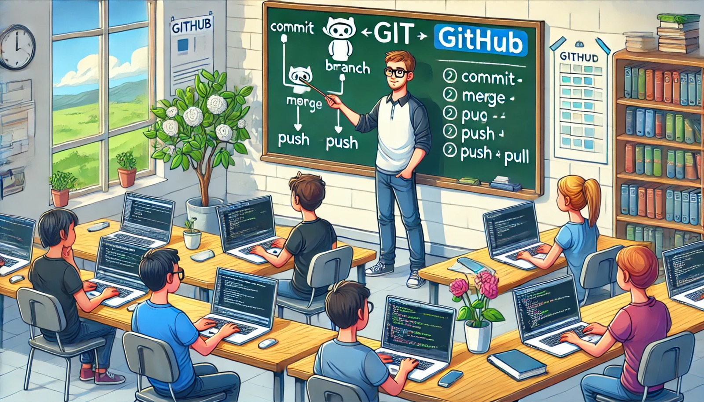

### Aula 28: Exercícios Práticos de Git e GitHub

#### Introdução

Nesta aula, vamos praticar os conceitos e comandos aprendidos sobre **Git** e **GitHub**. O objetivo é consolidar os conhecimentos através de exercícios práticos, aplicando comandos como **commit**, **branch**, **merge**, **push**, **pull**, e o uso de **forks** e **pull requests** no GitHub. Ao final desses exercícios, você deverá estar confortável para trabalhar em projetos colaborativos, contribuir para repositórios de código aberto e gerenciar o histórico de versões de um projeto.

---

### Exercício 1: Configurando um Repositório Local e Realizando Commits

1. **Inicialize um repositório Git**:
   - Crie uma pasta chamada `meu-projeto-git`.
   - Dentro dessa pasta, execute o comando:
     ```bash
     git init
     ```

2. **Criando Arquivos e Fazendo Commits**:
   - Crie um arquivo chamado `index.html` com o seguinte conteúdo:
     ```html
     <!DOCTYPE html>
     <html lang="pt-BR">
     <head>
         <meta charset="UTF-8">
         <title>Meu Projeto</title>
     </head>
     <body>
         <h1>Bem-vindo ao Meu Projeto</h1>
     </body>
     </html>
     ```
   - Adicione o arquivo ao **staging** e faça o commit:
     ```bash
     git add index.html
     git commit -m "Adiciona arquivo index.html"
     ```

3. **Modifique o Arquivo e Faça Outro Commit**:
   - Adicione um parágrafo ao `index.html`:
     ```html
     <p>Este é o primeiro projeto utilizando Git.</p>
     ```
   - Adicione e faça o commit da alteração:
     ```bash
     git add index.html
     git commit -m "Adiciona parágrafo de introdução ao projeto"
     ```

---

### Exercício 2: Criando e Mesclando Branches

1. **Crie uma Nova Branch para Adicionar uma Funcionalidade**:
   - No terminal, crie uma branch chamada `nova-funcionalidade`:
     ```bash
     git checkout -b nova-funcionalidade
     ```

2. **Adicione uma Nova Funcionalidade na Branch**:
   - Edite o arquivo `index.html` para incluir uma lista:
     ```html
     <ul>
         <li>Funcionalidade 1</li>
         <li>Funcionalidade 2</li>
     </ul>
     ```
   - Adicione e faça commit das mudanças na branch `nova-funcionalidade`:
     ```bash
     git add index.html
     git commit -m "Adiciona lista de funcionalidades"
     ```

3. **Mescle a Branch com a `main`**:
   - Volte para a branch principal:
     ```bash
     git checkout main
     ```
   - Faça o merge das alterações da `nova-funcionalidade`:
     ```bash
     git merge nova-funcionalidade
     ```

4. **Remova a Branch `nova-funcionalidade` (opcional)**:
   - Após o merge, você pode remover a branch:
     ```bash
     git branch -d nova-funcionalidade
     ```

---

### Exercício 3: Trabalhando com GitHub (Push e Pull)

1. **Crie um Repositório no GitHub**:
   - No GitHub, crie um novo repositório chamado `meu-projeto-github`.
   - Não selecione a opção para criar o repositório com um `README`.

2. **Conecte o Repositório Local ao GitHub**:
   - No terminal, adicione o repositório remoto:
     ```bash
     git remote add origin https://github.com/seu-usuario/meu-projeto-github.git
     ```

3. **Envie as Alterações para o GitHub**:
   - Faça o **push** para o repositório remoto na branch `main`:
     ```bash
     git push -u origin main
     ```

4. **Baixando Alterações do GitHub (Pull)**:
   - No GitHub, edite o arquivo `index.html` diretamente no editor online e adicione uma nova linha de texto.
   - No terminal, use o comando `git pull` para sincronizar as alterações com o repositório local:
     ```bash
     git pull origin main
     ```

---

### Exercício 4: Colaborando em Projetos com Fork e Pull Request

1. **Faça um Fork de um Repositório Público**:
   - No GitHub, acesse um repositório público (como um repositório de teste ou um repositório de prática) e faça o fork para sua conta GitHub.

2. **Clone o Repositório Forkado**:
   - No terminal, clone o repositório forkado para o seu ambiente local:
     ```bash
     git clone https://github.com/seu-usuario/repositorio-forkado.git
     cd repositorio-forkado
     ```

3. **Crie uma Nova Branch e Faça Alterações**:
   - Crie uma branch chamada `melhorias`:
     ```bash
     git checkout -b melhorias
     ```
   - Edite um arquivo, faça alterações e, em seguida, faça commit das mudanças:
     ```bash
     git add .
     git commit -m "Melhorias no arquivo de introdução"
     ```

4. **Faça Push para o Repositório Forkado**:
   - Envie suas alterações para o GitHub:
     ```bash
     git push origin melhorias
     ```

5. **Crie um Pull Request**:
   - No GitHub, vá até o seu repositório forkado e clique em **"Compare & pull request"**.
   - Preencha a descrição e o título, descrevendo as mudanças, e clique em **"Create pull request"** para enviar sua contribuição para revisão.

---

### Exercícios de Fixação

**Questão 1:** Qual é o comando utilizado para inicializar um repositório Git em uma pasta?
- (A) `git create`
- (B) `git init`
- (C) `git start`
- (D) `git new`

**Resposta correta:** (B)

---

**Questão 2:** O que o comando `git branch nome-da-branch` faz?
- (A) Cria um novo repositório no GitHub.
- (B) Mescla duas branches diferentes.
- (C) Cria uma nova branch chamada `nome-da-branch`.
- (D) Apaga a branch `nome-da-branch`.

**Resposta correta:** (C)

---

**Questão 3:** Para enviar suas alterações para o GitHub, qual comando você deve usar?
- (A) `git pull`
- (B) `git clone`
- (C) `git push`
- (D) `git branch`

**Resposta correta:** (C)

---

**Questão 4:** Qual é o objetivo de um pull request (PR) no GitHub?
- (A) Solicitar que alterações feitas em um fork sejam mescladas no repositório original.
- (B) Apagar o repositório original.
- (C) Mudar o nome de uma branch no GitHub.
- (D) Sincronizar o repositório local com o repositório remoto.

**Resposta correta:** (A)

---

**Questão 5:** Qual comando busca e mescla alterações do repositório remoto com o repositório local?
- (A) `git merge`
- (B) `git fetch`
- (C) `git push`
- (D) `git pull`

**Resposta correta:** (D)

---

### Conclusão

Com estes exercícios práticos, você consolidou os principais comandos e fluxos de trabalho em **Git** e **GitHub**, incluindo **commit**, **branch**, **merge**, **push**, **pull**, **fork** e **pull request**. Esses conceitos são fundamentais para qualquer desenvolvedor que deseja colaborar em projetos e gerenciar o histórico de alterações de um código.

Ao dominar essas habilidades, você estará preparado para contribuir em projetos colaborativos e trabalhar de forma organizada no desenvolvimento de software. Pratique esses exercícios para reforçar o uso de Git e GitHub em seu fluxo de trabalho!