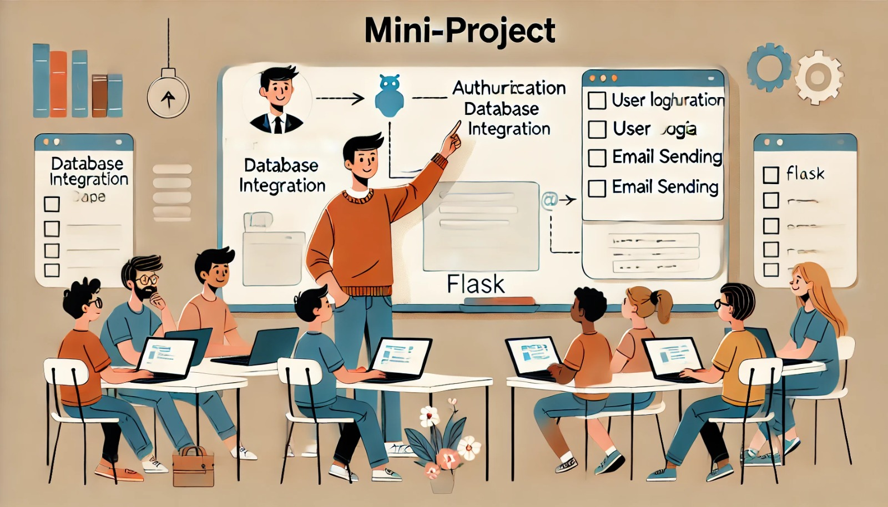

### Aula 30: Mini-Projeto de Flask (Autenticação, Banco de Dados, Envio de E-mails)

#### Introdução

Nesta aula, vamos desenvolver um mini-projeto usando **Flask** que reúne os principais conceitos e funcionalidades que aprendemos. Este projeto incluirá **autenticação** de usuários (login e registro), integração com um **banco de dados** para armazenar informações de usuários e **envio de e-mails** para confirmações e notificações. Esse mini-projeto permitirá que você aplique seus conhecimentos de forma prática, criando uma base sólida para projetos web mais complexos.

---

### Estrutura do Projeto

Nosso projeto será uma aplicação simples que permite que usuários se cadastrem, façam login e recebam um e-mail de confirmação.

- **Cadastro e Autenticação**: Criaremos um sistema de registro e login de usuários.
- **Banco de Dados**: Usaremos SQLite para armazenar informações de login (usuário e senha).
- **Envio de E-mails**: Enviaremos um e-mail de boas-vindas quando o usuário se cadastrar.

### Passo 1: Configuração do Projeto e Estrutura de Pastas

1. Crie uma pasta para o projeto chamada `mini_projeto_flask`.
2. Dentro da pasta, crie o arquivo `app.py`, uma pasta `templates` para os arquivos HTML e uma pasta `static` para arquivos de estilo e imagens.

### Passo 2: Instalação das Bibliotecas Necessárias

No terminal, instale as dependências necessárias para o projeto:

```bash
pip install Flask Flask-Mail
```

### Passo 3: Configurando o Banco de Dados

Para armazenar dados dos usuários, usaremos um banco de dados SQLite.

```python
# No arquivo app.py
import sqlite3

def criar_bd():
    con = sqlite3.connect('usuarios.db')
    cur = con.cursor()
    cur.execute('''CREATE TABLE IF NOT EXISTS usuarios (
                   id INTEGER PRIMARY KEY AUTOINCREMENT,
                   nome TEXT NOT NULL,
                   email TEXT UNIQUE NOT NULL,
                   senha TEXT NOT NULL)''')
    con.commit()
    con.close()
```

Chamaremos a função `criar_bd()` uma vez no início para configurar a tabela de usuários.

### Passo 4: Configurando Flask e Flask-Mail

Configurações básicas para a aplicação Flask e Flask-Mail para envio de e-mails.

```python
from flask import Flask, render_template, request, redirect, url_for, session
from flask_mail import Mail, Message

app = Flask(__name__)
app.secret_key = 'sua_chave_secreta'

# Configurações de e-mail
app.config['MAIL_SERVER'] = 'smtp.gmail.com'
app.config['MAIL_PORT'] = 587
app.config['MAIL_USE_TLS'] = True
app.config['MAIL_USERNAME'] = 'seuemail@gmail.com'
app.config['MAIL_PASSWORD'] = 'suasenha'
mail = Mail(app)
```

### Passo 5: Registro de Usuários com Envio de E-mail de Boas-vindas

O formulário de registro recebe o nome, e-mail e senha do usuário. Após o registro, um e-mail de boas-vindas é enviado ao usuário.

1. **Crie o template `register.html` em `templates`**:

```html
<!DOCTYPE html>
<html lang="pt-BR">
<head>
    <meta charset="UTF-8">
    <title>Registro</title>
</head>
<body>
    <h2>Cadastro de Usuário</h2>
    <form action="{{ url_for('registrar') }}" method="POST">
        <input type="text" name="nome" placeholder="Nome" required><br>
        <input type="email" name="email" placeholder="E-mail" required><br>
        <input type="password" name="senha" placeholder="Senha" required><br>
        <button type="submit">Registrar</button>
    </form>
</body>
</html>
```

2. **Rota de Registro e Envio de E-mail**:

```python
@app.route('/registrar', methods=['GET', 'POST'])
def registrar():
    if request.method == 'POST':
        nome = request.form['nome']
        email = request.form['email']
        senha = request.form['senha']

        # Salvar o usuário no banco de dados
        con = sqlite3.connect('usuarios.db')
        cur = con.cursor()
        try:
            cur.execute("INSERT INTO usuarios (nome, email, senha) VALUES (?, ?, ?)", (nome, email, senha))
            con.commit()
        except sqlite3.IntegrityError:
            return "E-mail já registrado."
        finally:
            con.close()

        # Envio do e-mail de boas-vindas
        msg = Message('Bem-vindo!', recipients=[email])
        msg.body = f'Olá, {nome}! Bem-vindo ao nosso sistema.'
        mail.send(msg)

        return redirect(url_for('login'))
    
    return render_template('register.html')
```

### Passo 6: Autenticação (Login e Logout)

1. **Crie o template `login.html` em `templates`**:

```html
<!DOCTYPE html>
<html lang="pt-BR">
<head>
    <meta charset="UTF-8">
    <title>Login</title>
</head>
<body>
    <h2>Login</h2>
    <form action="{{ url_for('login') }}" method="POST">
        <input type="email" name="email" placeholder="E-mail" required><br>
        <input type="password" name="senha" placeholder="Senha" required><br>
        <button type="submit">Entrar</button>
    </form>
</body>
</html>
```

2. **Rota de Login e Sessão de Usuário**:

```python
@app.route('/login', methods=['GET', 'POST'])
def login():
    if request.method == 'POST':
        email = request.form['email']
        senha = request.form['senha']

        # Verificar se o usuário existe no banco de dados
        con = sqlite3.connect('usuarios.db')
        cur = con.cursor()
        cur.execute("SELECT * FROM usuarios WHERE email = ? AND senha = ?", (email, senha))
        usuario = cur.fetchone()
        con.close()

        if usuario:
            session['usuario_id'] = usuario[0]
            session['nome'] = usuario[1]
            return redirect(url_for('dashboard'))
        else:
            return "E-mail ou senha incorretos."

    return render_template('login.html')
```

3. **Crie o Dashboard e o Logout**:

```python
@app.route('/dashboard')
def dashboard():
    if 'usuario_id' in session:
        return f'Bem-vindo, {session["nome"]}!'
    return redirect(url_for('login'))

@app.route('/logout')
def logout():
    session.pop('usuario_id', None)
    session.pop('nome', None)
    return redirect(url_for('login'))
```