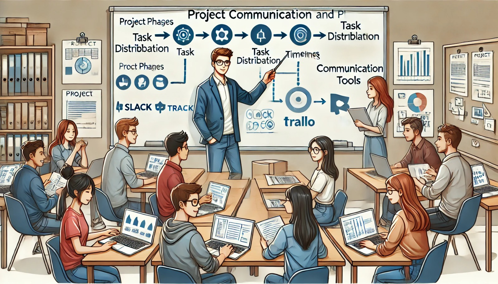

### Aula 31: Comunicação e Planejamento de Projetos

#### Introdução

Comunicação e planejamento são pilares essenciais para o sucesso de qualquer projeto, especialmente em desenvolvimento de software, onde equipes multidisciplinares trabalham juntas. A comunicação eficaz garante que todos os membros estejam alinhados e entendam claramente os objetivos e as responsabilidades. O planejamento, por sua vez, ajuda a organizar tarefas, estabelecer prazos e antecipar desafios. Nesta aula, vamos explorar como uma comunicação clara e um planejamento detalhado contribuem para o desenvolvimento eficiente e para a entrega bem-sucedida de projetos.

---

### 1. Importância da Comunicação no Planejamento de Projetos

Em projetos de desenvolvimento de software, a comunicação é crucial em várias etapas:
- **Definição de Requisitos**: Permite que a equipe entenda as necessidades dos usuários e o escopo do projeto.
- **Design e Implementação**: Facilita discussões sobre arquitetura e funcionalidades, ajudando a equipe a tomar decisões técnicas.
- **Testes e Validação**: Permite relatar bugs, discutir correções e validar entregas com os clientes ou usuários finais.
- **Feedback e Melhoria Contínua**: Estabelece um canal de comunicação contínuo para discutir melhorias e adaptações durante o ciclo de vida do projeto.

#### Boas Práticas de Comunicação
1. **Reuniões Regulares**: Planeje reuniões rápidas de atualização (stand-up meetings) para revisar o progresso e identificar obstáculos.
2. **Ferramentas de Comunicação**: Utilize ferramentas como Slack, Microsoft Teams ou e-mail para manter a comunicação fluida entre os membros.
3. **Documentação Clara**: Registre decisões importantes, escopo do projeto e requisitos para referência futura.
4. **Feedback Constante**: Incentive os membros a darem feedback para identificar pontos de melhoria.

---

### 2. Fases do Planejamento de Projetos

O planejamento é uma das primeiras e mais importantes etapas de um projeto, pois define a estrutura que guiará as próximas fases. 

#### 2.1. Definição do Escopo
O escopo do projeto descreve o que será entregue, incluindo funcionalidades, restrições e limitações. Definir o escopo corretamente evita que o projeto cresça descontroladamente e garante que todos saibam exatamente o que deve ser feito.

#### 2.2. Definição de Tarefas e Responsabilidades
Depois de entender o escopo, a equipe pode dividir o projeto em tarefas menores. Essas tarefas devem ser específicas e atribuídas a membros da equipe, considerando as habilidades de cada um.

#### 2.3. Estabelecimento de Prazos
Definir prazos realistas ajuda a equipe a manter o foco e o ritmo. O uso de ferramentas de planejamento, como Trello, Asana ou Jira, permite que todos acompanhem o progresso e saibam quando uma tarefa precisa ser concluída.

#### 2.4. Identificação de Recursos Necessários
Identifique os recursos que serão necessários para o projeto, como infraestrutura, ferramentas de desenvolvimento, acesso a ambientes de teste e orçamentos.

#### 2.5. Riscos e Soluções Preventivas
Identificar riscos potenciais ajuda a equipe a se preparar para possíveis problemas. Por exemplo, se há risco de falta de recursos ou atrasos, a equipe pode planejar soluções alternativas.

---

### 3. Ferramentas de Planejamento de Projetos

Ferramentas de planejamento ajudam a organizar e rastrear o progresso do projeto. Aqui estão algumas das ferramentas mais utilizadas:

- **Trello**: Utiliza quadros e cartões para organizar tarefas em listas. É simples e eficaz para pequenos projetos.
- **Asana**: Permite criar tarefas e subtarefas, além de visualizar o progresso em cronogramas.
- **Jira**: Uma ferramenta poderosa para projetos de desenvolvimento ágil, com suporte a sprints e gerenciamento de backlog.
- **Google Calendar**: Útil para agendar reuniões e prazos.

Essas ferramentas melhoram a visibilidade do projeto, facilitam a colaboração e permitem o acompanhamento contínuo das atividades.

---

### 4. Processos de Feedback e Melhoria Contínua

Uma comunicação aberta e feedback constante permitem que o projeto evolua durante seu desenvolvimento. Ao longo das fases, os membros da equipe e as partes interessadas devem estar dispostos a ajustar e adaptar planos conforme novas informações surgem.

---

### Exercícios de Fixação

**Questão 1:** Qual é a principal vantagem de uma comunicação eficaz em um projeto de desenvolvimento?
- (A) Aumenta o tempo de desenvolvimento do projeto.
- (B) Garante que todos os membros entendam o escopo e suas responsabilidades.
- (C) Reduz o número de membros da equipe necessários para o projeto.
- (D) Evita a necessidade de reuniões frequentes.

**Resposta correta:** (B)

---

**Questão 2:** Qual das opções abaixo descreve corretamente o escopo de um projeto?
- (A) As reuniões de feedback entre a equipe.
- (B) Os recursos financeiros disponíveis para o projeto.
- (C) A lista de funcionalidades e entregas previstas para o projeto.
- (D) A sequência de testes e validações do projeto.

**Resposta correta:** (C)

---

**Questão 3:** Quais ferramentas são úteis para o planejamento de tarefas e organização de projetos?
- (A) Trello, Asana e Jira
- (B) Slack, Google Drive e Twitter
- (C) Microsoft Word, Google Slides e Excel
- (D) YouTube, GitHub e Canva

**Resposta correta:** (A)

---

**Questão 4:** Qual das fases do planejamento de um projeto envolve dividir o projeto em tarefas menores?
- (A) Estabelecimento de Prazos
- (B) Definição do Escopo
- (C) Definição de Tarefas e Responsabilidades
- (D) Identificação de Riscos

**Resposta correta:** (C)

---

**Questão 5:** O que é essencial em um processo de feedback e melhoria contínua?
- (A) Evitar mudanças para manter o projeto estável.
- (B) Fazer ajustes no planejamento e nas metas conforme necessário.
- (C) Reduzir a comunicação para acelerar o progresso.
- (D) Limitar o feedback para apenas uma reunião final.

**Resposta correta:** (B)

---

### Conclusão

Nesta aula, exploramos os aspectos essenciais da **comunicação** e do **planejamento** em projetos de desenvolvimento de software. Aprendemos que uma comunicação clara e constante é fundamental para o alinhamento da equipe e que um planejamento estruturado define as bases para um projeto bem-sucedido. Utilizando essas práticas, você estará melhor preparado para enfrentar os desafios de projetos colaborativos, garantindo o desenvolvimento eficiente e organizado.