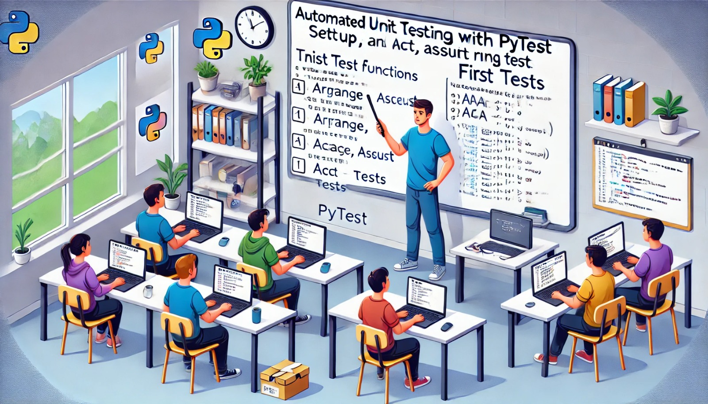

### Aula 34: Testes Unitários com Pytest (Setup, Primeiros Testes)

#### Introdução

Nesta aula, vamos aprender a usar o **Pytest**, uma das ferramentas mais populares para testes unitários em Python. Com o Pytest, você pode criar e organizar testes de forma simples e eficiente, garantindo que funções e métodos específicos funcionem como esperado. O objetivo dos testes unitários é verificar o comportamento de pequenas partes do código em isolamento, permitindo que os desenvolvedores identifiquem rapidamente erros em suas funções.

---

### 1. O que é Pytest?

**Pytest** é um framework de testes para Python que facilita a criação, execução e organização de testes automatizados. Ele é fácil de usar, permite escrita intuitiva de testes e oferece diversos recursos, como a execução de múltiplos testes e relatórios detalhados. Pytest é amplamente adotado para projetos Python de diferentes tamanhos.

#### Instalação do Pytest

Para começar a usar o Pytest, primeiro instale-o usando `pip`:

```bash
pip install pytest
```

#### Configuração Básica de Testes

1. Crie um novo diretório para armazenar os testes, chamado `tests`.
2. Dentro da pasta `tests`, crie um arquivo de teste, geralmente com o nome começando com `test_` (ex: `test_calculadora.py`). O Pytest automaticamente encontra e executa os arquivos que começam com `test_`.

---

### 2. Escrevendo o Primeiro Teste Unitário

Para exemplificar, vamos criar uma função simples de soma e escrever um teste para verificar seu funcionamento.

1. **Função Soma**:

   ```python
   # Arquivo: calculadora.py

   def soma(a, b):
       return a + b
   ```

2. **Escrevendo um Teste para Soma**:

   Crie o arquivo `test_calculadora.py` dentro da pasta `tests`:

   ```python
   # Arquivo: tests/test_calculadora.py

   from calculadora import soma

   def test_soma():
       resultado = soma(2, 3)
       assert resultado == 5  # Teste passa se o resultado for 5
   ```

   Nesse exemplo, `assert` verifica se o resultado da função `soma` é igual a `5`. Se for, o teste passa; caso contrário, o teste falha.

---

### 3. Executando Testes com Pytest

Para rodar os testes, abra o terminal na pasta do projeto e execute o comando:

```bash
pytest
```

O Pytest automaticamente encontra os arquivos de teste e executa todos os testes definidos. Ele também mostra um relatório com o status de cada teste.

#### Saída Esperada do Pytest

Após executar o comando `pytest`, você verá uma saída semelhante a esta:

```
==================== test session starts ====================
collected 1 item

tests/test_calculadora.py .                                  [100%]

==================== 1 passed in 0.02s =====================
```

O ponto `.` indica que o teste foi bem-sucedido. Se o teste falhar, o Pytest mostrará uma descrição do erro.

---

### 4. Estrutura Básica de um Teste

A estrutura de um teste unitário com Pytest pode seguir o padrão **AAA** (Arrange, Act, Assert):

1. **Arrange**: Prepare os dados e configurações necessárias.
2. **Act**: Execute a função que está sendo testada.
3. **Assert**: Verifique se o resultado é o esperado.

Exemplo de uma função com essa estrutura:

```python
def test_subtracao():
    # Arrange
    a = 10
    b = 5

    # Act
    resultado = subtracao(a, b)

    # Assert
    assert resultado == 5
```

### 5. Testando Exceções e Erros

Com Pytest, também é possível testar se uma função lança uma exceção esperada. Para isso, usamos a função `pytest.raises`.

Exemplo:

```python
import pytest

def dividir(a, b):
    if b == 0:
        raise ValueError("Divisão por zero não permitida")
    return a / b

def test_dividir_zero():
    with pytest.raises(ValueError):
        dividir(10, 0)
```

Nesse caso, o teste verifica se a função `dividir` lança um `ValueError` ao tentar dividir por zero.

---

### Exercícios de Fixação

**Questão 1:** Qual comando instala o Pytest no ambiente de desenvolvimento?
- (A) `pip install pyunit`
- (B) `pip install pytest`
- (C) `pip install unittest`
- (D) `pip install testpy`

**Resposta correta:** (B)

---

**Questão 2:** Qual o propósito dos testes unitários?
- (A) Testar a aplicação inteira em um ambiente de produção.
- (B) Verificar se pequenas partes do código, como funções e métodos, funcionam conforme esperado.
- (C) Executar todas as rotinas de backup.
- (D) Monitorar o uso de memória da aplicação.

**Resposta correta:** (B)

---

**Questão 3:** O que significa o padrão AAA em testes unitários?
- (A) Análise, Anotação e Avaliação
- (B) Arrange, Act, Assert
- (C) Assert, Arrange, Act
- (D) Autenticar, Autorizar e Auditar

**Resposta correta:** (B)

---

**Questão 4:** Qual dos seguintes comandos executa todos os testes em uma pasta usando o Pytest?
- (A) `pytest run`
- (B) `pytest start`
- (C) `pytest`
- (D) `pytest execute`

**Resposta correta:** (C)

---

**Questão 5:** Para que serve o `pytest.raises`?
- (A) Para verificar se uma função levanta uma exceção específica.
- (B) Para executar testes assíncronos.
- (C) Para rodar testes unitários em paralelo.
- (D) Para reiniciar o ambiente de teste.

**Resposta correta:** (A)

---

### Conclusão

Nesta aula, você aprendeu os conceitos e a prática de criar testes unitários usando o **Pytest**. Desde a instalação e configuração até a execução dos primeiros testes, cobrimos como o Pytest facilita a criação de testes claros e organizados. Incorporar testes automatizados ao seu fluxo de trabalho melhora a qualidade do código, reduz erros e permite que você faça alterações com mais segurança.