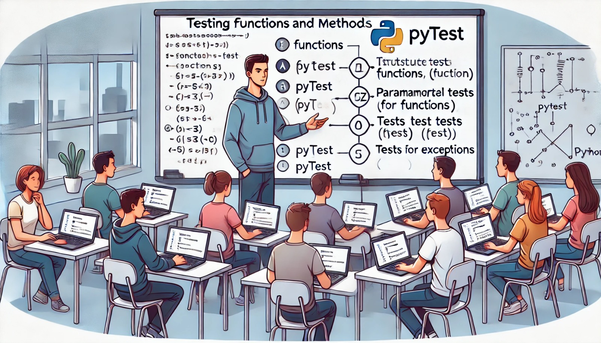

### Aula 35: Pytest – Testes de Funções e Métodos

#### Introdução

Nesta aula, vamos aprofundar o uso do **Pytest** para criar testes automatizados focados em funções e métodos de Python. O Pytest permite que você teste diferentes tipos de funções, passando dados variados para validar o comportamento do código. Aprenderemos também sobre **testes parametrizados**, uma funcionalidade do Pytest que possibilita testar uma função com múltiplos conjuntos de dados, aumentando a cobertura de testes de forma eficiente.

---

### 1. Estrutura Básica de Testes para Funções

Ao testar funções, o objetivo é garantir que cada função individual retorne o resultado esperado para entradas específicas. Vamos começar com uma função simples e depois explorar exemplos mais complexos.

#### Exemplo de Função e Teste Simples

Suponha que temos uma função `multiplicar` que recebe dois números e retorna o produto:

```python
# Arquivo: calculadora.py

def multiplicar(a, b):
    return a * b
```

Agora, vamos criar um teste básico para esta função:

```python
# Arquivo: tests/test_calculadora.py

from calculadora import multiplicar

def test_multiplicar():
    assert multiplicar(2, 3) == 6
    assert multiplicar(5, 0) == 0
    assert multiplicar(-2, 4) == -8
```

Esses testes garantem que a função `multiplicar` funcione corretamente para diferentes entradas.

---

### 2. Testando Métodos de Classes

Quando trabalhamos com classes, muitas vezes queremos garantir que os métodos da classe funcionem corretamente em diferentes cenários.

#### Exemplo de Classe e Teste de Método

Vamos criar uma classe `Calculadora` com um método `adicionar`:

```python
# Arquivo: calculadora.py

class Calculadora:
    def adicionar(self, a, b):
        return a + b
```

Para testar esse método, podemos criar um arquivo de teste:

```python
# Arquivo: tests/test_calculadora.py

from calculadora import Calculadora

def test_adicionar():
    calc = Calculadora()
    assert calc.adicionar(1, 2) == 3
    assert calc.adicionar(-1, 1) == 0
    assert calc.adicionar(0, 0) == 0
```

Aqui, o teste verifica se o método `adicionar` da classe `Calculadora` retorna o resultado correto para diferentes valores.

---

### 3. Testes Parametrizados

O Pytest permite a parametrização de testes, o que é útil quando queremos testar uma função ou método com múltiplos conjuntos de dados sem repetir o código.

#### Exemplo de Teste Parametrizado

Vamos parametrizar o teste da função `multiplicar` para garantir que ela funcione com várias entradas.

```python
# Arquivo: tests/test_calculadora.py

import pytest
from calculadora import multiplicar

@pytest.mark.parametrize("a, b, resultado", [
    (2, 3, 6),
    (5, 0, 0),
    (-2, 4, -8),
    (7, 7, 49)
])
def test_multiplicar_parametrizado(a, b, resultado):
    assert multiplicar(a, b) == resultado
```

Neste exemplo, o decorador `@pytest.mark.parametrize` permite definir vários conjuntos de valores (`a`, `b` e `resultado`) que são passados automaticamente ao teste `test_multiplicar_parametrizado`. Cada conjunto de dados executa o teste uma vez.

---

### 4. Testando Métodos com Exceções

Quando funções e métodos podem levantar exceções, também é importante testar esses cenários para garantir que o código se comporte conforme o esperado.

#### Exemplo de Teste com Exceção

Imagine que temos uma função `dividir` que levanta uma exceção se o divisor for zero:

```python
# Arquivo: calculadora.py

def dividir(a, b):
    if b == 0:
        raise ValueError("Divisão por zero não permitida")
    return a / b
```

Podemos testar essa função com o Pytest, verificando tanto o funcionamento normal quanto o tratamento da exceção:

```python
# Arquivo: tests/test_calculadora.py

import pytest
from calculadora import dividir

def test_dividir():
    assert dividir(10, 2) == 5

def test_dividir_por_zero():
    with pytest.raises(ValueError):
        dividir(10, 0)
```

Aqui, `pytest.raises` verifica se a exceção `ValueError` é levantada quando tentamos dividir por zero.

---

### Exercícios de Fixação

**Questão 1:** Qual comando permite rodar testes com Pytest?
- (A) `pytest run`
- (B) `run pytest`
- (C) `pytest`
- (D) `test run`

**Resposta correta:** (C)

---

**Questão 2:** Em testes unitários, o que o Pytest faz com o decorador `@pytest.mark.parametrize`?
- (A) Permite criar testes para funções que chamam outras funções.
- (B) Permite testar uma função com múltiplos conjuntos de dados.
- (C) Cria exceções automaticamente para funções testadas.
- (D) Verifica o uso de memória das funções testadas.

**Resposta correta:** (B)

---

**Questão 3:** Qual dos métodos abaixo deve ser usado para verificar se uma função levanta uma exceção específica com o Pytest?
- (A) `pytest.exception`
- (B) `pytest.raises`
- (C) `pytest.error`
- (D) `pytest.catch`

**Resposta correta:** (B)

---

**Questão 4:** Para que serve um teste parametrizado?
- (A) Executar múltiplos testes com diferentes entradas sem duplicar o código.
- (B) Testar apenas a estrutura da função.
- (C) Verificar o tipo de dados das variáveis usadas no teste.
- (D) Automatizar o download de bibliotecas para teste.

**Resposta correta:** (A)

---

**Questão 5:** O que a seguinte linha de código faz?
   ```python
   @pytest.mark.parametrize("a, b, resultado", [(2, 3, 6), (5, 0, 0), (-2, 4, -8)])
   ```
- (A) Executa a função apenas para o primeiro conjunto de dados.
- (B) Define um parâmetro que será aplicado a todas as funções do arquivo de teste.
- (C) Configura o Pytest para executar um teste com múltiplos conjuntos de valores para `a`, `b` e `resultado`.
- (D) Estabelece a estrutura do projeto de teste.

**Resposta correta:** (C)

---

### Conclusão

Nesta aula, aprendemos a usar o Pytest para testar funções e métodos de maneira eficiente, cobrindo testes básicos, parametrizados e com exceções. A prática de testar funções e métodos com Pytest garante que cada parte do código funcione corretamente para várias condições, ajudando a manter o software confiável e fácil de manter.