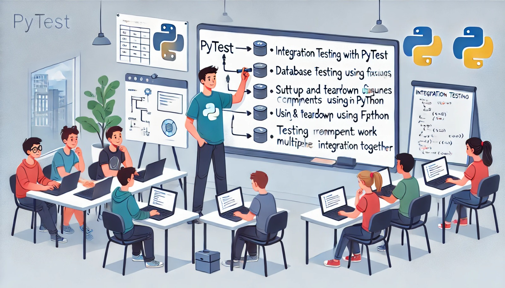

### Aula 36: Pytest – Testes de Integração

#### Introdução

Os testes de integração são um passo fundamental para garantir que diferentes componentes do sistema funcionem corretamente em conjunto. Em uma aplicação web, isso pode envolver a integração entre o banco de dados, o servidor e as funcionalidades da aplicação. Nesta aula, aprenderemos a criar testes de integração usando **Pytest**, validando que o sistema se comporta como esperado em cenários mais complexos que os testes unitários.

---

### 1. O que São Testes de Integração?

Testes de integração verificam se componentes individuais de um sistema funcionam juntos conforme esperado. Esses testes são especialmente úteis para detectar problemas de comunicação entre módulos, como falhas de conexão com o banco de dados ou erros de comunicação entre APIs.

#### Exemplos de Cenários para Testes de Integração

- **Conexão com o Banco de Dados**: Verificar se o sistema consegue se conectar ao banco e realizar operações.
- **Fluxos Completo de Funcionalidades**: Validar que as operações principais, como o cadastro de um usuário, funcionam corretamente.
- **Comunicação entre Serviços**: Testar se o sistema interage corretamente com APIs externas.

---

### 2. Preparando o Ambiente para Testes de Integração

Para realizar testes de integração, é importante ter um ambiente controlado para simular as interações. Geralmente, isso inclui:

1. **Banco de Dados de Teste**: Um banco de dados separado que não interfira com dados de produção.
2. **Configuração de Variáveis de Ambiente**: Variáveis específicas para os testes, como as credenciais de banco de dados e configurações de servidor.

#### Exemplo de Configuração para Testes de Integração

Crie um arquivo `conftest.py` para definir configurações que serão usadas nos testes de integração. Esse arquivo permite configurar uma sessão de banco de dados de teste, que será iniciada e finalizada automaticamente pelo Pytest.

```python
# Arquivo: conftest.py
import pytest
import sqlite3

@pytest.fixture
def db_conexao():
    # Cria uma conexão com o banco de dados de teste
    con = sqlite3.connect(":memory:")
    yield con
    con.close()  # Fecha a conexão após o teste
```

---

### 3. Escrevendo um Teste de Integração com Pytest

Vamos criar um teste de integração para verificar se um registro de usuário pode ser adicionado ao banco de dados.

1. **Função para Inserir Usuários no Banco de Dados**:

   ```python
   # Arquivo: sistema.py

   def inserir_usuario(con, nome, email):
       cursor = con.cursor()
       cursor.execute("INSERT INTO usuarios (nome, email) VALUES (?, ?)", (nome, email))
       con.commit()
   ```

2. **Teste de Integração para Inserção de Usuário**:

   ```python
   # Arquivo: tests/test_sistema.py

   from sistema import inserir_usuario

   def test_inserir_usuario(db_conexao):
       inserir_usuario(db_conexao, "João", "joao@example.com")

       cursor = db_conexao.cursor()
       cursor.execute("SELECT nome, email FROM usuarios WHERE email = ?", ("joao@example.com",))
       usuario = cursor.fetchone()

       assert usuario == ("João", "joao@example.com")
   ```

Neste exemplo, o teste de integração usa o `db_conexao` para criar um ambiente controlado. O teste insere um usuário e verifica se ele foi adicionado corretamente ao banco de dados.

---

### 4. Usando `pytest.fixture` para Preparar Dados

O decorador `pytest.fixture` permite preparar dados ou configurar o ambiente antes de um teste. Isso é útil em testes de integração, pois muitas vezes é necessário definir o estado do sistema antes de executá-los.

#### Exemplo de `fixture` para Preparar Dados

```python
# Arquivo: conftest.py

@pytest.fixture
def usuario_inicial(db_conexao):
    cursor = db_conexao.cursor()
    cursor.execute("CREATE TABLE usuarios (nome TEXT, email TEXT)")
    cursor.execute("INSERT INTO usuarios (nome, email) VALUES (?, ?)", ("Alice", "alice@example.com"))
    db_conexao.commit()
```

O `fixture` `usuario_inicial` prepara uma tabela e insere um usuário. Esse setup inicial permite que outros testes se beneficiem de uma base de dados pronta para testar.

---

### 5. Limpeza de Dados Após o Teste

Em testes de integração, garantir que o ambiente retorne ao estado inicial após cada teste é importante para evitar interferência entre testes. Isso pode ser feito usando `yield` dentro do `fixture` ou chamando uma função de limpeza diretamente.

#### Exemplo de Limpeza com `yield`

```python
# Arquivo: conftest.py

@pytest.fixture
def db_conexao():
    con = sqlite3.connect(":memory:")
    yield con
    con.close()
```

---

### Exercícios de Fixação

**Questão 1:** Qual é o objetivo principal dos testes de integração?
- (A) Testar pequenas partes isoladas do código.
- (B) Verificar se componentes funcionam corretamente em conjunto.
- (C) Validar a interface de usuário da aplicação.
- (D) Garantir que o ambiente de produção esteja seguro.

**Resposta correta:** (B)

---

**Questão 2:** Qual é a função do arquivo `conftest.py` em um projeto com Pytest?
- (A) Declarar as variáveis de ambiente.
- (B) Definir `fixtures` e configurações para os testes.
- (C) Armazenar o código principal da aplicação.
- (D) Executar comandos antes dos testes iniciarem.

**Resposta correta:** (B)

---

**Questão 3:** O que `pytest.fixture` permite fazer nos testes?
- (A) Criar variáveis globais para o projeto.
- (B) Executar um teste várias vezes.
- (C) Configurar o ambiente de teste e definir dados iniciais.
- (D) Remover todos os dados do banco de dados.

**Resposta correta:** (C)

---

**Questão 4:** Em um teste de integração, por que usamos `yield` em um `fixture`?
- (A) Para repetir o teste até que passe.
- (B) Para garantir que o teste seja executado em paralelo.
- (C) Para configurar e limpar o ambiente de teste.
- (D) Para definir variáveis de ambiente automaticamente.

**Resposta correta:** (C)

---

**Questão 5:** Qual é a vantagem de usar um banco de dados em memória (`:memory:`) para testes?
- (A) Garante que os dados persistam para sempre.
- (B) Aumenta a segurança dos dados de produção.
- (C) Facilita o isolamento dos dados de teste, tornando-o rápido e descartável.
- (D) Melhora o desempenho da aplicação em produção.

**Resposta correta:** (C)

---

### Conclusão

Os testes de integração são fundamentais para garantir que os componentes do sistema funcionem corretamente em conjunto. Aprendemos a configurar um ambiente de teste com `pytest.fixture`, preparar e limpar dados, e usar o Pytest para validar interações complexas, como operações em banco de dados. Incorporar esses testes ao desenvolvimento aumenta a confiabilidade e a robustez da aplicação, tornando-a mais estável e fácil de manter.