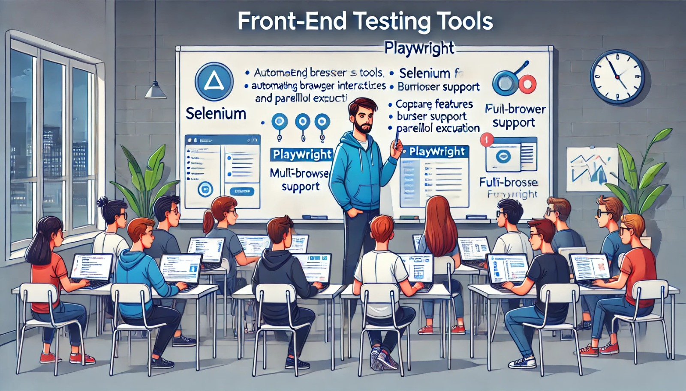

### Aula 37: Ferramentas de Teste para Front-end (Selenium, Playwright)

#### Introdução

Para garantir que uma aplicação web funcione como esperado do ponto de vista do usuário, é importante realizar testes no front-end. Esses testes validam que os elementos de interface, como botões, formulários e links, estão funcionando corretamente e que a aplicação é acessível e responsiva. **Selenium** e **Playwright** são duas das ferramentas mais usadas para testes de front-end em navegadores, permitindo automatizar interações e verificar o comportamento da interface de forma consistente.

---

### 1. O que é Selenium?

**Selenium** é uma ferramenta de teste de front-end que automatiza navegadores, permitindo a execução de ações como cliques, navegação, preenchimento de formulários, entre outros. Selenium suporta diversos navegadores (Chrome, Firefox, Safari) e é amplamente utilizado para testes de UI, especialmente em sistemas complexos e interativos.

#### Principais Características do Selenium

- **Automação de Navegadores**: Suporta diversos navegadores, incluindo Chrome, Firefox e Edge.
- **Integração com Pytest**: Pode ser integrado ao Pytest para gerenciar a execução dos testes.
- **Testes de UI Complexos**: Excelente para testar aplicações que exigem uma interação rica com a interface.

#### Instalando e Configurando o Selenium

1. **Instalando o Selenium**:
   ```bash
   pip install selenium
   ```
2. **Baixando o WebDriver**:
   Para executar testes no Chrome, baixe o ChromeDriver:
   - **ChromeDriver para Chrome**: https://sites.google.com/a/chromium.org/chromedriver/downloads

3. **Configurando o Selenium**:
   Com o WebDriver instalado, você pode iniciar o Selenium em Python.

#### Exemplo de Teste com Selenium

Neste exemplo, vamos verificar se a página inicial da aplicação Flask carrega corretamente.

```python
from selenium import webdriver
from selenium.webdriver.common.by import By

def test_homepage():
    driver = webdriver.Chrome()
    driver.get("http://localhost:5000")
    
    # Verifica se o título da página está correto
    assert "Página Inicial" in driver.title

    # Verifica se um elemento específico está presente
    elemento = driver.find_element(By.ID, "bem-vindo")
    assert elemento is not None
    
    driver.quit()
```

Neste exemplo, o Selenium abre o navegador, navega até a página e verifica o título e a presença de um elemento com o ID "bem-vindo". Em seguida, fecha o navegador.

---

### 2. O que é Playwright?

**Playwright** é uma ferramenta de teste desenvolvida pela Microsoft, com funcionalidades semelhantes ao Selenium, mas com foco em testes modernos e rápidos. Ele permite testar em múltiplos navegadores e oferece suporte para automação em ambientes como desktop e mobile.

#### Principais Características do Playwright

- **Suporte Multi-navegador**: Funciona com Chrome, Firefox e Safari.
- **Execução Paralela**: Testes são rápidos e podem ser executados em paralelo.
- **Funcionalidades Modernas**: Suporta testes em aplicativos single-page (SPA) e fornece melhor controle de redes e elementos do DOM.

#### Instalando e Configurando o Playwright

1. **Instalando o Playwright**:
   ```bash
   pip install playwright
   playwright install
   ```
2. **Iniciando o Playwright**:
   Após instalar o Playwright, é necessário inicializar os navegadores:

   ```bash
   playwright install
   ```

#### Exemplo de Teste com Playwright

Vamos criar um teste para verificar se a página inicial de uma aplicação Flask carrega corretamente.

```python
from playwright.sync_api import sync_playwright

def test_homepage():
    with sync_playwright() as p:
        browser = p.chromium.launch()
        page = browser.new_page()
        page.goto("http://localhost:5000")
        
        # Verifica se o título da página está correto
        assert "Página Inicial" in page.title()

        # Verifica a presença de um texto específico
        assert page.inner_text("#bem-vindo") == "Bem-vindo ao Flask!"

        browser.close()
```

Nesse exemplo, o Playwright lança um navegador Chromium, acessa a URL especificada e verifica se o título e o conteúdo da página estão corretos. Por fim, o navegador é fechado.

---

### 3. Comparação entre Selenium e Playwright

| Característica            | Selenium                        | Playwright                          |
|---------------------------|---------------------------------|-------------------------------------|
| Suporte Multi-navegador   | Chrome, Firefox, Safari         | Chrome, Firefox, WebKit             |
| Execução em Paralelo      | Limitado                        | Suporte integrado                   |
| Automação de Mobile       | Sim (com Appium)                | Sim (Web e Android)                 |
| Ideal para                | Testes de UI mais antigos       | Aplicações modernas e rápidas       |

### 4. Dicas para Testes Eficientes de Front-end

1. **Use Seletores Únicos**: Defina IDs únicos para elementos que serão testados.
2. **Evite Dependências Externas**: Quando possível, configure um servidor local para garantir a consistência dos testes.
3. **Automatize o Setup e Teardown**: Configure o ambiente para ser preparado antes do teste e limpo ao final.

---

### Exercícios de Fixação

**Questão 1:** Qual é o objetivo principal do Selenium?
- (A) Executar testes de unidade em back-end.
- (B) Automatizar interações de usuário em navegadores.
- (C) Gerenciar a documentação de código.
- (D) Criar animações em sites.

**Resposta correta:** (B)

---

**Questão 2:** O que o Playwright oferece que o diferencia do Selenium?
- (A) Compatibilidade com apenas um navegador.
- (B) Suporte integrado para execução paralela de testes.
- (C) Suporte exclusivo para testes de back-end.
- (D) Funcionalidades limitadas para aplicações web.

**Resposta correta:** (B)

---

**Questão 3:** Qual dos seguintes navegadores é suportado tanto pelo Selenium quanto pelo Playwright?
- (A) Chrome
- (B) Safari
- (C) Firefox
- (D) Todas as opções acima

**Resposta correta:** (D)

---

**Questão 4:** Qual biblioteca de Python é necessária para instalar o Selenium?
- (A) `playwright`
- (B) `pytest`
- (C) `selenium`
- (D) `flask`

**Resposta correta:** (C)

---

**Questão 5:** Qual vantagem o Playwright oferece para aplicações single-page (SPA)?
- (A) Permite criar APIs RESTful automaticamente.
- (B) Suporte melhorado para interações complexas em SPAs.
- (C) Facilita a criação de funções de back-end.
- (D) Otimiza o código JavaScript.

**Resposta correta:** (B)

---

### Conclusão

Nesta aula, exploramos as ferramentas **Selenium** e **Playwright** para realizar testes de front-end em navegadores. Ambas permitem simular ações de usuários, verificar a aparência e o comportamento da interface, e testar a interação com elementos do DOM. Enquanto o Selenium é uma escolha tradicional e bem estabelecida, o Playwright oferece recursos modernos para aplicações web complexas. Incorporar essas ferramentas ao seu fluxo de testes garante uma experiência de usuário mais confiável e ajuda a evitar problemas na interface antes que cheguem aos usuários finais.