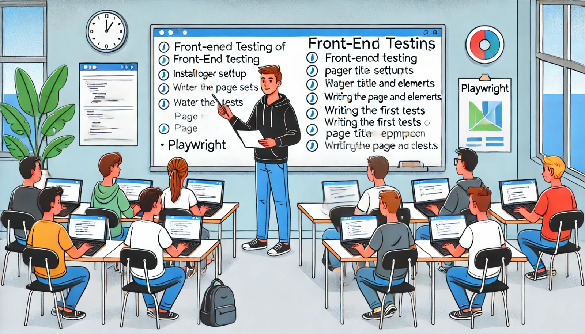

### Aula 38: Playwright – Setup e Primeiros Testes

#### Introdução

O **Playwright** é uma ferramenta poderosa e moderna para testes de front-end, desenvolvida pela Microsoft. Ele permite realizar testes automatizados em navegadores, simulando interações do usuário como cliques, preenchimento de formulários e navegação. Diferente de algumas outras ferramentas, o Playwright suporta execução em múltiplos navegadores (Chrome, Firefox, Safari) e até em dispositivos móveis. Nesta aula, vamos aprender a configurar o Playwright e a escrever nossos primeiros testes automatizados para uma aplicação web.

---

### 1. Configurando o Playwright

Para iniciar, você precisa instalar o Playwright e configurar seu ambiente de desenvolvimento.

#### Passo 1: Instalação do Playwright

1. No terminal, instale o Playwright com o seguinte comando:

   ```bash
   pip install playwright
   ```

2. Após instalar a biblioteca, execute o seguinte comando para baixar os navegadores necessários:

   ```bash
   playwright install
   ```

   Esse comando baixará os navegadores suportados (Chromium, Firefox e WebKit) para garantir a compatibilidade dos testes.

---

### 2. Estrutura Básica de um Teste com Playwright

Os testes do Playwright simulam o comportamento do usuário na interface da aplicação. Vamos começar com um exemplo básico que verifica o título de uma página e a presença de elementos.

#### Exemplo de Teste Simples

Neste exemplo, criaremos um teste para verificar se a página inicial de uma aplicação Flask carrega corretamente.

1. **Código da Aplicação**: Verifique se a aplicação Flask está rodando no endereço `http://localhost:5000`.

2. **Escrevendo o Teste**:

   ```python
   # Arquivo: test_homepage.py
   from playwright.sync_api import sync_playwright

   def test_homepage():
       with sync_playwright() as p:
           # Inicia o navegador
           browser = p.chromium.launch()
           page = browser.new_page()

           # Acessa a página inicial
           page.goto("http://localhost:5000")

           # Verifica se o título está correto
           assert "Página Inicial" in page.title()

           # Verifica a presença de um elemento com ID "bem-vindo"
           assert page.query_selector("#bem-vindo") is not None

           # Fecha o navegador
           browser.close()
   ```

   Neste exemplo, o Playwright acessa a página inicial, verifica o título e a presença de um elemento específico, e fecha o navegador ao final do teste.

#### Executando o Teste

Para executar o teste, abra o terminal e use o seguinte comando:

```bash
python test_homepage.py
```

---

### 3. Comandos Básicos do Playwright

Aqui estão alguns dos comandos mais comuns que você usará ao criar testes com o Playwright:

- **Acessar uma URL**:
  ```python
  page.goto("http://localhost:5000")
  ```

- **Verificar o Título da Página**:
  ```python
  assert "Página Inicial" in page.title()
  ```

- **Selecionar Elementos**:
  - Por ID: `page.query_selector("#id-do-elemento")`
  - Por Classe: `page.query_selector(".classe-do-elemento")`

- **Simular Clique em Elemento**:
  ```python
  page.click("button#meu-botao")
  ```

- **Preencher Formulário**:
  ```python
  page.fill("input#nome", "João")
  ```

Esses comandos permitem simular a maioria das interações do usuário em um navegador, tornando o Playwright ideal para testes de interface de usuário.

---

### 4. Utilizando `with` para Gerenciamento Automático

A palavra-chave `with` é amplamente utilizada no Python para gerenciar o ciclo de vida dos recursos, garantindo que o navegador seja iniciado e finalizado corretamente. Ao usar `with`, você evita ter que fechar o navegador manualmente, reduzindo o risco de problemas e garantindo que o navegador sempre seja fechado ao final do teste.

Exemplo:

```python
from playwright.sync_api import sync_playwright

def test_example():
    with sync_playwright() as p:
        browser = p.chromium.launch()
        page = browser.new_page()
        page.goto("http://localhost:5000")
        assert page.title() == "Página Inicial"
```

---

### Exercícios de Fixação

**Questão 1:** Qual comando instala o Playwright no ambiente de desenvolvimento?
- (A) `pip install selenium`
- (B) `pip install playwright`
- (C) `npm install playwright`
- (D) `playwright setup`

**Resposta correta:** (B)

---

**Questão 2:** Qual comando permite baixar os navegadores necessários para o Playwright?
- (A) `pip install playwright`
- (B) `playwright setup`
- (C) `playwright install`
- (D) `playwright download`

**Resposta correta:** (C)

---

**Questão 3:** Em um teste com Playwright, qual método é usado para acessar uma URL específica?
- (A) `page.get()`
- (B) `page.goto()`
- (C) `page.open()`
- (D) `page.access()`

**Resposta correta:** (B)

---

**Questão 4:** Qual comando verifica se o título da página está correto em um teste com Playwright?
- (A) `page.check_title()`
- (B) `page.query_selector()`
- (C) `page.title()`
- (D) `page.get_title()`

**Resposta correta:** (C)

---

**Questão 5:** Qual das opções abaixo descreve corretamente o uso do `with` no Playwright?
- (A) Usar `with` torna o código mais rápido.
- (B) `with` é usado para fechar automaticamente o navegador ao final do teste.
- (C) `with` substitui a necessidade de baixar navegadores.
- (D) `with` é usado para verificar o título da página.

**Resposta correta:** (B)

---

### Conclusão

Nesta aula, vimos como configurar o Playwright e escrever nossos primeiros testes para verificar o funcionamento de uma página web. O Playwright oferece uma sintaxe simples e recursos avançados, como suporte a múltiplos navegadores e execução paralela, tornando-o uma ferramenta robusta para garantir a qualidade e a funcionalidade das interfaces de usuário. Esses testes são fundamentais para detectar problemas antes que eles impactem o usuário final, proporcionando uma experiência mais confiável e agradável.