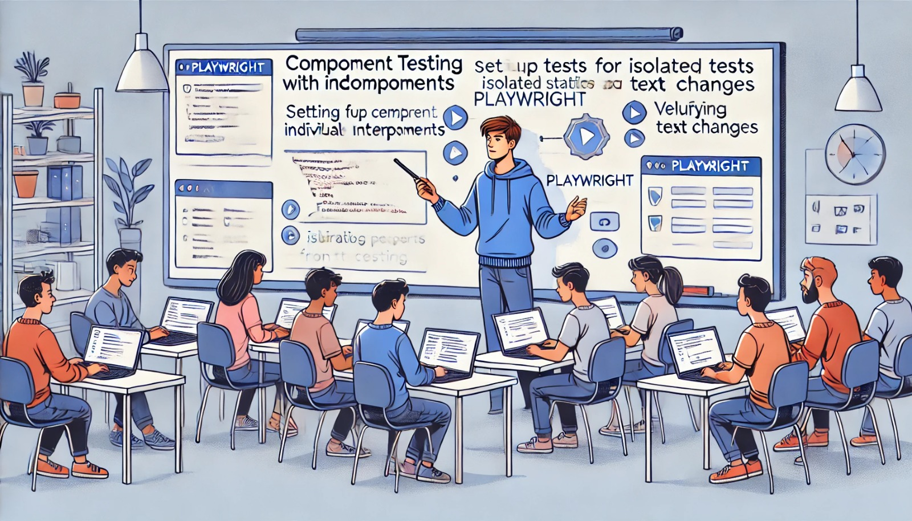

### Aula 39: Playwright – Testes de Componentes

#### Introdução

Na construção de interfaces web, os componentes são blocos fundamentais da aplicação. Testar esses componentes individualmente é essencial para garantir que cada parte da interface funcione corretamente e proporcione uma boa experiência ao usuário. O **Playwright** é uma ferramenta poderosa para testes de componentes, pois permite simular o comportamento de usuários em diferentes navegadores e testar interações e estados visuais dos componentes de forma automatizada. Nesta aula, vamos aprender a testar componentes da interface de usuário com Playwright, verificando sua renderização, visibilidade e comportamento em diferentes cenários.

---

### 1. Por Que Testar Componentes?

Os testes de componentes verificam se os blocos de construção da interface estão funcionando de maneira independente e correta. Testes de componentes ajudam a identificar problemas logo no início do desenvolvimento e aumentam a confiabilidade da aplicação.

**Principais Benefícios:**
- **Verificação de Estado e Comportamento**: Garantem que o componente responda corretamente a eventos como cliques e envios de formulários.
- **Detecção de Problemas de Estilo**: Verificam se o componente é renderizado corretamente em diferentes navegadores e dispositivos.
- **Isolamento de Problemas**: Permitem identificar problemas específicos em um componente sem interferência de outros elementos.

---

### 2. Estrutura de um Teste de Componente com Playwright

O Playwright fornece uma API que permite selecionar componentes na página, interagir com eles e verificar se eles estão funcionando como esperado. Abaixo, vamos ver um exemplo de teste para um botão que abre um modal na interface.

#### Exemplo de Teste de Componente: Botão que Abre um Modal

1. **Configuração da Aplicação**: Vamos assumir que você possui uma aplicação local rodando no endereço `http://localhost:5000` com um botão que abre um modal.

2. **Escrevendo o Teste do Componente**:

   ```python
   from playwright.sync_api import sync_playwright

   def test_open_modal():
       with sync_playwright() as p:
           # Lança o navegador Chromium
           browser = p.chromium.launch()
           page = browser.new_page()
           
           # Acessa a URL da aplicação
           page.goto("http://localhost:5000")

           # Verifica se o botão está presente e clicável
           assert page.is_visible("#open-modal-button")
           page.click("#open-modal-button")

           # Verifica se o modal foi aberto e está visível
           assert page.is_visible("#modal-content")

           # Fecha o navegador
           browser.close()
   ```

   Esse teste verifica se o botão de abrir modal está visível e, após o clique, verifica se o modal é exibido corretamente.

---

### 3. Comandos Úteis para Testes de Componentes com Playwright

O Playwright oferece vários comandos úteis para interagir com componentes e verificar seus estados:

- **Verificar Visibilidade**:
  ```python
  assert page.is_visible("#meu-componente")
  ```

- **Interagir com o Componente** (clique, envio de formulário, etc.):
  ```python
  page.click("#meu-botao")
  ```

- **Preencher um Formulário**:
  ```python
  page.fill("input#nome", "João")
  ```

- **Verificar o Conteúdo de Texto**:
  ```python
  assert page.inner_text("#mensagem") == "Bem-vindo!"
  ```

Esses comandos permitem interagir e verificar o estado do componente, simulando as ações de um usuário.

---

### 4. Testando Diferentes Estados de um Componente

Um dos principais objetivos dos testes de componentes é garantir que eles respondam corretamente a diferentes estados. Com o Playwright, você pode simular esses estados:

#### Exemplo: Testando Diferentes Estados de um Botão

Vamos supor que temos um botão que muda de texto ao ser clicado. Podemos criar um teste para verificar se ele funciona corretamente:

```python
from playwright.sync_api import sync_playwright

def test_toggle_button():
    with sync_playwright() as p:
        browser = p.chromium.launch()
        page = browser.new_page()

        # Acessa a URL da aplicação
        page.goto("http://localhost:5000")

        # Verifica o estado inicial do botão
        assert page.inner_text("#toggle-button") == "Iniciar"

        # Clica no botão e verifica o novo estado
        page.click("#toggle-button")
        assert page.inner_text("#toggle-button") == "Parar"

        # Fecha o navegador
        browser.close()
```

Neste exemplo, o Playwright verifica o texto inicial do botão, simula um clique e verifica se o texto mudou conforme o esperado.

---

### 5. Dicas para Testes Eficientes de Componentes

- **Use Seletores Únicos**: Para selecionar os componentes com precisão, é recomendado usar IDs ou classes exclusivas.
- **Execute Testes em Diferentes Navegadores**: O Playwright permite testar em múltiplos navegadores, como Chrome, Firefox e Safari, garantindo a compatibilidade do componente.
- **Mantenha os Testes Simples e Diretos**: Foque em testar a funcionalidade principal do componente para evitar complexidade desnecessária.

---

### Exercícios de Fixação

**Questão 1:** Qual é a principal vantagem de realizar testes de componentes?
- (A) Garantir que o servidor de back-end funcione corretamente.
- (B) Verificar se cada parte da interface funciona de maneira independente.
- (C) Automatizar o processo de design visual.
- (D) Otimizar o tempo de resposta do servidor.

**Resposta correta:** (B)

---

**Questão 2:** Em um teste com Playwright, qual comando verifica se um componente está visível?
- (A) `page.check()`
- (B) `page.goto()`
- (C) `page.is_visible()`
- (D) `page.open()`

**Resposta correta:** (C)

---

**Questão 3:** Qual comando o Playwright usa para simular o clique em um componente?
- (A) `page.type()`
- (B) `page.click()`
- (C) `page.check_click()`
- (D) `page.fill()`

**Resposta correta:** (B)

---

**Questão 4:** Para testar diferentes estados de um botão (por exemplo, de "Iniciar" para "Parar"), qual método do Playwright você usaria?
- (A) `page.change_text()`
- (B) `page.fill()`
- (C) `page.click()`
- (D) `page.inner_text()`

**Resposta correta:** (D)

---

**Questão 5:** Qual das opções abaixo descreve melhor a função de um teste de componente?
- (A) Verificar o comportamento de um único componente, de forma isolada, na interface.
- (B) Realizar o backup de dados do componente.
- (C) Verificar apenas o layout do componente em dispositivos móveis.
- (D) Testar todas as funcionalidades do sistema de forma integrada.

**Resposta correta:** (A)

---

### Conclusão

Os testes de componentes são fundamentais para garantir que cada parte da interface funcione conforme esperado. Com o Playwright, podemos simular interações do usuário, verificar diferentes estados e validar a renderização de componentes de forma rápida e eficaz. Esses testes melhoram a qualidade da aplicação e ajudam a evitar problemas na experiência do usuário, oferecendo uma interface mais confiável e agradável.