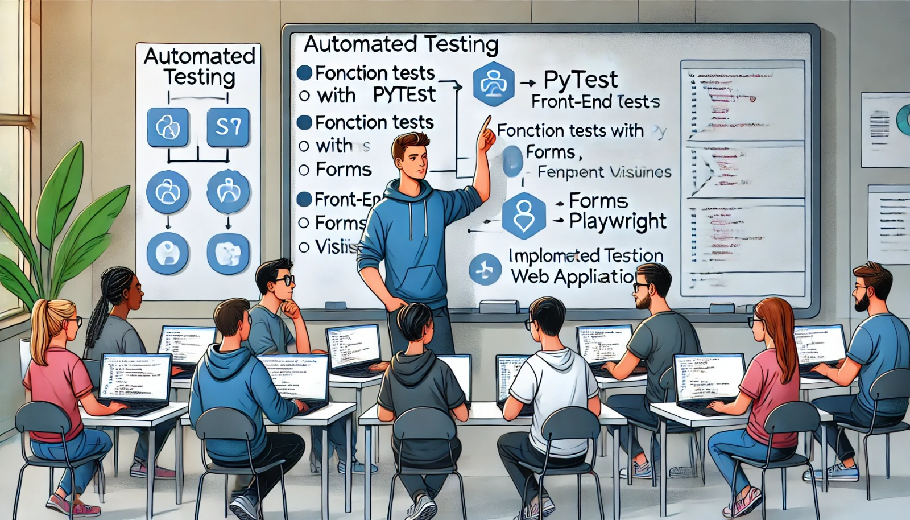

### Aula 40: Exercícios Práticos de Testes Automatizados

#### Introdução

Nesta aula prática, vamos colocar em prática o que aprendemos sobre testes automatizados para verificar e aprimorar a qualidade do código de uma aplicação web. Utilizaremos uma combinação de ferramentas de teste, incluindo **Pytest** para o back-end e **Playwright** para o front-end, para garantir que as funcionalidades e interfaces estejam funcionando corretamente. Esses exercícios práticos cobrem desde testes de funções no back-end até a simulação de interações do usuário na interface.

---

### Exercícios Práticos com Pytest (Back-end)

#### 1. Testando Funções de Lógica de Negócio

Para este exercício, vamos testar uma função que calcula o total de uma compra aplicando um desconto.

1. **Função a ser Testada**:
   ```python
   # Arquivo: calculadora.py

   def calcular_total(preco, quantidade, desconto=0):
       subtotal = preco * quantidade
       total = subtotal - (subtotal * desconto / 100)
       return round(total, 2)
   ```

2. **Escrevendo o Teste**:
   No arquivo `test_calculadora.py`, crie um teste para verificar o funcionamento correto da função `calcular_total`.

   ```python
   # Arquivo: tests/test_calculadora.py

   from calculadora import calcular_total

   def test_calcular_total_sem_desconto():
       assert calcular_total(100, 2) == 200

   def test_calcular_total_com_desconto():
       assert calcular_total(100, 2, 10) == 180  # 10% de desconto
   ```

3. **Executando o Teste**:
   No terminal, execute o comando:
   ```bash
   pytest tests/test_calculadora.py
   ```

---

### Exercícios Práticos com Playwright (Front-end)

#### 2. Testando Interações com um Botão de Modal

Suponha que sua aplicação tenha um botão que abre um modal com informações adicionais quando clicado. Vamos testar essa funcionalidade.

1. **Configuração da Página**: Garanta que a aplicação Flask esteja rodando em `http://localhost:5000`.

2. **Escrevendo o Teste de Componente**:
   No arquivo `test_modal_component.py`, escreva um teste para verificar a abertura do modal.

   ```python
   # Arquivo: tests/test_modal_component.py
   from playwright.sync_api import sync_playwright

   def test_open_modal():
       with sync_playwright() as p:
           browser = p.chromium.launch()
           page = browser.new_page()
           
           # Acessa a página principal
           page.goto("http://localhost:5000")

           # Clica no botão para abrir o modal
           page.click("#open-modal-button")

           # Verifica se o modal foi exibido
           assert page.is_visible("#modal-content")

           browser.close()
   ```

3. **Executando o Teste**:
   Execute o teste com o comando:
   ```bash
   python tests/test_modal_component.py
   ```

#### 3. Testando Formulários com Playwright

Neste exercício, vamos testar um formulário que permite que o usuário envie seu nome e receba uma mensagem de boas-vindas.

1. **Configuração da Página**: Garanta que o formulário da aplicação Flask esteja rodando.

2. **Escrevendo o Teste do Formulário**:
   No arquivo `test_form.py`, crie um teste para o formulário.

   ```python
   # Arquivo: tests/test_form.py
   from playwright.sync_api import sync_playwright

   def test_form_submission():
       with sync_playwright() as p:
           browser = p.chromium.launch()
           page = browser.new_page()

           # Acessa a página do formulário
           page.goto("http://localhost:5000/form")

           # Preenche o formulário e envia
           page.fill("input#name", "João")
           page.click("button#submit")

           # Verifica se a mensagem de boas-vindas foi exibida
           assert page.inner_text("#welcome-message") == "Bem-vindo, João!"

           browser.close()
   ```

3. **Executando o Teste**:
   Execute o teste com o comando:
   ```bash
   python tests/test_form.py
   ```

---

### Exercício Integrado: Testando o Fluxo de Cadastro e Login

Suponha que sua aplicação possui uma funcionalidade de cadastro e login. Vamos verificar se o fluxo de registro e autenticação funciona como esperado.

1. **Configuração da Página**: Garanta que a aplicação Flask esteja rodando e tenha páginas de cadastro e login.

2. **Escrevendo o Teste Integrado**:
   No arquivo `test_authentication.py`, crie um teste para simular o registro e login de um usuário.

   ```python
   # Arquivo: tests/test_authentication.py
   from playwright.sync_api import sync_playwright

   def test_register_and_login():
       with sync_playwright() as p:
           browser = p.chromium.launch()
           page = browser.new_page()

           # Acessa a página de cadastro
           page.goto("http://localhost:5000/register")
           page.fill("input#username", "usuario_teste")
           page.fill("input#password", "senha123")
           page.click("button#register")

           # Verifica se o cadastro foi bem-sucedido
           assert page.inner_text("#message") == "Cadastro realizado com sucesso!"

           # Acessa a página de login
           page.goto("http://localhost:5000/login")
           page.fill("input#username", "usuario_teste")
           page.fill("input#password", "senha123")
           page.click("button#login")

           # Verifica se o login foi bem-sucedido
           assert page.inner_text("#welcome") == "Bem-vindo, usuario_teste!"

           browser.close()
   ```

3. **Executando o Teste**:
   Execute o teste com o comando:
   ```bash
   python tests/test_authentication.py
   ```

---

### Conclusão

Esses exercícios práticos demonstram como o Pytest e o Playwright podem ser usados para testar diferentes aspectos de uma aplicação web. Desde a verificação de funções de lógica de negócios até a simulação de interações do usuário, esses testes cobrem áreas essenciais para garantir a qualidade da aplicação.

Testes automatizados ajudam a identificar problemas rapidamente, evitando que bugs cheguem ao usuário final e proporcionando uma experiência mais confiável.